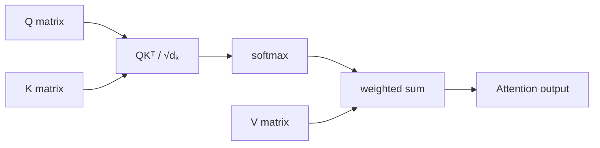
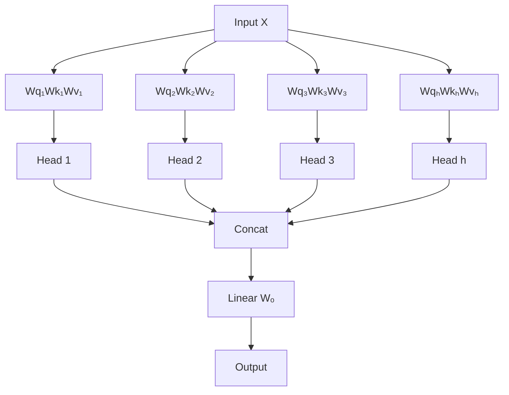
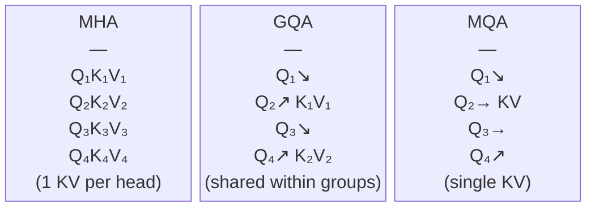
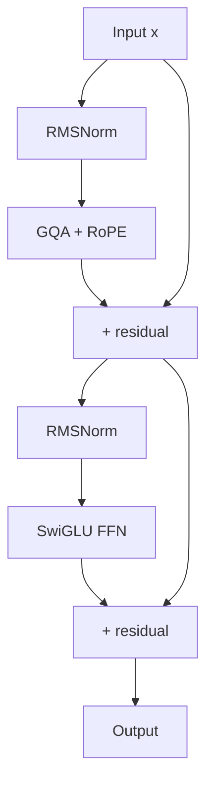
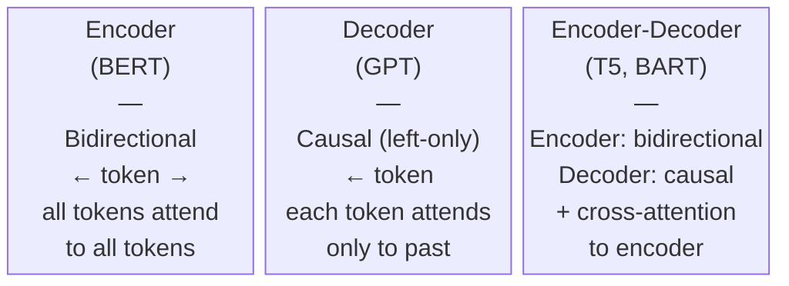

# Transformers in Depth

A technical look at the mechanisms inside transformer models: how attention is computed, how position is encoded, the architectural variants that exist, and the engineering choices that make inference practical at scale.

---

## Attention as a Retrieval Operation

Attention computes a weighted combination of values based on similarity between queries and keys.

For each position in the sequence:
1. Produce a **query** vector: "what am I looking for?"
2. Compare it against **key** vectors from all positions: "how relevant is each position?"
3. Use the resulting scores to weight the **values**: "what do I actually retrieve?"

All three (Q, K, V) are linear projections of the same input, with learned weight matrices `W_Q`, `W_K`, `W_V`.

```
Attention(Q, K, V) = softmax(QKᵀ / √d_k) · V
```

The `√d_k` scaling prevents dot products from growing large enough that softmax saturates into near-zero gradients.



---

## Scaled Dot-Product Attention: PyTorch Implementation

The formula maps directly to code. For causal (decoder) attention, `mask` is the lower-triangular boolean matrix: position `i` can attend to positions `0..i` only.

---

## Scaled Dot-Product Attention: PyTorch Implementation

```python
import torch
import torch.nn.functional as F
import math

def scaled_dot_product_attention(
    q: torch.Tensor,  # (batch, heads, seq_q, d_k)
    k: torch.Tensor,  # (batch, heads, seq_k, d_k)
    v: torch.Tensor,  # (batch, heads, seq_k, d_v)
    mask: torch.Tensor | None = None,
) -> tuple[torch.Tensor, torch.Tensor]:
    d_k = q.size(-1)
    scores = torch.matmul(q, k.transpose(-2, -1)) / math.sqrt(d_k)  # (batch, heads, seq_q, seq_k)

    if mask is not None:
        scores = scores.masked_fill(mask == 0, float('-inf'))

    attn_weights = F.softmax(scores, dim=-1)  # rows sum to 1
    output = torch.matmul(attn_weights, v)    # (batch, heads, seq_q, d_v)
    return output, attn_weights
```

---

## Scaled Dot-Product Attention: Step by Step

Given input sequence of length `n` and dimension `d_model`:

1. **Project to Q, K, V**: each is `(n, d_k)` or `(n, d_v)`
2. **Compute scores**: `QKᵀ` gives an `(n, n)` matrix; entry `[i,j]` is how much position `i` attends to `j`
3. **Scale**: divide by `√d_k` to keep gradients healthy
4. **Mask (decoder only)**: fill upper triangle with `-inf` so softmax maps it to 0
5. **Softmax**: normalize scores along the key dimension
6. **Weighted sum**: multiply softmax output by `V` to get context vectors

---

## Multi-Head Attention

Running one attention operation gives you one perspective on the sequence.

**Multi-head attention** runs `h` attention operations in parallel, each in a lower-dimensional subspace:

```
head_i  = Attention(Q W_Qi, K W_Ki, V W_Vi)
MultiHead(Q, K, V) = Concat(head_1, ..., head_h) W_O
```

With `d_model = 4096` and `h = 32` heads, each head operates in `d_k = 128` dimensions.



---

## Multi-Head Attention

```python
import torch.nn as nn

class MultiHeadAttention(nn.Module):
    def __init__(self, d_model: int, n_heads: int):
        super().__init__()
        assert d_model % n_heads == 0
        self.d_k = d_model // n_heads
        self.n_heads = n_heads
        self.W_q = nn.Linear(d_model, d_model, bias=False)
        self.W_k = nn.Linear(d_model, d_model, bias=False)
        self.W_v = nn.Linear(d_model, d_model, bias=False)
        self.W_o = nn.Linear(d_model, d_model, bias=False)

    def forward(self, x, mask=None):
        B, T, C = x.shape
        # Project and reshape to (B, heads, T, d_k)
        q = self.W_q(x).view(B, T, self.n_heads, self.d_k).transpose(1, 2)
        k = self.W_k(x).view(B, T, self.n_heads, self.d_k).transpose(1, 2)
        v = self.W_v(x).view(B, T, self.n_heads, self.d_k).transpose(1, 2)
        out, _ = scaled_dot_product_attention(q, k, v, mask)
        out = out.transpose(1, 2).contiguous().view(B, T, C)
        return self.W_o(out)
```

---

## Positional Encodings: Why They're Needed

Attention is permutation-invariant: shuffling the tokens changes attention scores but the mechanism has no inherent sense of order.

Position encodings inject sequence order information into the token representations.

Three main approaches have evolved:

1. **Absolute positional encodings**: add a position-dependent vector to each token embedding (original "Attention Is All You Need" approach using fixed sinusoids or learned embeddings)
2. **Relative positional encodings**: encode the distance between positions rather than absolute indices
3. **RoPE (Rotary Position Embedding)**: encodes position as a rotation applied to query and key vectors before the dot product

RoPE is now the dominant choice in modern open models (Llama 3, Mistral 7B, Qwen 2.5, Gemma).

---

## RoPE: Rotary Position Embedding

RoPE encodes position `m` by rotating query and key vectors in 2D subspaces.

For a vector dimension `d`, the rotation in the `j`-th pair of dimensions is:

```
R(m, θ_j) = [[cos(m θ_j), -sin(m θ_j)],
              [sin(m θ_j),  cos(m θ_j)]]

θ_j = base^(-2j/d),   base = 10000 (default)
```

The key property: when you compute the dot product `q_m · k_n` after applying RoPE, the result depends on the content of the vectors *and* on the relative offset `m - n`. This is ideal for attention.

Why RoPE wins in practice: better length generalization than absolute encodings, compatible with KV caching, and supports extended context via RoPE scaling techniques (YaRN, dynamic NTK scaling).

---

## RoPE: Rotary Position Embedding

```python
def apply_rotary_emb(x: torch.Tensor, cos: torch.Tensor, sin: torch.Tensor) -> torch.Tensor:
    """x: (batch, heads, seq, d_k). cos/sin: (seq, d_k//2) broadcast-ready."""
    x1, x2 = x[..., ::2], x[..., 1::2]       # split even/odd
    rotated = torch.stack([-x2, x1], dim=-1).flatten(-2)
    return x * cos + rotated * sin

def build_rope_cache(seq_len: int, d_k: int, base: int = 10000, device=None):
    theta = 1.0 / (base ** (torch.arange(0, d_k, 2, device=device).float() / d_k))
    positions = torch.arange(seq_len, device=device).float()
    freqs = torch.outer(positions, theta)       # (seq_len, d_k//2)
    cos = freqs.cos().unsqueeze(0).unsqueeze(0) # (1, 1, seq_len, d_k//2)
    sin = freqs.sin().unsqueeze(0).unsqueeze(0)
    return cos, sin
```

---

## Grouped-Query Attention (GQA)

Standard MHA: `h` heads each with their own K and V projections. KV cache stores `h × 2` matrices per layer.

**Grouped-Query Attention** reduces the number of distinct K/V heads while keeping the full number of Q heads:

```
h_q query heads, h_kv key/value heads, where h_kv divides h_q.
Each group of (h_q / h_kv) query heads shares one K head and one V head.
```

- **Multi-Query Attention (MQA)**: `h_kv = 1`, single K/V for all Q heads
- **GQA**: `h_kv = 8` with `h_q = 32` is Llama 3's configuration
- **MHA**: `h_kv = h_q`, the original form

Effect on KV cache: Llama 3 8B uses 8 KV heads vs 32 Q heads, making the cache 4x smaller than MHA.



---

## Grouped-Query Attention (GQA)

```python
# GQA forward: repeat K/V heads to match Q heads for matmul compatibility
def gqa_forward(q, k, v, n_q_heads, n_kv_heads):
    # q: (B, n_q_heads, T, d_k)
    # k, v: (B, n_kv_heads, T, d_k)
    groups = n_q_heads // n_kv_heads
    k = k.repeat_interleave(groups, dim=1)  # (B, n_q_heads, T, d_k)
    v = v.repeat_interleave(groups, dim=1)
    return scaled_dot_product_attention(q, k, v)
```

---

## Flash Attention

Standard attention materializes the full `(n, n)` attention score matrix in HBM (GPU global memory).

For sequence length 4096 with 32 heads and 32 layers in bf16: `4096² × 32 × 32 × 2 bytes ≈ 34 GB`.

**Flash Attention** (Dao et al., 2022) reorders the computation to avoid materializing the full matrix:

- Process attention in tiles that fit in fast on-chip SRAM
- Fuse softmax, masking, and matmul into a single kernel
- Track the running softmax normalization across tiles (online softmax trick)
- Produce the exact same output with O(n) HBM memory instead of O(n²)

Results: 2-4x faster than standard attention in practice, same numerical output, no approximation.

Flash Attention 2 adds better parallelism across the sequence dimension; Flash Attention 3 targets Hopper (H100) architecture.

---

## Flash Attention

```python
from transformers import AutoModelForCausalLM

model = AutoModelForCausalLM.from_pretrained(
    "meta-llama/Meta-Llama-3-8B-Instruct",
    torch_dtype=torch.bfloat16,
    attn_implementation="flash_attention_2",  # requires flash-attn package
    device_map="auto",
)
```

```python
# Drop-in replacement; PyTorch selects FlashAttention, memory-efficient, or math backend
out = F.scaled_dot_product_attention(q, k, v, attn_mask=mask, is_causal=True)
```

---

## Sliding Window Attention

Even with Flash Attention, O(n²) compute eventually becomes a bottleneck for very long contexts.

**Sliding window attention** restricts each token to a local window of `w` positions, making attention O(n × w).

Used in Mistral 7B with window size 4096. The effective receptive field grows through layer stacking: layer `l` can indirectly reach `l × w` positions.

For many tasks, local context is sufficient and the compute savings are significant for 32K+ token contexts.

---

## Sliding Window Attention

```python
# Generating a local attention mask for window size w
def sliding_window_mask(seq_len: int, window: int, device=None) -> torch.Tensor:
    # True where attention is allowed
    mask = torch.zeros(seq_len, seq_len, dtype=torch.bool, device=device)
    for i in range(seq_len):
        start = max(0, i - window + 1)
        mask[i, start:i + 1] = True
    return mask
```

---

## The KV Cache

During autoregressive generation, you generate one token at a time.

Without caching: computing token `t` requires running attention over all `t` previous tokens, repeating K/V computation for every prior position on every step. Cost scales as O(t²).

**The KV cache**: store K and V for positions 1 through `t-1`. On step `t`, only compute Q, K, V for the new token, then concatenate with cached K and V. O(t) per step.

Memory cost for Llama 3 8B (8 KV heads, d_k=128, 32 layers, bf16):

```
32 layers × 2 (K+V) × 8 KV heads × 128 dims × 2 bytes × T tokens
= 32 × 2 × 8 × 128 × 2 × T = 131072 × T bytes ≈ 0.125 MB per token

At T = 8192:  1 GB per request
At T = 128K:  16 GB per request
```

KV cache management is a dominant concern in production inference. Techniques like PagedAttention (vLLM) and prefix sharing exist specifically to address this.

---

## Putting the Architecture Together

A single transformer block (decoder-only, Llama-style):

```
x = x + attn(rms_norm(x))       # pre-norm + residual
x = x + ffn(rms_norm(x))        # pre-norm + residual
```

The FFN uses **SwiGLU** gating:

```
FFN(x) = (silu(x W_gate) ⊙ (x W_up)) W_down
```

where `⊙` is elementwise multiplication. Llama 3 8B parameters:

| Component    | Shape  |
| ------------ | ------ |
| d_model      | 4096   |
| n_heads (Q)  | 32     |
| n_heads (KV) | 8      |
| d_k = d_v    | 128    |
| d_ff         | 14336  |
| n_layers     | 32     |
| Vocab size   | 128256 |

The FFN is ~2/3 of total parameters: `d_model × d_ff × 3 × 32 layers ≈ 5.6B` out of 8B total.



---

## Putting the Architecture Together

```python
class LlamaFFN(nn.Module):
    def __init__(self, d_model: int, d_ff: int):
        super().__init__()
        self.gate = nn.Linear(d_model, d_ff, bias=False)
        self.up   = nn.Linear(d_model, d_ff, bias=False)
        self.down = nn.Linear(d_ff, d_model, bias=False)

    def forward(self, x):
        return self.down(F.silu(self.gate(x)) * self.up(x))
```

---

## Encoder, Decoder, Encoder-Decoder

Three architectural families, each suited to different tasks:

**Encoder-only (BERT, RoBERTa):**
- Bidirectional attention: every token attends to every other
- Output: contextual embeddings per token
- Best for: classification, NER, sentence embeddings

**Decoder-only (Llama 3, Mistral 7B, Qwen 2.5, GPT-4):**
- Causal attention: each token sees only past tokens
- Output: next-token probability distribution
- Best for: generation, instruction following, language modeling

**Encoder-decoder (T5, BART, Whisper):**
- Encoder processes input with bidirectional attention
- Decoder attends to encoder output via cross-attention
- Best for: translation, summarization, speech-to-text

Most frontier LLMs are decoder-only. The simplicity of one attention type and clean compatibility with autoregressive generation made it dominant.



---

## Key Takeaways

- `Attention(Q, K, V) = softmax(QKᵀ / √d_k) · V`: queries locate relevant keys, values are retrieved proportionally
- Multi-head attention runs `h` parallel attentions in `d_k = d_model/h`-dimensional subspaces; each head learns different relationships
- RoPE encodes position as a rotation in 2D subspaces of Q and K; the dot product then depends only on relative offset `m - n`
- GQA reduces KV head count (`h_kv < h_q`) to shrink the KV cache; Llama 3 uses 8 KV heads with 32 Q heads (4x cache reduction)
- Flash Attention fuses the attention kernel to avoid materializing the O(n²) score matrix in HBM; use `F.scaled_dot_product_attention` or `attn_implementation="flash_attention_2"`
- KV cache makes autoregressive generation O(t) per step but grows with context; at 128K tokens this is ~16 GB for Llama 3 8B
- Decoder-only with pre-RMSNorm, SwiGLU FFN, and GQA is the standard modern LLM architecture
