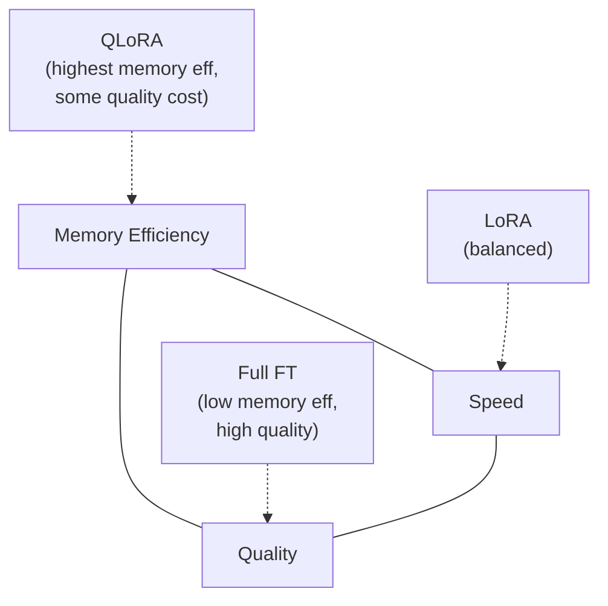

# PEFT & Quantization

A technical deep dive into parameter-efficient fine-tuning methods and quantization techniques: how they work mechanically, when to use each, and how to combine them effectively for the competition's hardware constraints.

---

## The PEFT Landscape

Parameter-Efficient Fine-Tuning (PEFT) covers a family of methods that reduce the number of trainable parameters during fine-tuning.

The main approaches:

| Method            | Trainable params                                    | Key idea                                               |
| ----------------- | --------------------------------------------------- | ------------------------------------------------------ |
| **LoRA**          | Low-rank matrices added to weight layers            | Decompose weight updates into two small matrices       |
| **QLoRA**         | LoRA on top of quantized base model                 | Combine quantization + LoRA for extreme memory savings |
| **Adapters**      | Small bottleneck modules inserted between layers    | Freeze everything, only train adapter modules          |
| **Prefix tuning** | Trainable soft prompts prepended to keys and values | Steer behavior via learned context vectors             |

LoRA and QLoRA dominate in practice for fine-tuning models like Llama 3 8B, Mistral 7B, and Qwen 2.5 7B.

---

## LoRA Mechanics: The Linear Algebra

LoRA assumes the weight update `ΔW` is low-rank.

For a weight matrix `W ∈ ℝ^(d × k)`:

```
W_new = W + ΔW = W + B A
```

Where:
- `B ∈ ℝ^(d × r)` (initialized to zero)
- `A ∈ ℝ^(r × k)` (initialized from N(0, σ²))
- `r << min(d, k)` (rank much smaller than weight dimensions)

Zero-initializing `B` ensures that at training start, `ΔW = B A = 0`, so the model begins from the pretrained weights. The forward pass becomes:

```
h = W x + (B A) x = W x + B (A x)
```

With scaling: the LoRA output is multiplied by `α/r`, giving the effective update `(α/r) B A x`.

---

## LoRA: Parameter Count

For `d = k = 4096, r = 16`:

```
LoRA parameters: r × (d + k) = 16 × 8192 = 131,072
Full weight:     d × k        = 4096 × 4096 = 16,777,216
Reduction:       128x per layer
```

With LoRA applied to all attention projections (`q_proj`, `k_proj`, `v_proj`, `o_proj`) in Llama 3 8B (32 layers, 4 projections per layer):

```
Total LoRA params ≈ 32 × 4 × 2 × 4096 × 16 = ~134M
vs. 8B base parameters
→ ~1.7% trainable
```

---

## LoRA Config in Practice

```python
from peft import LoraConfig, get_peft_model, TaskType

config = LoraConfig(
    r=16,                        # rank
    lora_alpha=32,               # scaling: effective factor = alpha/r = 2.0
    target_modules=[             # which projections to adapt
        "q_proj", "k_proj",
        "v_proj", "o_proj",
        "gate_proj", "up_proj", "down_proj",  # include FFN for factual tasks
    ],
    lora_dropout=0.05,
    bias="none",
    task_type=TaskType.CAUSAL_LM,
)

model = get_peft_model(model, config)
model.print_trainable_parameters()
# trainable params: 83,886,080 || all params: 8,030,261,248 || trainable%: 1.04
```

---

## LoRA: Rank and Alpha

**Rank (r):** capacity of the adapter.
- `r = 4`: minimal, for simple format or style changes
- `r = 16`: general purpose default
- `r = 64`: larger capacity, closer to full fine-tuning quality
- `r = 128+`: diminishing returns; may approach full fine-tuning cost

**Alpha (α):** scales the LoRA contribution: `ΔW_effective = (α/r) × BA`

The effective learning rate for the adapter is `(α/r)` times the optimizer's learning rate.

Common convention: `α = r` (scaling factor = 1) or `α = 2r`. Setting `α = r` means the LoRA output is not additionally scaled beyond the optimizer's LR, which simplifies tuning.

---

## LoRA vs. Full Fine-tuning: When Does Each Win?

LoRA approaches full fine-tuning quality in most settings, but there are exceptions.

**LoRA is sufficient for:**
- Instruction following and chat format adaptation
- Style and tone changes
- Task-specific output formats
- Small to medium dataset sizes (< 50k examples)

**Full fine-tuning has an edge for:**
- Injecting substantial new factual knowledge
- Very large datasets (100k+ examples)
- Tasks requiring deep behavioral change across the whole model

Research (Biderman et al., "LoRA vs. Full Fine-tuning", 2024) shows that LoRA can fail to fully "unlearn" pretrained behaviors, while full fine-tuning has complete control over the weight space.

For most competition tasks: start with LoRA, escalate to full fine-tuning only if LoRA clearly falls short.

---

## QLoRA: Combining Quantization with LoRA

QLoRA (Dettmers et al., 2023) enables fine-tuning large models on single-consumer GPUs.

The setup:
1. Load the base model in **4-bit NormalFloat (NF4)** quantization, frozen
2. Add LoRA adapters in **bf16**
3. Only the adapters are updated; the 4-bit base is never written to

The 4-bit weights are stored as NF4 but dequantized to bf16 on-the-fly during the forward/backward pass through each layer. Matrix multiplications happen in bf16; the quantized storage is purely for memory footprint.

Memory profile for Llama 3 8B:
- 4-bit base: ~4.5 GB
- LoRA adapters (r=16, all layers): ~120 MB
- Adam states (bf16, LoRA only): ~240 MB
- Activations (seq 512, batch 1): ~3.5 GB
- **Total: ~9 GB, fits on a 16 GB T4**

---

## QLoRA: Full Training Script Structure

```python
import torch
from transformers import AutoModelForCausalLM, AutoTokenizer, BitsAndBytesConfig
from peft import LoraConfig, get_peft_model
from trl import SFTTrainer, SFTConfig
from datasets import load_dataset

# 1. Quantization config
bnb_config = BitsAndBytesConfig(
    load_in_4bit=True,
    bnb_4bit_quant_type="nf4",          # NormalFloat4
    bnb_4bit_compute_dtype=torch.bfloat16,
    bnb_4bit_use_double_quant=True,     # double quantization saves ~0.37 bits/param
)

# 2. Load model
model = AutoModelForCausalLM.from_pretrained(
    "meta-llama/Meta-Llama-3-8B-Instruct",
    quantization_config=bnb_config,
    device_map="auto",
    attn_implementation="flash_attention_2",
)
model.config.use_cache = False          # disable KV cache during training
tokenizer = AutoTokenizer.from_pretrained("meta-llama/Meta-Llama-3-8B-Instruct")
tokenizer.pad_token = tokenizer.eos_token

# 3. LoRA config
lora_config = LoraConfig(
    r=16,
    lora_alpha=32,
    target_modules=["q_proj", "k_proj", "v_proj", "o_proj",
                    "gate_proj", "up_proj", "down_proj"],
    lora_dropout=0.05,
    bias="none",
    task_type="CAUSAL_LM",
)
model = get_peft_model(model, lora_config)

# 4. Training config
train_args = SFTConfig(
    output_dir="./qlora-llama3",
    num_train_epochs=3,
    per_device_train_batch_size=2,
    gradient_accumulation_steps=8,      # effective batch = 16
    gradient_checkpointing=True,
    learning_rate=2e-4,
    lr_scheduler_type="cosine",
    warmup_ratio=0.05,
    bf16=True,
    logging_steps=10,
    save_steps=200,
    max_seq_length=2048,
)

# 5. Train
dataset = load_dataset("your_dataset", split="train")
trainer = SFTTrainer(
    model=model,
    args=train_args,
    train_dataset=dataset,
    tokenizer=tokenizer,
)
trainer.train()
```

---

## NF4 and Double Quantization

NF4 (NormalFloat 4-bit) is a data type designed specifically for neural network weights.

Weights in pretrained models follow a roughly normal distribution. NF4 places quantization bins at equal quantile intervals, not equal linear intervals:

```
Uniform int4:  bins at  {-8, -7, ..., 0, ..., 7}  (linear spacing)
NF4:           bins at  quantiles of N(0,1), e.g., {-∞, -1.09, -0.58, ..., 1.09, +∞}
```

More bins in the dense central region, fewer in the tails where weights are rare. Better information preservation per bit than uniform int4.

**Double quantization**: the quantization scales (one per 64-weight block by default) are themselves quantized in fp8. This recovers approximately 0.37 bits per parameter on top of the 4-bit base.

Both features are the defaults when you pass `bnb_4bit_quant_type="nf4"` and `bnb_4bit_use_double_quant=True`.

---

## GPTQ Quantization

GPTQ (Frantar et al., 2022) is a post-training quantization method that minimizes layer-wise reconstruction error using a calibration dataset.

The calibration step runs 100-1000 batches through the model and takes minutes to an hour depending on model size. GPTQ produces higher quality than bitsandbytes RTN at the same bit-width.

For inference serving, prefer GPTQ or AWQ. For QLoRA training, use bitsandbytes.

---

## GPTQ Quantization

```python
from transformers import AutoModelForCausalLM, GPTQConfig

gptq_config = GPTQConfig(
    bits=4,
    dataset="wikitext2",        # calibration dataset
    tokenizer=tokenizer,
    group_size=128,             # one scale per 128 weights
    desc_act=True,              # activation ordering improves quality
)

model = AutoModelForCausalLM.from_pretrained(
    "meta-llama/Meta-Llama-3-8B-Instruct",
    quantization_config=gptq_config,
    device_map="auto",
)
model.save_pretrained("llama3-8b-gptq-4bit")
```

---

## Merging LoRA Adapters

After training, LoRA adapters can be merged into the base weights:

```
W_merged = W + (α/r) × B A
```

The merged model is architecturally identical to the original, with zero inference overhead. No adapter code or PEFT dependency needed at serving time.

After merging, the model loads and runs exactly like any standard HuggingFace model.

---

## Merging LoRA Adapters

```python
from peft import PeftModel

# Load base model (full precision for merging)
base_model = AutoModelForCausalLM.from_pretrained(
    "meta-llama/Meta-Llama-3-8B-Instruct",
    torch_dtype=torch.bfloat16,
    device_map="cpu",
)

# Load and merge
model = PeftModel.from_pretrained(base_model, "./qlora-llama3/checkpoint-final")
merged_model = model.merge_and_unload()  # fuses BA into W in-place

# Save as standard HuggingFace model
merged_model.save_pretrained("./llama3-8b-finetuned")
tokenizer.save_pretrained("./llama3-8b-finetuned")
```

---

## Quantization Methods: AWQ

**AWQ (Lin et al., 2023):** Activation-aware Weight Quantization.

AWQ observes that only a small fraction of weights (~1%) are "salient": they have large activation magnitudes and dominate the output. AWQ identifies and protects these weights during quantization by scaling them before rounding.

AWQ generally matches or beats GPTQ quality with faster calibration.

---

## Quantization Methods: AWQ

```python
# AWQ quantization using the autoawq library
from awq import AutoAWQForCausalLM

model = AutoAWQForCausalLM.from_pretrained("meta-llama/Meta-Llama-3-8B-Instruct")
tokenizer = AutoTokenizer.from_pretrained("meta-llama/Meta-Llama-3-8B-Instruct")

quant_config = {
    "zero_point": True,
    "q_group_size": 128,
    "w_bit": 4,
    "version": "GEMM",  # optimized kernel variant
}

model.quantize(tokenizer, quant_config=quant_config)
model.save_quantized("llama3-8b-awq-4bit")
```

---

## int8 vs. int4: Bit Width and Groupsize

Not all quantization is equal. The key parameters:

**Bit width:** 8-bit halves parameter memory vs bf16; 4-bit quarters it.

**Groupsize:** how many weights share a single quantization scale.
- Smaller group = more scales stored = overhead but better quality
- Typical: `group_size = 128` (one scale per 128 weights)
- Smaller groups: `group_size = 32` for higher quality at the cost of more scale overhead

**Quality loss in practice:**
- int8: nearly imperceptible for most tasks
- int4 (GPTQ/AWQ): 1-3% quality loss on benchmarks
- int4 (naive RTN, as in bitsandbytes): 5-10% loss on some tasks; NF4 reduces this substantially
- int2: active research area (QuIP, BitNet) but not yet practical for general use

---

## Adapter Methods: Comparison with LoRA

**Houlsby Adapters** (the original adapter approach):
- Insert small bottleneck modules: `Linear(d, r) → nonlinearity → Linear(r, d)` with a residual
- Added after attention and FFN sublayers
- Only adapter parameters are trained

Drawbacks vs. LoRA:
- Adds serial computation depth: inference is slower because adapters sit in the forward path
- LoRA can be merged into weights at inference time (`W_merged = W + BA`); adapters cannot
- Generally worse throughput

LoRA's major practical advantage: after training, merge the adapter with zero inference overhead.

The merged model is identical in architecture and speed to the original base model.

---

## Prefix Tuning and Prompt Tuning

These methods steer model behavior by prepending learned vectors to the input.

**Prompt tuning** (Lester et al., 2021):
- Prepend `k` learned token embeddings to the input
- Only these embeddings are trained
- Very few parameters but limited capacity; works well mainly for large models (11B+)

**Prefix tuning** (Li & Liang, 2021):
- Prepend learned vectors to keys and values at every layer
- More expressive than prompt tuning
- Can be thought of as providing learned "context" to every attention operation

For most fine-tuning tasks, LoRA outperforms prefix methods. Prefix tuning is more relevant in multi-task serving scenarios where you want per-task steering without separate model copies.

---

## Accuracy, Latency, and Memory Tradeoffs

| —                     | QLoRA 4-bit                        | LoRA bf16    | Full FT bf16 |
| --------------------- | ---------------------------------- | ------------ | ------------ |
| VRAM for 7B (train)   | 6-10 GB                            | 16-24 GB     | 80-100 GB    |
| Training speed        | Slowest (dequant overhead)         | Moderate     | Fastest      |
| Quality ceiling       | Slight degradation from base quant | Near-full-FT | Highest      |
| Inference after merge | 4-bit or upcast                    | bf16         | bf16         |



---

## Practical Recipes: Low-VRAM GPUs

**T4 (16 GB) or RTX 3080 (10 GB):** QLoRA with gradient checkpointing.

**RTX 3090 / 4090 (24 GB):** LoRA in bf16, no quantization needed for 7B models; higher rank is possible.

---

## Practical Recipes: Low-VRAM GPUs

```python
bnb_config = BitsAndBytesConfig(load_in_4bit=True, bnb_4bit_compute_dtype=torch.bfloat16)
lora_config = LoraConfig(r=16, lora_alpha=32, target_modules=["q_proj","v_proj","o_proj","k_proj"])
train_args = SFTConfig(
    per_device_train_batch_size=1,
    gradient_accumulation_steps=16,  # effective batch = 16
    gradient_checkpointing=True,
    max_seq_length=2048,
    bf16=True,
)
```

```python
model = AutoModelForCausalLM.from_pretrained(
    "mistralai/Mistral-7B-Instruct-v0.3",
    torch_dtype=torch.bfloat16,
    attn_implementation="flash_attention_2",
)
lora_config = LoraConfig(r=64, lora_alpha=64, ...)  # higher rank, more capacity
```

---

## Practical Recipes: High-VRAM GPUs

**A100 40 GB:**
- Full fine-tuning viable for 7B models
- LoRA in bf16 for 13B or larger
- Batch size 8-16, no accumulation needed
- Long context (8K+) feasible with Flash Attention

When in doubt: QLoRA is the safe, memory-efficient default that runs nearly anywhere.

---

## Practical Recipes: High-VRAM GPUs

```python
# Full fine-tuning on A100
from trl import SFTTrainer, SFTConfig
train_args = SFTConfig(
    per_device_train_batch_size=8,
    gradient_checkpointing=False,  # not needed at this VRAM
    bf16=True,
    max_seq_length=4096,
    learning_rate=1e-5,
    num_train_epochs=3,
)
```

---

## Key Takeaways

- LoRA decomposes weight updates as `ΔW = (α/r) BA`; only `B` and `A` are trained, base weights are frozen. For `d=4096, r=16`, this is a 128x parameter reduction per layer
- Rank, alpha, and target modules are the three LoRA settings that actually matter; `r=16`, `alpha=32`, all attention projections is a solid default
- QLoRA extends LoRA by loading the base model in NF4 4-bit, enabling 7B fine-tuning in under 10 GB VRAM on a T4
- NF4 places quantization bins at equal quantile intervals of N(0,1), preserving more information per bit than uniform int4
- GPTQ and AWQ are better for inference (calibration-based, higher quality); bitsandbytes RTN is the standard for QLoRA training
- After training, `model.merge_and_unload()` fuses adapters into the base weights at zero inference overhead
- Choose QLoRA on memory-constrained hardware, LoRA in bf16 on 24 GB+, full fine-tuning only with 40 GB+ and sufficient data
