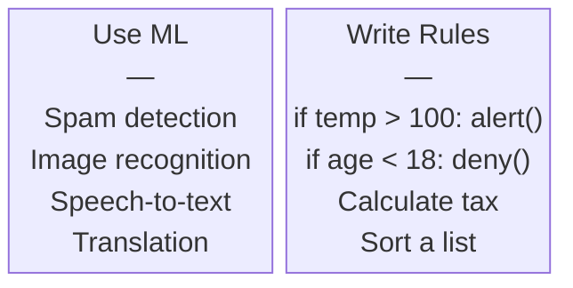
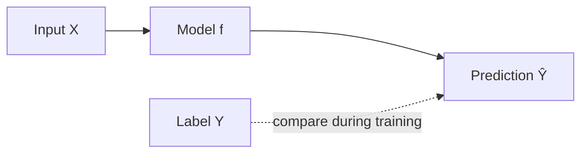
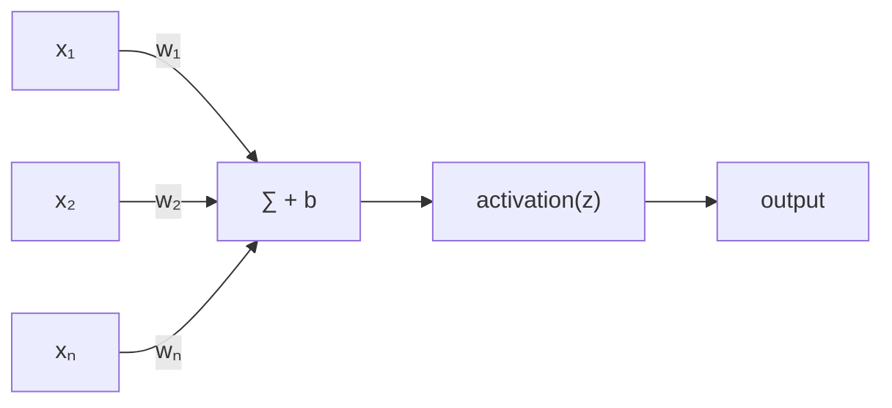
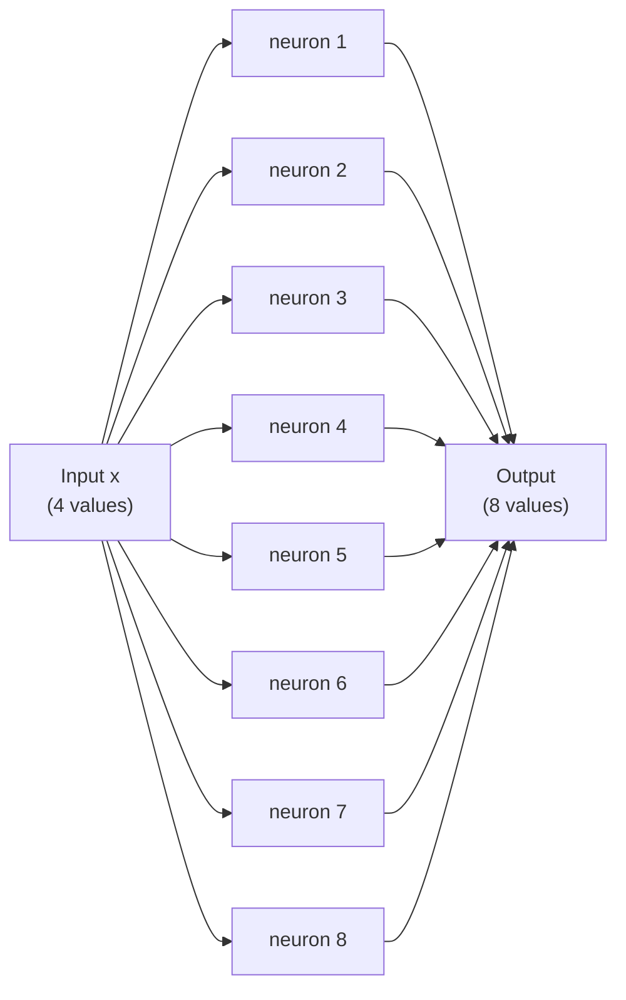
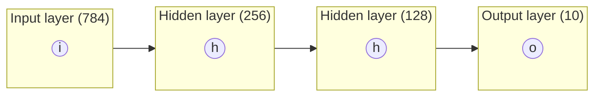
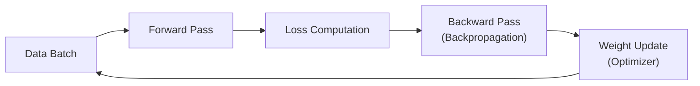

# ML & Neural Networks

A ground-up introduction to how machines learn, how neural networks are structured, and what happens when you train one.

---

## What Is Machine Learning?

Traditional programming: you write rules, the computer follows them.

Machine learning: you show the computer examples, and it figures out the rules.

- **Rule-based**: `if temperature > 100 and pressure > 50: alert()`
- **ML-based**: show the model thousands of sensor readings labeled "safe" or "dangerous", and it learns the boundary itself

The key shift is from *specifying* behavior to *demonstrating* it.

When rules are too complex to write by hand (language, vision, audio), ML is the practical path.

---

## Where ML Works Well

ML works when:

- You have examples of the thing you want to predict or classify
- The pattern is consistent enough that it generalizes
- You can tolerate some rate of error

It struggles when:

- Data is scarce or noisy
- You need guaranteed correctness (safety-critical logic)
- The rules are actually simple and well-defined



---

## Supervised Learning

The most common ML setup:

- **Inputs (X)**: the data you feed in (an image, a sentence, a row of numbers)
- **Labels (Y)**: the correct answer for each input ("cat", "spam", 42.5)
- **Prediction (Ŷ)**: what the model outputs given a new input

The model learns a function `f(X) → Y` from many `(X, Y)` pairs. At test time, it applies `f` to unseen `X`.

Examples:
- Classify an email as spam or not spam
- Predict tomorrow's temperature from today's weather
- Translate a sentence from English to French



---

## The Three Data Splits

You need three separate sets of data:

| Split              | Purpose                              | Typical size |
| ------------------ | ------------------------------------ | ------------ |
| **Training set**   | The model learns from this           | 70-80%       |
| **Validation set** | Tune hyperparameters, check progress | 10-15%       |
| **Test set**       | Final, one-time evaluation           | 10-15%       |

If you train and evaluate on the same data, you're grading your own exam. The test set must stay sealed until you are done making decisions. This is not optional.

---

## Overfitting and Underfitting

**Overfitting**: the model memorizes training data instead of learning the pattern.
- Training loss is low; validation loss is higher and rising
- Analogy: a student who memorizes practice exams but fails on new questions

**Underfitting**: the model is too simple to capture the actual pattern.
- Both training and validation loss are high
- Analogy: fitting a straight line to data that is clearly nonlinear

Signs of overfitting: training loss keeps dropping but validation loss starts rising.

Common fixes for overfitting: more data, dropout, regularization (weight decay), early stopping, simpler model.

---

## The Fitting Spectrum

The goal is the middle ground: a model that generalizes, not one that memorizes or ignores.

---

## A Single Neuron

The building block of every neural network.

A neuron takes inputs, multiplies each by a weight, adds a bias, and applies an activation function:

```
output = activation(w₁x₁ + w₂x₂ + ... + wₙxₙ + b)
       = activation(wᵀx + b)
```

- **Weights** (w): how much each input matters; learned during training
- **Bias** (b): shifts the activation threshold; also learned
- **Activation function**: adds nonlinearity (ReLU, sigmoid, tanh)

In PyTorch, one neuron with 3 inputs and 1 output is `nn.Linear(3, 1)`.

---

## A Single Neuron

```python
import torch
import torch.nn as nn

neuron = nn.Linear(3, 1)   # weight matrix (1, 3), bias (1,)
x = torch.tensor([1.0, 2.0, 3.0])
out = neuron(x)            # wᵀx + b
print(out.shape)           # torch.Size([1])
```

---

## Why Activation Functions Matter

Without a nonlinear activation function, stacking any number of layers is mathematically equivalent to a single linear transformation:

```
Layer 2(Layer 1(x)) = W₂(W₁x + b₁) + b₂ = (W₂W₁)x + (W₂b₁ + b₂)
```

This collapses to one linear layer regardless of depth. Activation functions break this collapse.

**ReLU** (Rectified Linear Unit) is the most common choice:

```
ReLU(z) = max(0, z)
```

Simple, cheap to compute, and empirically effective. Variants like GELU and SiLU are used in transformers.



---

## Why Activation Functions Matter

```python
import torch.nn.functional as F

z = torch.tensor([-2.0, -1.0, 0.0, 1.0, 2.0])
print(F.relu(z))    # tensor([0., 0., 0., 1., 2.])
print(F.gelu(z))    # smoother, used in BERT/GPT architectures
```

---

## From One Neuron to a Layer

A **layer** is a collection of neurons that all receive the same inputs but have different weights. In matrix form:

```
output = activation(W x + b)
```

where `W ∈ ℝ^(out_features × in_features)`, `b ∈ ℝ^(out_features)`.

Each of the 8 output neurons has its own row in `W` and learns to detect a different feature.



---

## From One Neuron to a Layer

```python
# A layer with 4 inputs and 8 outputs
layer = nn.Linear(4, 8)     # W: (8, 4), b: (8,)
x = torch.randn(4)          # one input vector
out = F.relu(layer(x))      # shape: (8,)
```

---

## A Full Neural Network

Stack several layers together:

- **Input layer**: receives raw data (pixels, token IDs, numbers)
- **Hidden layers**: learn intermediate representations
- **Output layer**: produces the final prediction

More layers can capture more complex patterns, but also cost more to train and are harder to optimize.



---

## A Full Neural Network

```python
model = nn.Sequential(
    nn.Linear(784, 256),   # input layer: 784 pixel values to 256 hidden units
    nn.ReLU(),
    nn.Linear(256, 128),   # hidden layer
    nn.ReLU(),
    nn.Linear(128, 10),    # output layer: 10 class scores (e.g., digits 0-9)
)

x = torch.randn(784)    # one flattened 28x28 image
logits = model(x)       # shape: (10,) -- raw scores for each class
```

---

## Loss Functions

The loss function measures how wrong the model is. Training minimizes it.

**Cross-entropy loss** for classification:

```
L = -∑ᵢ yᵢ log(p̂ᵢ)
```

where `yᵢ` is the true label (one-hot) and `p̂ᵢ` is the predicted probability. When the model assigns high probability to the correct class, the log term is close to zero and loss is low.

**Mean Squared Error** for regression:

```
L = (1/n) ∑ᵢ (yᵢ - ŷᵢ)²
```

Larger errors are penalized more heavily due to squaring.

---

## Loss Functions

```python
criterion_ce  = nn.CrossEntropyLoss()   # classification
criterion_mse = nn.MSELoss()            # regression

logits = torch.tensor([[2.0, 0.5, -1.0]])  # raw scores for 3 classes
target = torch.tensor([0])                  # correct class is 0
loss = criterion_ce(logits, target)
print(f"Cross-entropy loss: {loss.item():.4f}")
```

---

## What "Training" Actually Means

Training is iterative. Each step:

1. Feed a batch of inputs through the network (forward pass)
2. Compute the loss between predictions and labels
3. Compute how much each weight contributed to the error (backward pass / backpropagation)
4. Update each weight to reduce the loss (optimizer step)



---

## What "Training" Actually Means

```python
# Minimal training loop
optimizer = torch.optim.Adam(model.parameters(), lr=1e-3)
criterion = nn.CrossEntropyLoss()

for batch_x, batch_y in dataloader:
    optimizer.zero_grad()           # clear gradients from last step
    logits = model(batch_x)         # forward pass
    loss = criterion(logits, batch_y)
    loss.backward()                 # compute gradients
    optimizer.step()                # update weights
```

---

## Backpropagation and Gradients

Backpropagation applies the chain rule to compute the gradient of the loss with respect to every weight.

For a weight `w` deep in the network, the gradient `∂L/∂w` tells you: if you increase `w` by a tiny amount, how much does the loss increase?

PyTorch computes this automatically when you call `loss.backward()`. The result is stored in `param.grad` for each parameter.

Large gradient norms can indicate instability; very small norms indicate the model is barely updating.

---

## Backpropagation and Gradients

```python
# Inspect gradients after backward()
loss.backward()
for name, param in model.named_parameters():
    if param.grad is not None:
        print(f"{name}: grad norm = {param.grad.norm().item():.4f}")
```

---

## Optimizers

After computing gradients, the optimizer applies a weight update rule.

**SGD** (the conceptual baseline):

```
w ← w - η × ∂L/∂w
```

where `η` is the learning rate.

**Adam** adapts the learning rate for each weight individually using running estimates of the first and second moments of the gradient:

```
mₜ = β₁ mₜ₋₁ + (1 - β₁) gₜ           # first moment (mean)
vₜ = β₂ vₜ₋₁ + (1 - β₂) gₜ²          # second moment (variance)
w ← w - η × m̂ₜ / (√v̂ₜ + ε)          # bias-corrected update
```

Typical defaults: `β₁ = 0.9`, `β₂ = 0.999`, `ε = 1e-8`. Adam converges faster than SGD in practice and is the default for nearly all neural network training.

---

## Optimizers

```python
optimizer = torch.optim.Adam(model.parameters(), lr=1e-3, weight_decay=1e-2)
```

---

## Learning Rate

The single most important hyperparameter.

- **Too high**: weights overshoot; training diverges or oscillates
- **Too low**: training is very slow; may get stuck
- **Just right**: loss decreases steadily

Typical starting values: `1e-3` for training from scratch with Adam, `1e-4` to `2e-4` for fine-tuning pretrained models.

**Learning rate schedules** adjust the rate over training. Warmup prevents large, destabilizing updates at the start of training when gradients can be noisy.

---

## Learning Rate

```python
from transformers import get_cosine_schedule_with_warmup

scheduler = get_cosine_schedule_with_warmup(
    optimizer,
    num_warmup_steps=100,    # ramp from 0 to lr over 100 steps
    num_training_steps=1000, # then cosine decay to 0
)
```

---

## Putting It Together: The Full Training Loop

The full supervised learning workflow: collect data, split into train/val/test, define architecture, pick loss and optimizer, train with this loop, evaluate on validation, final test evaluation once.

---

## Putting It Together: The Full Training Loop

```python
import torch
import torch.nn as nn
from torch.utils.data import DataLoader, TensorDataset

# Model, data, loss, optimizer
model = nn.Sequential(nn.Linear(10, 64), nn.ReLU(), nn.Linear(64, 2))
optimizer = torch.optim.Adam(model.parameters(), lr=1e-3)
criterion = nn.CrossEntropyLoss()

X = torch.randn(1000, 10)
y = torch.randint(0, 2, (1000,))
loader = DataLoader(TensorDataset(X, y), batch_size=32, shuffle=True)

for epoch in range(10):
    total_loss = 0.0
    for batch_x, batch_y in loader:
        optimizer.zero_grad()
        logits = model(batch_x)
        loss = criterion(logits, batch_y)
        loss.backward()
        torch.nn.utils.clip_grad_norm_(model.parameters(), max_norm=1.0)  # gradient clipping
        optimizer.step()
        total_loss += loss.item()
    print(f"Epoch {epoch+1}: avg loss = {total_loss / len(loader):.4f}")
```

---

## Key Takeaways

- ML learns patterns from examples rather than explicit rules; supervised learning maps inputs to labels
- Always split data: train to learn, validation to tune, test to evaluate (test set stays sealed)
- Overfitting: memorizing training data; validation loss diverges from training loss. Fix with more data, dropout, or early stopping
- Underfitting: model too simple; both losses are high. Fix with more capacity, longer training
- A neuron computes `activation(wᵀx + b)`; activation functions (ReLU, GELU) add the nonlinearity that makes deep networks expressive
- `nn.Sequential` and `nn.Linear` build networks in PyTorch; `loss.backward()` computes all gradients automatically
- Cross-entropy loss: `L = -∑ yᵢ log(p̂ᵢ)` for classification. MSE: `L = (1/n) ∑ (yᵢ - ŷᵢ)²` for regression
- Adam is the default optimizer; learning rate (start at 1e-3, drop to 1e-4 for fine-tuning) is the most important hyperparameter
