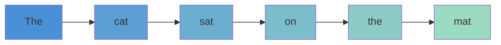
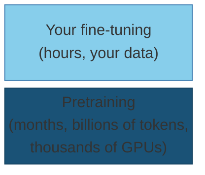
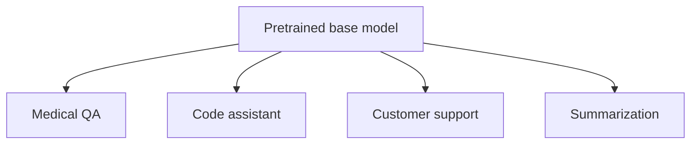

# Transformers and the Fine-tuning Mindset

How modern language models work at a conceptual level, and why fine-tuning a pretrained model is almost always the right starting point.

---

## The Problem with Sequential Models

Before transformers, language models were built on RNNs and LSTMs.

These process text one token at a time, left to right:

- To understand word 50, the model must pass information through words 1 through 49
- Long-range dependencies get "forgotten" or diluted over many steps
- Training is inherently sequential, which is slow

The hidden state at position `t` is a bottleneck: it must compress everything from positions 1 through `t-1` into a single fixed-size vector. This creates a hard ceiling on how well models can understand context.



---

## Attention: Looking at What Matters

The core insight of transformers: instead of reading one token at a time, let every token look directly at every other token.

**Attention** computes, for each position, a weighted combination of all other positions based on learned relevance:

```
Attention(Q, K, V) = softmax(QKᵀ / √d_k) · V
```

Example: "The trophy didn't fit in the suitcase because **it** was too big."

- What does "it" refer to? "trophy" or "suitcase"?
- Attention lets the model compare "it" directly against both words in one step

No sequential propagation. Any token attends to any other token directly.

---

## Why Attention Works So Well

Attention has three properties that made it win:

1. **Direct access**: any token connects to any other token regardless of distance. There is no path-length problem
2. **Learned relevance**: the model learns what to attend to from data, not from hand-coded rules
3. **Parallelizable**: unlike RNNs, the entire sequence is processed simultaneously during training

The parallelism point is critical. RNN computation is sequential: step `t` depends on step `t-1`. Transformer attention is a single matrix multiplication, parallelizable across the full sequence.

More GPUs = train faster on more data = better model. This scaling law does not apply to RNNs.

---

## Why Transformers Replaced RNNs

The shift happened quickly after the 2017 "Attention Is All You Need" paper.

**RNNs/LSTMs:**
- Sequential processing, hard to parallelize
- Struggle with long-range dependencies (vanishing gradients)
- Hit a wall scaling to more data or hardware

**Transformers:**
- Fully parallel training on the full sequence at once
- Direct attention across the full context window
- Scale smoothly: more parameters, more data, better performance

Today, essentially all frontier language models, and most state-of-the-art models in vision, audio, and code, are transformer-based.

---

## What Pretraining Means

A large language model is not designed for any specific task. It is trained on a massive corpus of text with one simple objective:

```
Predict the next token given all previous tokens:
  maximize  P(token_t | token_1, token_2, ..., token_{t-1})
```

This is called **pretraining**. The training loss is cross-entropy over the vocabulary:

```
L = -(1/T) ∑_{t=1}^{T} log P(token_t | token_1, ..., token_{t-1})
```

From this simple objective, the model absorbs grammar and syntax, world knowledge, reasoning patterns, and long-range context understanding. These capabilities emerge from prediction, not from explicit annotation.

GPT-4, Llama 3, Mistral 7B, Gemma, Qwen 2.5: all pretrained this way on trillions of tokens.

---

## The Scale of Pretraining

To understand why pretrained models are so valuable, consider what they represent:

- Llama 3 8B: 8 billion parameters, trained on roughly 15 trillion tokens
- Training requires thousands of H100 GPUs running for weeks
- Cost: millions of dollars in compute

You will not be replicating this. But you don't need to. Pretrained weights encode an enormous amount of useful structure, and they are freely available on HuggingFace. This one call downloads a model that required millions of dollars to produce and puts it on your GPU.



---

## The Scale of Pretraining

```python
from transformers import AutoModelForCausalLM, AutoTokenizer

model = AutoModelForCausalLM.from_pretrained(
    "meta-llama/Meta-Llama-3-8B-Instruct",
    torch_dtype=torch.bfloat16,
    device_map="auto",
)
tokenizer = AutoTokenizer.from_pretrained("meta-llama/Meta-Llama-3-8B-Instruct")
```

---

## Fine-tuning: Adapting to Your Task

Pretraining produces a general-purpose model. Fine-tuning specializes it.

You continue training on a much smaller, task-specific dataset. The pretrained weights are the starting point, not random initialization.

- The model already understands language
- Fine-tuning teaches it your task's style, format, and domain
- Existing knowledge is retained and redirected

Examples:
- Fine-tune Llama 3 8B on customer support conversations to make a support bot
- Fine-tune Mistral 7B on medical notes to improve clinical summarization
- Fine-tune Qwen 2.5 on code pairs to improve debugging assistance

Fine-tuning datasets are typically thousands to tens of thousands of examples, not trillions of tokens.

---

## Why You Almost Never Train From Scratch

Training from scratch means random initialization: the model knows nothing.

Reasons not to do it:

- **Data**: you'd need billions of tokens to match a pretrained model's language understanding
- **Compute**: weeks of multi-GPU time vs. hours or less for fine-tuning
- **Risk**: optimization is harder with no pretrained structure to build on

For almost everything you'll encounter in practice, start from a pretrained model. The exception is highly specialized domains where text pretraining doesn't transfer (some scientific, medical, or proprietary formats), and even then domain-adaptive pretraining on top of an existing model is more common than training from scratch.

---

## What Fine-tuning Changes and What It Keeps

**What changes:**
- The model's output style and format
- Domain-specific vocabulary and reasoning patterns
- Task-specific behavior (following a specific instruction format, generating structured output)

**What stays:**
- Broad language understanding
- World knowledge from pretraining data
- The ability to generalize within the task

Think of it as: pretraining is general education (years of school), fine-tuning is on-the-job training for a specific role (days or weeks). The general knowledge built during pretraining doesn't disappear.

---

## The Pretrain-Once, Fine-tune-Many Mental Model

One pretrained model can be the base for many different fine-tunes.

The practical workflow:
1. Pick a pretrained base model appropriate for your task (size, language, modality)
2. Collect a small labeled dataset for your specific task
3. Fine-tune for a relatively short time
4. Evaluate and iterate



---

## The Pretrain-Once, Fine-tune-Many Mental Model

```python
base = "meta-llama/Meta-Llama-3-8B-Instruct"  # one shared base

# Produce four specialized variants:
finetune("medical_qa_data.jsonl",       output="llama3-medical-qa")
finetune("customer_support_data.jsonl", output="llama3-support-bot")
finetune("code_debug_pairs.jsonl",      output="llama3-debugger")
finetune("summarization_data.jsonl",    output="llama3-summarizer")
```

---

## Choosing a Base Model

Not all pretrained models are equal. Consider:

- **Size**: larger models are more capable but cost more to run and fine-tune. 7-8B models are the practical sweet spot for single-GPU work
- **Training data**: Qwen 2.5 excels at multilingual and code; Llama 3 is strong across general English tasks; Mistral 7B is efficient and well-rounded
- **License**: check whether the model allows your intended use. Llama 3 has a use-based license; Mistral and Qwen are more permissive
- **Instruction-tuned vs. base**: instruction-tuned models already follow instructions and are safer starting points for most tasks; base models are raw next-token predictors that need more guidance

For most hackathon tasks, a 7B or 8B instruction-tuned model (`-Instruct` or `-Chat` suffix on HuggingFace) is a solid starting point.

---

## Running a Pretrained Model

This is inference. Fine-tuning is the same model, but with gradients enabled and a training loop.

---

## Running a Pretrained Model

```python
import torch
from transformers import AutoModelForCausalLM, AutoTokenizer

model_id = "meta-llama/Meta-Llama-3-8B-Instruct"
tokenizer = AutoTokenizer.from_pretrained(model_id)
model = AutoModelForCausalLM.from_pretrained(
    model_id,
    torch_dtype=torch.bfloat16,
    device_map="auto",
)

messages = [
    {"role": "system", "content": "You are a helpful assistant."},
    {"role": "user",   "content": "Explain attention in transformers in two sentences."},
]

input_ids = tokenizer.apply_chat_template(
    messages, add_generation_prompt=True, return_tensors="pt"
).to(model.device)

with torch.no_grad():
    output_ids = model.generate(input_ids, max_new_tokens=200, do_sample=False)

response = tokenizer.decode(output_ids[0][input_ids.shape[1]:], skip_special_tokens=True)
print(response)
```

---

## Key Takeaways

- Attention: `softmax(QKᵀ / √d_k) · V`. Every token attends to every other token directly, solving the long-range dependency problem
- Transformers parallelized training in a way RNNs could not, enabling the scale that makes modern LLMs possible
- Pretraining objective: predict the next token. Everything else, grammar, knowledge, reasoning, emerges from this at scale
- Fine-tuning adapts pretrained knowledge to a specific task with a small dataset and far less compute
- Training from scratch is almost never the right call; start from a pretrained model (Llama 3, Mistral 7B, Qwen 2.5, Gemma)
- One base model can produce many specialized fine-tunes; `AutoModelForCausalLM.from_pretrained` puts it on your GPU in one call
