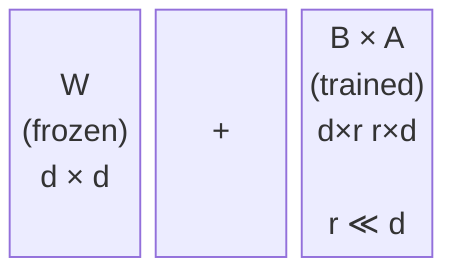

# Fine-tuning in Practice

A practical guide to the decisions you'll actually make when fine-tuning a language model: full fine-tuning vs. LoRA, which hyperparameters to care about, and how to recognize when things are going wrong.

---

## Two Main Approaches

When fine-tuning a pretrained model, you have two broad options:

| Approach             | What it does                                       | Cost                      |
| -------------------- | -------------------------------------------------- | ------------------------- |
| **Full fine-tuning** | Updates all model weights                          | High memory, high compute |
| **LoRA**             | Adds small trainable matrices, most weights frozen | Low memory, low compute   |

Both can produce excellent results. The choice depends on your data, hardware, and how much the model needs to change.

---

## Full Fine-tuning

Every parameter in the model is updated during training.

**When it makes sense:**
- You have a large, high-quality dataset (tens of thousands of examples or more)
- The task is quite different from the model's pretraining distribution
- You have the compute to support it

**Tradeoffs:**
- Requires storing optimizer states for all parameters. With Adam, that is 2 extra fp32 tensors per parameter, roughly 3-4x the model size in memory
- A 7B model with full fine-tuning and Adam requires ~80-100 GB VRAM without any memory tricks
- Risk of catastrophic forgetting if learning rate is too high or dataset is too small

---

## Full Fine-tuning

```python
from transformers import AutoModelForCausalLM, TrainingArguments, Trainer

model = AutoModelForCausalLM.from_pretrained(
    "meta-llama/Meta-Llama-3-8B-Instruct",
    torch_dtype=torch.bfloat16,
)
# All parameters have requires_grad=True by default: full fine-tuning
```

---

## LoRA: Low-Rank Adaptation

LoRA (Hu et al., 2022) is the most widely used parameter-efficient fine-tuning method.

The idea: freeze all original model weights, and add small trainable matrices alongside specific layers. The weight update `ΔW` is constrained to be low-rank:

```
W_new = W + ΔW = W + B A

B ∈ ℝ^(d × r),  A ∈ ℝ^(r × k),  r << min(d, k)
```

For a 4096 × 4096 weight matrix with rank `r = 16`:
- LoRA parameters: `2 × 4096 × 16 = 131,072`
- Original parameters: `4096 × 4096 = 16,777,216`
- Reduction: **128x per layer**



---

## Why LoRA Works

It might seem like adding tiny matrices can't change a model's behavior much.

It works because:

- Pretrained models already have excellent representations; you only need to steer them
- The "change" needed for most fine-tuning tasks is intrinsically low-rank: the task occupies a small subspace of the weight space
- Frozen weights preserve general knowledge; the new matrices capture task-specific behavior

Frozen base weights also mean optimizer states are only needed for the LoRA parameters, not the full model. This is the primary reason LoRA is so memory-efficient.

---

## LoRA: Setting It Up with PEFT

Only ~0.26% of parameters are trained. The rest stay frozen in bf16.

---

## LoRA: Setting It Up with PEFT

```python
from transformers import AutoModelForCausalLM
from peft import LoraConfig, get_peft_model, TaskType
import torch

model = AutoModelForCausalLM.from_pretrained(
    "meta-llama/Meta-Llama-3-8B-Instruct",
    torch_dtype=torch.bfloat16,
    device_map="auto",
)

lora_config = LoraConfig(
    r=16,                   # rank: adapter capacity
    lora_alpha=32,          # scaling factor: effective = alpha/r = 2.0
    target_modules=["q_proj", "k_proj", "v_proj", "o_proj"],  # attention only
    lora_dropout=0.05,
    bias="none",
    task_type=TaskType.CAUSAL_LM,
)

model = get_peft_model(model, lora_config)
model.print_trainable_parameters()
# trainable params: 20,971,520 || all params: 8,051,232,768 || trainable%: 0.26
```

---

## LoRA Hyperparameters

**Rank (r):** controls adapter capacity. Higher rank = more expressive but more parameters and memory.
- `r = 8` or `r = 16`: general purpose default
- `r = 4`: minimal, for simple format or style changes
- `r = 64`: larger capacity for tasks requiring substantial knowledge updates

**Alpha (α):** scales the LoRA output by `α/r`. A common default is `α = 2r` (e.g., rank 16, alpha 32). If you don't want to think about it, set `α = r` for a neutral scaling factor of 1.

**Target modules:** which layers to apply LoRA to.
- Attention only (`q_proj`, `k_proj`, `v_proj`, `o_proj`): default, works for most tasks
- Add MLP layers (`gate_proj`, `up_proj`, `down_proj`) for tasks requiring factual recall or domain knowledge injection

---

## Choosing Between Full Fine-tuning and LoRA

| Situation                                   | Recommendation                       |
| ------------------------------------------- | ------------------------------------ |
| Small dataset (< 5k examples)               | LoRA: full fine-tuning will overfit  |
| Large dataset (> 50k examples)              | Full fine-tuning or LoRA both viable |
| Limited VRAM (< 24 GB)                      | LoRA                                 |
| Task very far from pretraining distribution | Full fine-tuning preferred           |
| Need to quickly iterate on multiple tasks   | LoRA (swap adapters, keep base)      |
| Deploying many task variants                | LoRA (one base, many adapters)       |

When in doubt, start with LoRA. It is faster to iterate, cheaper to run, and often matches full fine-tuning quality.

---

## A Minimal Training Loop with SFTTrainer

The `trl` library's `SFTTrainer` handles the boilerplate for supervised fine-tuning.

---

## A Minimal Training Loop with SFTTrainer

```python
from trl import SFTTrainer, SFTConfig
from datasets import load_dataset

dataset = load_dataset("json", data_files="data/train.jsonl", split="train")

train_args = SFTConfig(
    output_dir="./checkpoints",
    num_train_epochs=3,
    per_device_train_batch_size=2,
    gradient_accumulation_steps=8,   # effective batch = 16
    learning_rate=2e-4,
    lr_scheduler_type="cosine",
    warmup_ratio=0.05,
    bf16=True,
    logging_steps=10,
    save_steps=100,
    evaluation_strategy="steps",
    eval_steps=100,
    max_seq_length=2048,
    dataset_text_field="text",       # field in your dataset containing the text
)

trainer = SFTTrainer(
    model=model,       # the model with LoRA applied
    args=train_args,
    train_dataset=dataset,
    tokenizer=tokenizer,
)
trainer.train()
```

---

## Hyperparameters That Actually Matter

You will encounter dozens of hyperparameters. These four have the biggest impact:

**Learning rate**: the most important. For LoRA fine-tuning, `2e-4` is a common starting point. For full fine-tuning, `1e-5` to `5e-5`. Too high causes instability; too low means nothing changes.

**Number of epochs**: how many passes through the dataset. 1-3 epochs is typical for large datasets. More epochs on small datasets increases overfitting risk.

**Batch size**: examples per gradient update. Use gradient accumulation if you need a large effective batch but have limited VRAM (`gradient_accumulation_steps` in `SFTConfig`).

**Warmup steps**: a short period at the start where the learning rate ramps from 0. Prevents unstable early updates. Typically 5-10% of total steps (`warmup_ratio=0.05`).

---

## Learning Rate in More Detail

Signs it is too high:
- Loss spikes or becomes NaN early in training
- Validation loss oscillates rather than trending down
- Outputs become incoherent

Signs it is too low:
- Loss barely moves after many steps
- Training looks fine but the model does not improve on your task

`SFTTrainer` sets this up automatically when you pass `lr_scheduler_type="cosine"` and `warmup_ratio=0.05`.

---

## Learning Rate in More Detail

```python
# Learning rate schedule with warmup and cosine decay
from transformers import get_cosine_schedule_with_warmup

total_steps = len(dataloader) * num_epochs
warmup_steps = int(0.05 * total_steps)

scheduler = get_cosine_schedule_with_warmup(
    optimizer,
    num_warmup_steps=warmup_steps,
    num_training_steps=total_steps,
)
```

---

## Common Failure Mode: Overfitting

Symptoms:
- Training loss is low, validation loss is higher and growing
- Model outputs training examples almost verbatim
- Performance on held-out data is poor

Causes and fixes:

| Cause                                | Fix                                           |
| ------------------------------------ | --------------------------------------------- |
| Too few training examples            | Collect more data, use data augmentation      |
| Too many epochs                      | Stop earlier, use early stopping              |
| Learning rate too high               | Reduce by 10x                                 |
| Model too large for data             | Use a smaller model or heavier regularization |
| LoRA rank too high for small dataset | Reduce rank                                   |

Early stopping monitors validation loss and halts training when it starts rising. `SFTTrainer` supports this via `load_best_model_at_end=True`.

---

## Common Failure Mode: Training Instability

Symptoms:
- Loss suddenly spikes mid-training
- Loss oscillates wildly rather than declining
- Training produces NaN values

Causes and fixes:

| Cause                  | Fix                                    |
| ---------------------- | -------------------------------------- |
| Learning rate too high | Reduce, add warmup                     |
| No gradient clipping   | Add `max_grad_norm=1.0`                |
| Bad data batches       | Inspect and clean your dataset         |
| Mixed precision issues | Try fp32 or switch bf16/fp16           |
| Batch size too small   | Increase, or use gradient accumulation |

Gradient clipping clips the gradient norm to a maximum value before the optimizer step:

```
if ‖∇θ‖ > max_norm:
    ∇θ ← ∇θ × (max_norm / ‖∇θ‖)
```

Add `max_grad_norm=1.0` to your `SFTConfig`. It costs almost nothing and prevents the worst instability cases.

---

## Common Failure Mode: No Improvement

Symptoms:
- Loss decreases but the model's actual outputs do not improve on your task
- Evaluation metrics stay flat despite training

Possible causes:
- **Learning rate too low**: the model barely updates
- **Wrong task format**: if the instruction format during training does not match evaluation, the model does not transfer
- **Data quality issue**: noisy or mislabeled examples confuse the model
- **Wrong layers targeted (LoRA)**: try including more modules

The most common culprit: a mismatch between training format and evaluation format. Check that the prompt template is identical in both.

---

## Common Failure Mode: No Improvement

```python
# Consistent prompt template: define once, use everywhere
def format_prompt(instruction, response=""):
    return f"<|begin_of_text|><|start_header_id|>user<|end_header_id|>\n{instruction}<|eot_id|><|start_header_id|>assistant<|end_header_id|>\n{response}"

# Use the same function for training data formatting AND evaluation
```

---

## A Minimal Fine-tuning Checklist

Before starting a training run:

- [ ] Dataset is cleaned and de-duplicated
- [ ] Train/validation split is in place
- [ ] Prompt template is consistent across train and eval
- [ ] Learning rate and warmup steps are configured
- [ ] Gradient clipping is enabled (`max_grad_norm=1.0`)
- [ ] Logging is set up (loss, eval metric, learning rate)
- [ ] You know what "success" looks like before you run

During training:
- [ ] Watch the first few steps: if loss does not start dropping, stop and debug
- [ ] Check validation loss regularly, not just training loss
- [ ] Save checkpoints so you can recover from spikes

---

## Key Takeaways

- Full fine-tuning updates all weights and needs 80+ GB VRAM for a 7B model with Adam; use it when you have data and hardware
- LoRA adds low-rank matrices `ΔW = BA` (rank `r << d`) and freezes the rest; ~0.26% of 8B parameters trained at `r=16`
- Set up LoRA with `peft.LoraConfig` and `get_peft_model`; train with `trl.SFTTrainer`
- Learning rate, epochs, batch size, and warmup are the four hyperparameters to tune first
- Overfitting: diverging validation loss. Instability: loss spikes or NaN. No improvement: check format mismatch before anything else
- Add gradient clipping (`max_grad_norm=1.0`) and monitor validation loss from the start
- Prompt template must be identical during training and evaluation; this is the most common silent failure
