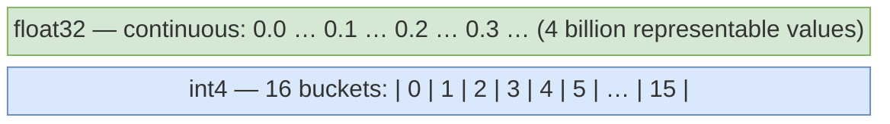

# Surviving Limited VRAM

How to understand GPU memory, where it goes during training, and the practical techniques to fit larger models and bigger batches on the hardware you actually have.

---

## Why VRAM Is the Binding Constraint

When training neural networks on a GPU, everything lives in VRAM (video RAM), and VRAM is finite.

Unlike CPU RAM (often 64 GB or more on a workstation), a single GPU typically has:
- Consumer card (RTX 3090/4090): 24 GB
- Cloud/datacenter (A100): 40 or 80 GB
- Colab free tier (T4): 16 GB

A 7B-parameter model in 16-bit floats takes roughly 14 GB for weights alone, before any training overhead.

Running out of VRAM does not just slow you down; it crashes your training run with an out-of-memory (OOM) error.

---

## What's Actually Using Your VRAM?

VRAM usage during training comes from four sources:

| Source               | What it is                             | Relative size               |
| -------------------- | -------------------------------------- | --------------------------- |
| **Parameters**       | The model's weights                    | 1x                          |
| **Gradients**        | `∂L/∂w` for each weight                | ~1x                         |
| **Optimizer states** | Adam stores `m` and `v` per weight     | ~2x in fp32                 |
| **Activations**      | Intermediate values saved for backprop | Scales with batch × seq_len |

With Adam and fp32, just parameters + gradients + optimizer states is roughly 4x the parameter memory.

For a 7B model in fp32: `7B × 4 bytes × 4 ≈ 112 GB`. That does not fit on any single consumer GPU.

This is why you need the techniques covered in this deck.

---

## VRAM Math in Detail

```
Full fine-tuning, 7B model, Adam, mixed precision:

  bf16 working copy:           7B × 2 bytes = 14 GB
  fp32 master weights:         7B × 4 bytes = 28 GB
  Adam first moment (fp32):    7B × 4 bytes = 28 GB
  Adam second moment (fp32):   7B × 4 bytes = 28 GB
  ─────────────────────────────────────────────────
  Before activations:                         98 GB

  With QLoRA (4-bit base, LoRA adapters only trained):
  NF4 base:                    7B × 0.5 bytes = 3.5 GB
  LoRA adapters (bf16):                        ~0.1 GB
  Adam states for LoRA only:                   ~0.2 GB
  ─────────────────────────────────────────────────
  Before activations:                          ~3.8 GB
```

QLoRA compresses the pre-activation footprint from ~98 GB to ~4 GB for a 7B model.

---

## Reading nvidia-smi

`nvidia-smi` is your first diagnostic tool.

```
$ nvidia-smi

+-----------------------------------------------------------------------------+
| NVIDIA-SMI 535.86.10    Driver Version: 535.86.10    CUDA Version: 12.2    |
|-------------------------------+----------------------+----------------------+
| GPU  Name        Persistence-M| Bus-Id        Disp.A | Volatile Uncorr. ECC |
| Fan  Temp  Perf  Pwr:Usage/Cap|         Memory-Usage | GPU-Util  Compute M. |
|   0  NVIDIA A100-SXM4   Off  | 00000000:00:04.0 Off |                    0 |
| N/A   36C    P0   68W / 400W |  24512MiB / 40960MiB |     82%      Default |
+-----------------------------------------------------------------------------+
```

Key fields:
- **Memory-Usage**: `24512MiB / 40960MiB` = 24.5 GB used of 40 GB total
- **GPU-Util**: percentage of time the GPU is doing compute; low values mean you are bottlenecked on data loading or CPU
- **Pwr:Usage/Cap**: near capacity means the GPU is working hard

`watch -n 1 nvidia-smi` refreshes every second for real-time monitoring.

---

## Checking Memory from Python

`memory_reserved` is what PyTorch has claimed from the OS (its internal pool). `memory_allocated` is what is actively in use. The difference is internal fragmentation; call `torch.cuda.empty_cache()` to release unused reserved memory back to the OS.

---

## Checking Memory from Python

```python
import torch

# Current usage
print(f"Allocated: {torch.cuda.memory_allocated() / 1e9:.2f} GB")
print(f"Reserved:  {torch.cuda.memory_reserved()  / 1e9:.2f} GB")

# Peak since last reset
torch.cuda.reset_peak_memory_stats()
# ... run training step ...
print(f"Peak:      {torch.cuda.max_memory_allocated() / 1e9:.2f} GB")

# Detailed breakdown by allocation site
print(torch.cuda.memory_summary(device=0, abbreviated=True))
```

---

## Mixed Precision: fp16 and bf16

By default, PyTorch uses 32-bit floats (fp32): 4 bytes per value.

**Mixed precision** uses 16-bit formats for most operations, roughly halving memory.

| Format | Bits | Range   | Notes                                       |
| ------ | ---- | ------- | ------------------------------------------- |
| fp32   | 32   | ±3.4e38 | Default, most stable                        |
| fp16   | 16   | ±65504  | Risk of overflow with large activations     |
| bf16   | 16   | ±3.4e38 | Same range as fp32, less mantissa precision |

**bf16 is generally preferred** for training on modern hardware (Ampere GPUs and newer). It has fp32's dynamic range, so it is much less prone to NaN than fp16.

A fp32 master copy of weights is kept for the optimizer update; the forward and backward passes run in fp16/bf16. This is why it is called "mixed" precision.

In HuggingFace `SFTTrainer` / `TrainingArguments`, just pass `bf16=True`. On older GPUs (T4, V100): use `fp16=True` with automatic loss scaling.

---

## What Mixed Precision Costs

Mixed precision is almost always worth enabling:

**Memory savings**: ~40-50% reduction in activation and gradient memory.

**Speed**: bf16/fp16 operations are faster on tensor cores (often 2-4x throughput vs. fp32).

**Risks**:
- fp16 can produce NaN if activations overflow its limited range. Use automatic loss scaling (the default in most libraries)
- bf16 requires Ampere or newer (RTX 3000 series, A100, H100). On older hardware, use fp16
- Some operations always run in fp32 internally for stability (layer norm, softmax). This is handled automatically

---

## Gradient Accumulation

The problem: you want an effective batch size of 32, but VRAM only fits 4 examples at a time.

**Gradient accumulation** runs multiple small batches and sums gradients before updating weights. Memory usage is determined by the micro-batch size, not the effective batch size.

**What it costs**: time. 8 accumulation steps = 8x more forward/backward passes per weight update. No extra memory.

In `SFTTrainer`, set `gradient_accumulation_steps=8` and it handles this for you.

---

## Gradient Accumulation

```python
accumulation_steps = 8  # effective batch = 4 × 8 = 32

for i, batch in enumerate(dataloader):
    loss = model(batch).loss / accumulation_steps  # normalize the loss
    loss.backward()                                 # accumulate gradients

    if (i + 1) % accumulation_steps == 0:
        torch.nn.utils.clip_grad_norm_(model.parameters(), 1.0)
        optimizer.step()
        scheduler.step()
        optimizer.zero_grad()
```

---

## Gradient Checkpointing

During the forward pass, PyTorch saves all intermediate activations for use in backpropagation.

For a large model with long sequences, these activations can be the single largest consumer of VRAM. Activation memory scales as `batch × seq_len × hidden_dim × layers`.

**Gradient checkpointing** discards most saved activations during the forward pass and recomputes them from saved checkpoints during the backward pass.

- **Memory**: up to 60-80% reduction in activation memory
- **Cost**: roughly 30-40% more compute per step (each discarded activation is recomputed once)

Use this whenever you are memory-constrained. The compute overhead is usually acceptable.

---

## Gradient Checkpointing

```python
# Enable for the whole model
model.gradient_checkpointing_enable()
model.config.use_cache = False   # KV cache is incompatible with checkpointing during training

# Or via SFTConfig:
train_args = SFTConfig(
    gradient_checkpointing=True,
    ...
)
```

---

## Quantization: What It Is

Quantization reduces the numerical precision of model weights, trading some accuracy for massive memory savings.

| Format     | Bytes/weight | 7B model size |
| ---------- | ------------ | ------------- |
| fp32       | 4 bytes      | ~28 GB        |
| bf16/fp16  | 2 bytes      | ~14 GB        |
| int8       | 1 byte       | ~7 GB         |
| int4 / NF4 | 0.5 bytes    | ~3.5 GB       |

Instead of storing a weight as a 32-bit float, you store it as an 8-bit or 4-bit integer and scale it back when needed.

The key insight: most neural network weights are small and clustered near zero. A 4-bit grid with bins placed at the right intervals captures most of the information. Well-calibrated 4-bit quantization (NF4, GPTQ, AWQ) causes 1-3% quality loss on benchmarks.



---

## Loading a Quantized Model

Loading a 4-bit quantized model with `bitsandbytes` for QLoRA training. Then apply LoRA on top with `peft.LoraConfig` as usual. This combination is QLoRA.

---

## Loading a Quantized Model

```python
import torch
from transformers import AutoModelForCausalLM, BitsAndBytesConfig

bnb_config = BitsAndBytesConfig(
    load_in_4bit=True,
    bnb_4bit_quant_type="nf4",             # NormalFloat4: optimized for neural net weight distributions
    bnb_4bit_compute_dtype=torch.bfloat16, # dequantize to bf16 for matmuls
    bnb_4bit_use_double_quant=True,        # quantize the quantization scales too (~0.37 bits saved)
)

model = AutoModelForCausalLM.from_pretrained(
    "meta-llama/Meta-Llama-3-8B-Instruct",
    quantization_config=bnb_config,
    device_map="auto",
)

# The model is now in memory at ~4.5 GB instead of 14 GB
print(f"Model memory: {torch.cuda.memory_allocated() / 1e9:.1f} GB")
```

---

## Combining Techniques

These techniques stack. A realistic QLoRA setup for a 7B model on a 16 GB GPU:

| Technique                           | Effect                                         |
| ----------------------------------- | ---------------------------------------------- |
| NF4 4-bit quantization (base model) | ~80% reduction in parameter memory             |
| LoRA (train only adapters)          | ~95% less optimizer state memory               |
| bf16 activations                    | ~50% reduction in activation memory            |
| Gradient checkpointing              | ~75% of remaining activation memory eliminated |
| Flash Attention                     | Removes O(seq²) attention memory term          |

Combined, you can fine-tune Llama 3 8B on a 16 GB T4 that would otherwise require 100+ GB.

The tradeoff is training speed: every technique except quantization adds compute overhead. On a T4, a 1-hour run might become 3-4 hours with all techniques enabled.

---

## Debugging OOM Errors

Out-of-memory errors look like:

```
RuntimeError: CUDA out of memory. Tried to allocate 2.00 GiB
(GPU 0; 15.78 GiB total capacity; 14.20 GiB already allocated)
```

Systematic approach:

1. Check `torch.cuda.memory_allocated()` and `nvidia-smi`: how much was free before the crash?
2. Reduce `per_device_train_batch_size` by half, try again
3. Enable gradient checkpointing if not already on
4. Enable bf16 or fp16 if not already on
5. Reduce `max_seq_length`: attention memory scales quadratically with sequence length without Flash Attention
6. Switch from full fine-tuning to LoRA
7. Switch from LoRA in bf16 to QLoRA (4-bit base)
8. If it still OOMs with batch size 1, the model is too large for the GPU without quantization

---

## Debugging OOM Errors

```python
# Add this before your training loop to find the exact allocation causing the OOM
torch.cuda.memory._record_memory_history()
# ... reproduce the OOM ...
# Then upload the snapshot to pytorch.org/memory_viz
```

---

## Key Takeaways

- VRAM is shared by weights, gradients, optimizer states, and activations; with Adam full fine-tuning, you need ~98 GB for 7B before activations
- `nvidia-smi` and `torch.cuda.memory_allocated()` tell you what is happening; use the PyTorch memory snapshot for detailed allocation traces
- Mixed precision (bf16 on Ampere+) cuts activation and gradient memory ~50% with minimal quality impact; set `bf16=True` in `SFTConfig`
- Gradient accumulation trades time for memory: `gradient_accumulation_steps=8` with micro-batch 2 gives effective batch 16 with no extra VRAM
- Gradient checkpointing recomputes activations during backprop instead of storing them: 60-80% memory reduction at ~33% extra compute
- Quantization (NF4 4-bit via `BitsAndBytesConfig`) compresses parameter storage from 14 GB to 3.5 GB for a 7B model
- When facing OOM errors: reduce batch size, then enable gradient checkpointing, then quantize; work through the list systematically
