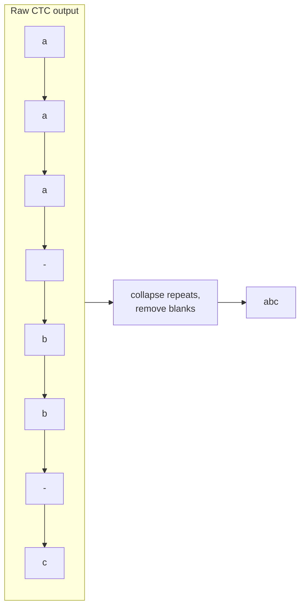
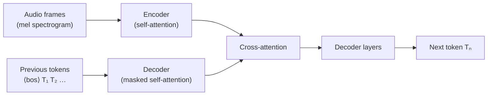
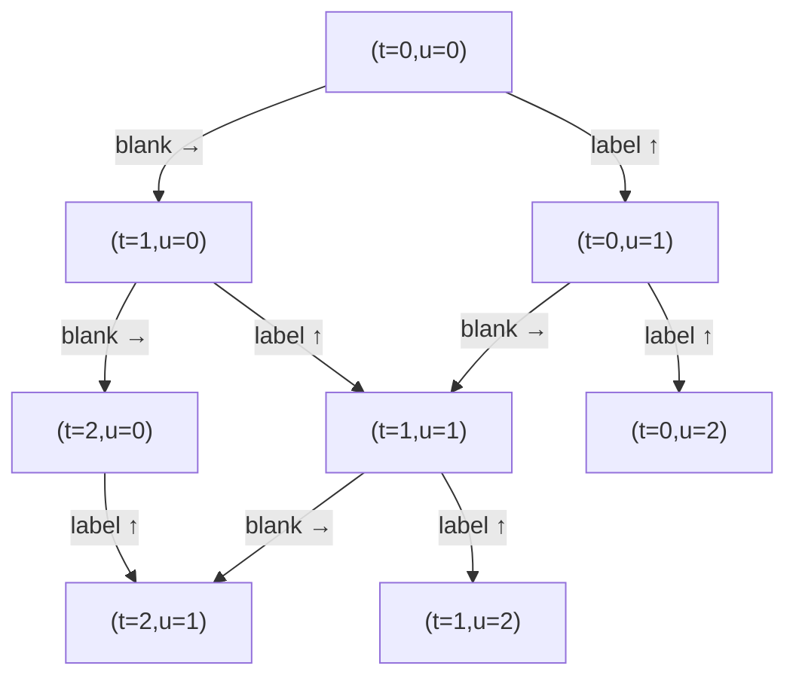
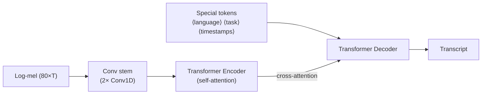
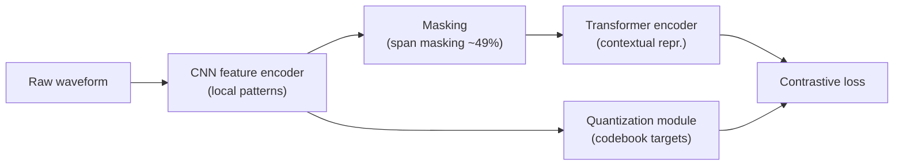
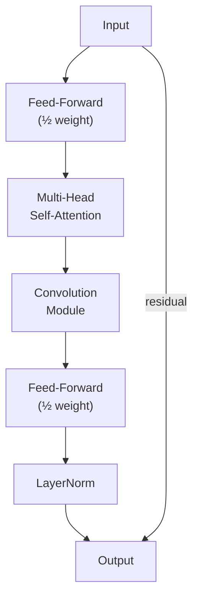

# ASR Architecture Landscape

A survey of the major paradigms in modern automatic speech recognition.

---

## The Core Problem All ASR Models Solve

**Mapping a variable-length audio sequence to a variable-length text sequence**

- Input: a sequence of audio frames (typically log-mel spectrogram), length T
- Output: a sequence of tokens (characters, subwords, words), length U
- T and U are different and not known in advance
- T >> U in general (hundreds of frames per word)

The fundamental challenge: **alignment**. Which audio frames correspond to which output tokens? Early systems required explicit forced alignment; modern systems avoid it.

---

## Three Dominant ASR Paradigms

Three dominant paradigms:
1. **CTC**: alignment-free, non-autoregressive
2. **Seq2Seq**: autoregressive encoder-decoder
3. **RNN-T**: streaming-friendly transducer

---

## CTC — Core Idea

**Connectionist Temporal Classification**

- Introduced by Graves et al. (2006); still widely used
- The encoder maps each audio frame to a probability distribution over the vocabulary + one special **blank token**
- Output at each frame is independent of other output frames

The blank token serves two purposes:
1. Absorbs frames where "nothing new is being said"
2. Separates repeated characters ("tt" vs. "t")



---

## CTC Loss Formulation

**CTC marginalizes over all valid alignments during training**

Let `x` be the input audio and `y` be the target label sequence of length U. The set of all valid CTC paths `B^{-1}(y)` consists of every frame-level sequence that collapses (after removing blanks and repeats) to `y`.

```
p(y | x) = Σ_{π ∈ B^{-1}(y)} Π_{t=1}^{T} p(π_t | x)
```

- `π_t` is the label (including blank) predicted at frame `t`
- Each frame prediction is independent given the encoder output
- The sum over all valid paths is computed efficiently with the forward-backward algorithm (analogous to HMM Baum-Welch)
- Training loss: `L_CTC = -log p(y | x)`

This is why CTC requires T >= U: you need at least one frame per output label plus blanks.

---

## CTC — Greedy Decoding in Code

**Argmax at each frame, then collapse**

---

## CTC — Greedy Decoding in Code

```python
import torch
import torch.nn.functional as F

def ctc_greedy_decode(log_probs: torch.Tensor, blank_id: int = 0) -> list[int]:
    """
    log_probs: [T, vocab_size] log-probabilities from CTC head
    Returns the collapsed token sequence (no blanks, no repeats).
    """
    # Argmax at every frame
    tokens = log_probs.argmax(dim=-1).tolist()  # length T

    # Collapse: remove blanks and consecutive duplicates
    result = []
    prev = None
    for tok in tokens:
        if tok != blank_id and tok != prev:
            result.append(tok)
        prev = tok
    return result

# Example: encoder output -> CTC logits -> greedy decode
# model is a CTC model with a linear head on top of the encoder
log_probs = F.log_softmax(model(features), dim=-1)  # [T, V]
token_ids = ctc_greedy_decode(log_probs, blank_id=0)
```

---

## CTC — Beam Search with Language Model

**Shallow LM fusion improves accuracy significantly on homophones and rare words**

The rescoring formula for beam search with LM integration:

```
score(y) = log p_CTC(y | x) + λ · log p_LM(y) + β · |y|
```

- `log p_CTC(y | x)`: acoustic model score (sum of frame-level log-probs along the best path)
- `λ · log p_LM(y)`: language model score scaled by weight `λ` (typically 0.3 to 1.0)
- `β · |y|`: length bonus to prevent the model from preferring shorter hypotheses
- `|y|` is the number of output tokens

---

## CTC — Beam Search with Language Model

```python
from pyctcdecode import build_ctcdecoder

# Build decoder with KenLM language model
decoder = build_ctcdecoder(
    labels=vocab_list,           # list of tokens including "" for blank
    kenlm_model="lm.arpa",       # KenLM n-gram language model
    alpha=0.5,                   # LM weight (lambda)
    beta=1.0                     # word insertion bonus
)

# Beam search decode: returns best transcript string
logits = model(features).cpu().numpy()  # [T, V] numpy array
transcript = decoder.decode(logits, beam_width=100)
print(transcript)
```

---

## CTC — Alignment and Training: Practical Notes

**Training a CTC model with HuggingFace**

---

## CTC — Alignment and Training: Practical Notes

```python
from transformers import Wav2Vec2ForCTC, Wav2Vec2Processor
import torch

processor = Wav2Vec2Processor.from_pretrained(
    "facebook/wav2vec2-large-xlsr-53"
)
model = Wav2Vec2ForCTC.from_pretrained(
    "facebook/wav2vec2-large-xlsr-53"
)

# Tokenize audio
inputs = processor(
    audio_array,          # raw waveform at 16 kHz as numpy array
    sampling_rate=16000,
    return_tensors="pt",
    padding=True
)

with torch.no_grad():
    logits = model(**inputs).logits  # [batch, T, vocab]

# Greedy decode
predicted_ids = logits.argmax(dim=-1)
transcription = processor.batch_decode(predicted_ids)
print(transcription)
```

---

## CTC — Decoding and Limitations

**CTC decoding is fast; conditional independence is its main weakness**

Decoding options:
- **Greedy**: take argmax at each frame; fast but suboptimal
- **Beam search**: maintain top-K label sequences; better but slower
- **With language model**: shallow-fuse a LM for large WER gains

Key limitation:
- Each output label is predicted **independently given the audio**; no left-to-right language model baked in
- Models can struggle with homophones and context-dependent words without an external LM
- CTC requires the input length T >= output length U (always true in practice for audio)

Still used heavily in production because of fast, streaming-compatible inference.

---

## Sequence-to-Sequence ASR

**Encoder-decoder with cross-attention**

- Encoder: processes the full audio and produces contextualized frame representations
- Decoder: autoregressively generates tokens, attending to encoder outputs via cross-attention
- The model learns alignment implicitly through attention weights

Cross-attention in the decoder at layer `l`, head `h`:

```
Attention(Q, K, V) = softmax(QK^T / √d_k) · V
```

- `Q` comes from the decoder's self-attention output (the partial transcript so far)
- `K` and `V` come from the encoder output (the audio representations)
- The attention weights show which audio frames the decoder "looks at" when predicting each token



Advantages:
- Built-in language modeling through autoregressive generation
- Can learn long-range dependencies across the full utterance
- Naturally handles variable-length inputs and outputs

---

## Sequence-to-Sequence ASR: Disadvantages

Disadvantages:
- Inherently offline: decoder needs the full encoder output before it can generate
- Slower inference due to autoregressive generation (each token requires a full decoder forward pass)
- Can hallucinate (generate plausible but incorrect text with no grounding in the audio)

---

## RNN-T — The Transducer

**Designed for streaming: produces output as audio arrives**

Three components:
1. **Encoder** (acoustic model): maps audio frames to representations
2. **Prediction network** (language model): maps previous output tokens to a representation
3. **Joint network**: combines encoder and prediction network outputs, then predicts the next output symbol or a blank



- At each step, the model either emits a label or a blank
- Blanks advance the time counter; labels advance the output counter
- This formulation allows frame-by-frame streaming with bounded latency

Training uses a generalization of CTC loss over the 2D (T x U) lattice.

---

## RNN-T Loss Formulation

**The joint network and the 2D lattice**

The joint network combines encoder output `h_t^{enc}` and prediction network output `h_u^{pred}`:

```
z_{t,u} = W · tanh(W_enc · h_t^{enc} + W_pred · h_u^{pred})
p(k | t, u) = softmax(z_{t,u})[k]
```

The RNN-T loss sums over all valid (T x U) paths:

```
p(y | x) = Σ_{valid paths} Π_{(t,u)} p(label or blank | t, u)
L_RNNT = -log p(y | x)
```

The forward-backward computation over the 2D lattice has O(T x U) complexity per sequence, which is the main scalability challenge.

---

## RNN-T — Practical Considerations

**Why streaming models are harder to train and serve**

- The joint network creates a T x U grid; full forward pass requires O(T x U) memory
- Pruning strategies (FastEmit, pruned RNN-T) are essential at scale
- Prediction network is often an LSTM or embedding lookup, keeping autoregressive cost low

Where RNN-T excels:
- On-device ASR (phones, smart speakers) where low latency is required
- Real-time captioning and voice commands

Where it struggles:
- Long-form audio where context is important
- Rare words and proper nouns (limited LM capacity in the small prediction network)

Used in production at Google, Apple, and Amazon voice assistants.

---

## Whisper — Architecture

**OpenAI's large-scale multilingual seq2seq model**

Architecture:
- Standard encoder-decoder Transformer
- Encoder: log-mel spectrogram -> two convolutional layers (stem) -> Transformer encoder
- Decoder: Transformer decoder with cross-attention, autoregressive token generation

The convolutional stem uses two Conv1d layers with kernel size 3 and stride 1 on the 80-bin log-mel input, projecting to `d_model` before the Transformer layers.



---

## Whisper — Model Sizes and Running Inference

**Five size tiers covering very different compute budgets**

| Model    | Parameters | Encoder Layers | d_model | Relative Speed |
| -------- | ---------- | -------------- | ------- | -------------- |
| tiny     | 39M        | 4              | 384     | ~32x           |
| base     | 74M        | 6              | 512     | ~16x           |
| small    | 244M       | 12             | 768     | ~6x            |
| medium   | 769M       | 24             | 1024    | ~2x            |
| large-v3 | 1550M      | 32             | 1280    | 1x             |
| turbo    | 809M       | 32 enc / 4 dec | 1280    | ~8x            |

---

## Whisper — Model Sizes and Running Inference

```python
from transformers import AutoModelForSpeechSeq2Seq, AutoProcessor
import torch

model_id = "openai/whisper-large-v3"
device = "cuda" if torch.cuda.is_available() else "cpu"
dtype = torch.float16 if device == "cuda" else torch.float32

model = AutoModelForSpeechSeq2Seq.from_pretrained(
    model_id, torch_dtype=dtype
).to(device)
processor = AutoProcessor.from_pretrained(model_id)
```

---

## Whisper — Pretraining Approach

Pretraining approach:
- Trained on 680,000 hours of weakly supervised audio from the internet
- Multilingual: covers 99 languages
- Special tokens control task: `<|transcribe|>`, `<|translate|>`, language ID tokens like `<|en|>`, `<|zh|>`
- No manual alignment; model learns from (audio, transcript) pairs with noisy supervision

Key insight: at large enough scale, weakly supervised data produces robust generalizable features.

---

## Whisper — Strengths and Weaknesses

**Where Whisper excels and where it falls short**

Strengths:
- Excellent zero-shot generalization to new domains
- Robust to noise, accents, and recording conditions due to diverse training data
- Built-in language identification and translation
- Multiple model sizes (tiny to large-v3) allow compute/accuracy tradeoff

Weaknesses:
- Offline only; autoregressive decoder requires full audio
- Hallucination on silence or low-quality audio (the decoder keeps generating)
- Long-form transcription requires chunking with careful timestamp handling
- Proprietary training data; not fully reproducible

For competition tasks: `openai/whisper-large-v3` is often the strong baseline to beat.

---

## Wav2Vec 2.0 — Self-Supervised Pretraining

**Contrastive learning on raw audio**

Architecture:
- **Feature encoder**: multi-layer CNN that maps raw waveform to a sequence of latent representations (every 20 ms)
- **Context network**: Transformer encoder that processes masked latent representations
- **Quantization module**: maps continuous representations to a discrete codebook entry via Gumbel-softmax

Pretraining objective:
- Some latent representations are masked
- Model must identify the correct quantized representation for each masked position among K distractors



---

## Wav2Vec 2.0 — Contrastive Loss

**The pretraining loss in detail**

For a masked time step `t`, let `c_t` be the context network output and `q_t` be the quantized target. The contrastive loss is:

```
L_w2v = -log [ exp(sim(c_t, q_t) / κ) / Σ_{q̃ ∈ Q_t} exp(sim(c_t, q̃) / κ) ]
```

- `sim(a, b) = a^T b / (||a|| · ||b||)` is cosine similarity
- `κ` is a temperature parameter (typically 0.1)
- `Q_t` contains the true quantized target plus K sampled distractors
- An additional diversity loss encourages the codebook entries to be used uniformly

The model also applies a **feature penalty** on the CNN encoder output to prevent representation collapse.

---

## Wav2Vec 2.0 — Why It Matters

**Self-supervised pretraining unlocks low-resource ASR**

- Pretrain on unlabeled audio (any language, any domain)
- Fine-tune with a small amount of labeled data using CTC
- 10 minutes of labeled data can match systems trained on hundreds of hours with prior approaches

Why the quantization step?
- Predicting raw continuous features is trivial (model collapses to predicting the mean)
- Discrete targets force the model to learn meaningful distinctions

Multilingual variant: **XLSR** (`facebook/wav2vec2-large-xlsr-53`) pretrained on 53 languages simultaneously; representations transfer across language families.

Key result: shared representations across languages help low-resource languages, even typologically distant ones.

---

## Wav2Vec 2.0 — Fine-Tuning for ASR

**Adding a CTC head and fine-tuning on labeled data**

---

## Wav2Vec 2.0 — Fine-Tuning for ASR

```python
from transformers import (
    Wav2Vec2ForCTC,
    Wav2Vec2Processor,
    TrainingArguments,
    Trainer
)
import torch

model_id = "facebook/wav2vec2-large-xlsr-53"
processor = Wav2Vec2Processor.from_pretrained(model_id)
model = Wav2Vec2ForCTC.from_pretrained(
    model_id,
    ctc_loss_reduction="mean",
    pad_token_id=processor.tokenizer.pad_token_id,
    vocab_size=len(processor.tokenizer),
)

# Freeze the feature encoder CNN; only fine-tune the Transformer
model.freeze_feature_encoder()

# The Trainer handles CTC loss computation automatically
# when labels are provided as token id sequences
```

---

## Data Collation for ASR Training

**Padding audio and labels to the same length within a batch**

Audio sequences and label sequences vary in length. A custom data collator handles padding efficiently.

---

## Data Collation for ASR Training

```python
from dataclasses import dataclass
from typing import Any
import torch

@dataclass
class DataCollatorCTCWithPadding:
    processor: Any
    padding: bool = True

    def __call__(self, features: list[dict]) -> dict:
        # Separate audio inputs from text labels
        input_features = [
            {"input_values": f["input_values"]} for f in features
        ]
        label_features = [{"input_ids": f["labels"]} for f in features]

        # Pad audio to the longest sequence in the batch
        batch = self.processor.pad(
            input_features, padding=self.padding, return_tensors="pt"
        )

        # Pad labels; use -100 so CTC loss ignores padding positions
        labels_batch = self.processor.tokenizer.pad(
            label_features, padding=self.padding, return_tensors="pt"
        )
        labels = labels_batch["input_ids"].masked_fill(
            labels_batch.attention_mask.ne(1), -100
        )
        batch["labels"] = labels
        return batch
```

---

## Conformer — Hybrid Local and Global Modeling

**Convolution + attention for speech**

Pure attention (Transformer): captures long-range dependencies but weak on local patterns.
Pure convolution (CNN): strong on local patterns but limited global context.

The **Conformer** (Gulati et al., 2020) interleaves both in each encoder block:

```
Input -> Feed-Forward (half) -> Multi-Head Self-Attention ->
         Convolution Module -> Feed-Forward (half) -> Layer Norm
```

The convolution module:
- Pointwise conv -> gated linear unit (GLU) -> depthwise conv -> BatchNorm -> pointwise conv
- Captures local phoneme-level patterns with a small kernel size (typically 31)
- The macaron-style half feed-forward layers are placed before and after the attention+conv pair



Result: Conformer-based models consistently outperform pure-Transformer ASR encoders.

---

## CNN Front-End: Why a Convolutional Stem Matters

**The acoustic feature front-end shapes everything downstream**

Before the Transformer encoder, most modern ASR models use a convolutional subsampling front-end.

A 4x subsampling factor (two stride-2 convolutions) reduces 1000 time frames to 250, cutting Transformer compute by 16x.

---

## CNN Front-End: Why a Convolutional Stem Matters

```python
import torch.nn as nn

class ConvSubsampling(nn.Module):
    """2x temporal downsampling via strided convolutions."""
    def __init__(self, in_channels: int, out_channels: int):
        super().__init__()
        self.conv1 = nn.Conv2d(1, out_channels, kernel_size=3, stride=2)
        self.conv2 = nn.Conv2d(out_channels, out_channels, kernel_size=3, stride=2)
        self.relu = nn.ReLU()

    def forward(self, x):
        # x: [batch, time, freq] -> [batch, 1, time, freq]
        x = x.unsqueeze(1)
        x = self.relu(self.conv1(x))
        x = self.relu(self.conv2(x))
        batch, chan, time, freq = x.shape
        # Flatten freq into channels -> [batch, time, chan * freq]
        return x.permute(0, 2, 1, 3).contiguous().view(batch, time, chan * freq)
```

---

## Paradigm Comparison for Multilingual Tasks

**Choosing the right architecture depends on your constraints**

| Architecture      | Streaming | Multilingual     | Low-resource        | Latency  |
| ----------------- | --------- | ---------------- | ------------------- | -------- |
| CTC               | Yes       | Decent           | Moderate            | Low      |
| Seq2Seq (Whisper) | No        | Excellent        | Strong (with scale) | High     |
| RNN-T             | Yes       | Decent           | Moderate            | Very low |
| Wav2Vec 2.0 + CTC | No        | Excellent (XLSR) | Best                | Moderate |
| Conformer + CTC/T | Both      | Good             | Good                | Low      |

---

## Paradigm Comparison: Hackathon Recommendations

For a hackathon setting:
- Best out-of-the-box multilingual accuracy: `openai/whisper-large-v3`
- Best fine-tuning starting point for low-resource: `facebook/wav2vec2-large-xlsr-53`
- Best for streaming/on-device: Conformer-T or LSTM-T
- MMS (Massively Multilingual Speech, `facebook/mms-1b-all`) covers 1,100+ languages with CTC; useful for extreme low-resource scenarios

---

## WER and CER: Evaluation Metrics

**How to measure ASR performance quantitatively**

Word Error Rate (WER) counts substitutions (S), deletions (D), and insertions (I) relative to reference word count N:

```
WER = (S + D + I) / N
```

Character Error Rate (CER) applies the same formula at the character level. CER is preferred for CJK languages where word segmentation is ambiguous.

---

## WER and CER: Evaluation Metrics

```python
from jiwer import wer, cer

reference = "the quick brown fox"
hypothesis = "the quick brown box"

print(f"WER: {wer(reference, hypothesis):.4f}")  # 0.25 (1/4 words wrong)
print(f"CER: {cer(reference, hypothesis):.4f}")  # 0.05 (1/19 chars wrong)
```

```python
import evaluate

metric = evaluate.load("wer")
score = metric.compute(predictions=["the quick brown box"],
                       references=["the quick brown fox"])
print(f"WER: {score:.4f}")
```

---

## Active Research Areas

**Where the field is moving**

**Self-supervised pretraining at scale**
- HuBERT, data2vec, WavLM: masked prediction objectives; richer discrete or continuous targets
- Universal speech models covering ASR, speaker ID, emotion, and more from one pretrained backbone

**Streaming and low latency**
- Unified streaming/non-streaming models; neural LM shallow fusion at inference
- Monotonic chunk-wise attention for seq2seq with bounded latency

**Code-switching**
- Models that handle within-utterance language switches (e.g., Mandarin-English)
- Requires multilingual tokenizers and training data with code-switched speech

---

## Active Research Areas: End-to-End Multi-Task

**End-to-end multi-task**
- Single model for ASR + translation + diarization + punctuation
- LLM-based ASR: using a large language model as the decoder (Qwen-Audio, SeamlessM4T)
- SeamlessM4T (`facebook/seamless-m4t-v2-large`): speech-to-speech and speech-to-text across 100+ languages in a single model

---

## What We Covered

**The ASR architecture landscape at a glance**

- **CTC**: alignment-free, fast, streaming-compatible, no built-in LM; loss marginalizes over all valid paths
- **CTC beam search**: `score = log p_CTC + λ log p_LM + β|y|` for LM shallow fusion
- **Seq2Seq**: powerful autoregressive decoding via cross-attention; offline, can hallucinate
- **RNN-T**: streaming-first transducer, O(TxU) joint network; production standard for voice assistants
- **Whisper**: large-scale weak supervision, 680k hours, `openai/whisper-large-v3` is the baseline to beat
- **Wav2Vec 2.0**: contrastive SSL pretraining with discrete codebook targets; `facebook/wav2vec2-large-xlsr-53` for low-resource fine-tuning
- **Conformer**: CNN + attention hybrid, macaron architecture, consistently the strongest encoder

