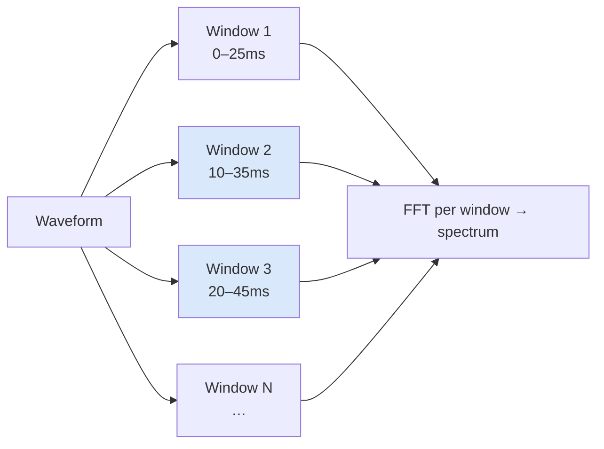
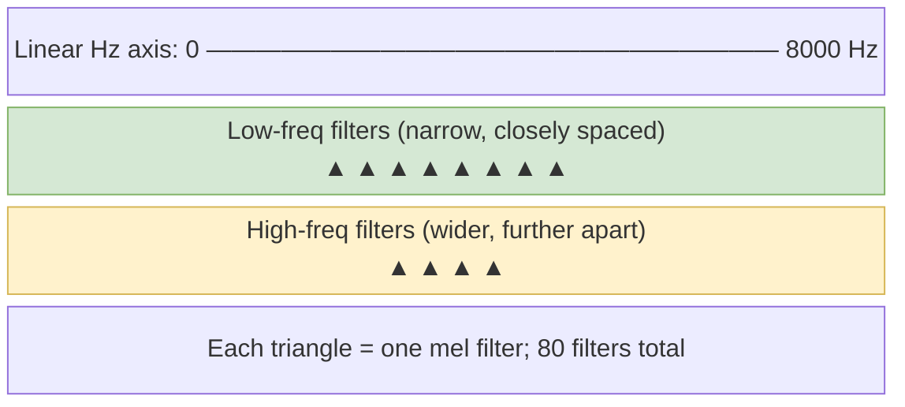
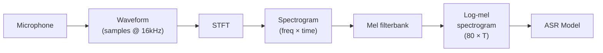

# Speech as a Signal

Understanding what audio actually is, and how machines process it.

---

## What Is Audio?

**Sound is pressure waves moving through air**

- A microphone converts those pressure changes into a varying electrical voltage
- We represent that voltage over time as a **waveform**
- The x-axis is time; the y-axis is **amplitude** (how loud or soft the sound is at that moment)

- Louder sounds have higher amplitude (bigger swings up and down)
- Silence is a flat line near zero

---

## What Audio Looks Like

- Every spoken word looks like a unique squiggly pattern in the waveform

---

## From Continuous to Digital

**Computers can't store a truly continuous signal, so we sample it**

- "Sampling" means measuring the waveform's amplitude at regular time intervals
- Each measurement is called a **sample**
- The number of samples taken per second is the **sample rate**, measured in Hz

- A sample rate of 16,000 Hz means 16,000 amplitude measurements per second
- Between each pair of ticks, the computer doesn't know what happened; it just stores the two values

---

## Why 16 kHz?

**16,000 Hz (16 kHz) is the standard sample rate for ASR**

- Human speech contains most of its information between roughly 80 Hz and 8,000 Hz
- The Nyquist theorem says: to faithfully capture a signal up to frequency F, you need to sample at least 2F times per second
- 2 x 8,000 = 16,000 samples per second captures everything relevant to speech

| Sample Rate | Typical Use           |
| ----------- | --------------------- |
| 8 kHz       | Telephone audio       |
| 16 kHz      | ASR, voice assistants |
| 44.1 kHz    | CD audio, music       |
| 48 kHz      | Professional audio    |

---

## Why 16 kHz: Practical Implication

- Higher sample rates use more storage and compute without improving ASR accuracy

---

## One Second of Audio in Numbers

**At 16 kHz, one second of audio = 16,000 numbers**

- Each number is typically a 16-bit integer, so 1 second = ~32 KB
- A 10-second audio clip is a 1D array of 160,000 values
- That's what the computer stores: just a long list of amplitude measurements
- The audio tensor has no notion of "words" or "phonemes"; it's just numbers

---

## One Second of Audio in Numbers

```python
import torchaudio

# torchaudio returns (waveform_tensor, sample_rate)
waveform, sample_rate = torchaudio.load("speech.wav")
print(waveform.shape)   # torch.Size([1, 160000]) for 10s mono at 16kHz
print(sample_rate)      # 16000

# waveform values are float32 in [-1.0, 1.0]
print(waveform.dtype)   # torch.float32
print(waveform.min(), waveform.max())
```

---

## Loading and Resampling Audio

**Real-world audio often arrives at the wrong sample rate**

Models like Whisper and Wav2Vec 2.0 both expect 16 kHz. If your file is at 44.1 kHz or 8 kHz, you must resample before inference.

Always check your audio's sample rate before feeding it to a model.

---

## Loading and Resampling Audio

```python
import torchaudio
import torchaudio.transforms as T

waveform, sample_rate = torchaudio.load("speech_44k.wav")
print(f"Original: {waveform.shape}, {sample_rate} Hz")
# torch.Size([2, 441000]), 44100 Hz  (stereo, 10 seconds)

# Step 1: convert stereo to mono by averaging channels
waveform_mono = waveform.mean(dim=0, keepdim=True)

# Step 2: resample from 44100 Hz to 16000 Hz
resampler = T.Resample(orig_freq=sample_rate, new_freq=16000)
waveform_16k = resampler(waveform_mono)

print(f"Resampled: {waveform_16k.shape}")
# torch.Size([1, 160000])
```

---

## What Does a Model "See"?

**You could feed the raw waveform directly into a model, but most don't**

- Raw waveform: a 1D array of 160,000 values for 10 seconds
- Problems with raw waveforms:
  - Very long sequences; computationally expensive
  - Tiny time-step differences matter a lot for audio but not for speech content
  - The model has to learn from scratch what "frequency" means

- Most ASR systems transform the waveform into a **2D representation** called a spectrogram
- A spectrogram captures *frequency content over time*, which is much more useful

---

## What Is a Spectrogram?

**A spectrogram is a picture of sound: time on the x-axis, frequency on the y-axis, brightness = energy**

- To make a spectrogram:
  1. Slide a short window across the waveform
  2. Apply a **Fourier transform** to each window to find what frequencies are present
  3. Stack the results side by side

- Each column in the spectrogram = one window in time
- Each row = one frequency bin

---

## Reading a Spectrogram

- The color/brightness = how much energy is at that frequency at that moment

---

## The Short-Time Fourier Transform (STFT)

**The STFT is the engine that produces spectrograms**

The STFT formula applied to a discrete signal x(n) with window w, hop size H, and N-point FFT:

```
X(m, k) = Σ x(n) · w(n - mH) · e^(-j2πkn/N)
```

- `m` is the frame index (time), `k` is the frequency bin index
- `w(n - mH)` is a window function (Hann window) centered at frame `m`
- The result `X(m, k)` is a complex number; we usually take `|X(m, k)|²` for the power spectrogram

Key parameters:
- **Window size (n_fft)**: how many samples in each window (e.g., 400 samples = 25 ms at 16 kHz)
- **Hop length**: how many samples to advance between windows (e.g., 160 samples = 10 ms)
  - Smaller hop length = more overlap = finer time resolution



- The output is a matrix of shape `[frequency_bins, time_frames]`

---

## Computing a Spectrogram with torchaudio

The 201 frequency bins come from the FFT symmetry: only the first `n_fft // 2 + 1` bins are unique for a real-valued input signal.

---

## Computing a Spectrogram with torchaudio

```python
import torch
import torchaudio
import torchaudio.transforms as T

waveform, sr = torchaudio.load("speech.wav")  # assumes 16000 Hz

# Compute power spectrogram via STFT
spectrogram_transform = T.Spectrogram(
    n_fft=400,       # 25 ms window at 16 kHz
    hop_length=160,  # 10 ms hop
    power=2.0        # power spectrogram (|X|^2)
)

spec = spectrogram_transform(waveform)
print(spec.shape)  # torch.Size([1, 201, time_frames])
# 201 = n_fft // 2 + 1 frequency bins
```

---

## Mel-Spectrograms

**Humans don't hear frequency on a linear scale**

- We're better at distinguishing low frequencies than high frequencies
- The difference between 100 Hz and 200 Hz sounds much bigger than the difference between 5,000 Hz and 5,100 Hz, even though both are 100 Hz apart

The **mel scale** compresses the frequency axis to match human perception. The formula converting Hz to mels:

```
m = 2595 · log₁₀(1 + f / 700)
```

- At low frequencies (f near 0): m ≈ 2595 · f/700 (nearly linear)
- At high frequencies: the log compresses a wide range of Hz into a small number of mels

---

## Mel-Spectrograms: The Filterbank

- A **mel-spectrogram** applies a bank of triangular filters to the power spectrogram
- Each triangular filter is centered at a mel-spaced frequency, collecting energy from a range of FFT bins
- The output is one number per filter per time frame: the total energy in that perceptual frequency band



---

## Why Mel-Spectrograms for ASR?

**The mel scale focuses compute on what matters for speech**

- Speech phonemes are better separated in mel space than in linear frequency space
- A typical mel-spectrogram uses 80 or 128 mel bins instead of 201 linear frequency bins
- Fewer features = smaller model input = faster training

Comparison:

| Representation     | Dimensions (10s audio) | Notes                            |
| ------------------ | ---------------------- | -------------------------------- |
| Raw waveform       | 160,000 values         | Long, 1D                         |
| Linear spectrogram | 201 x 1000             | Large, lots of redundancy        |
| Mel-spectrogram    | 80 x 1000              | Compact, perceptually meaningful |

- The mel-spectrogram is the standard input format for most modern ASR systems

---

## Computing a Mel-Spectrogram with torchaudio

---

## Computing a Mel-Spectrogram with torchaudio

```python
import torchaudio
import torchaudio.transforms as T

waveform, sr = torchaudio.load("speech.wav")  # 16000 Hz

mel_transform = T.MelSpectrogram(
    sample_rate=sr,
    n_fft=400,        # 25 ms window
    hop_length=160,   # 10 ms hop
    n_mels=80,        # 80 mel bins (Whisper standard)
    f_min=0.0,
    f_max=8000.0
)

mel_spec = mel_transform(waveform)
print(mel_spec.shape)  # torch.Size([1, 80, time_frames])

# Convert to log scale
log_mel = T.AmplitudeToDB(stype="power")(mel_spec)
print(log_mel.min(), log_mel.max())  # roughly -80 to 0 dB
```

---

## Converting Audio to Mel-Spectrogram with librosa

**librosa is another popular option, especially for quick experimentation**

- The **log-mel spectrogram** (log of the mel-spectrogram) is used because energy values span many orders of magnitude; taking the log compresses them into a manageable range

---

## Converting Audio to Mel-Spectrogram with librosa

```python
import librosa
import numpy as np

audio, sr = librosa.load("speech.wav", sr=16000)

mel_spec = librosa.feature.melspectrogram(
    y=audio,
    sr=sr,
    n_fft=400,       # window size
    hop_length=160,  # step between windows
    n_mels=80        # number of mel bins
)

# Convert to log scale (log-mel spectrogram)
log_mel = librosa.power_to_db(mel_spec)
print(log_mel.shape)  # (80, time_frames)
```

---

## Why Log Scale?

**Loudness is perceived logarithmically**

- A whisper at 30 dB and a normal voice at 60 dB don't feel "twice as different" as 60 dB and 90 dB
- Raw energy values can range from near-zero to very large; neural networks struggle with such wide value ranges

- Taking the log compresses the dynamic range
- Values end up roughly in the range -80 to 0 dB, which trains more stably
- This is why you'll see "log-mel spectrogram" almost everywhere in ASR papers

---

## Computing MFCCs

**MFCCs are an older but still-used alternative to log-mel spectrograms**

MFCCs (Mel-Frequency Cepstral Coefficients) apply a Discrete Cosine Transform (DCT) on top of the log-mel filterbank. This decorrelates the features and compresses them further.

In practice, modern end-to-end models (Whisper, Wav2Vec 2.0) use raw log-mel spectrograms, not MFCCs. MFCCs are still common in classical GMM-HMM systems and lightweight on-device models.

---

## Computing MFCCs

```python
import torchaudio
import torchaudio.transforms as T

waveform, sr = torchaudio.load("speech.wav")

mfcc_transform = T.MFCC(
    sample_rate=sr,
    n_mfcc=13,       # number of cepstral coefficients to keep
    melkwargs={
        "n_fft": 400,
        "hop_length": 160,
        "n_mels": 80,
    }
)

mfccs = mfcc_transform(waveform)
print(mfccs.shape)  # torch.Size([1, 13, time_frames])
```

---

## Running Whisper Inference with HuggingFace

**From audio file to transcript in under 10 lines**

Whisper handles the entire feature extraction pipeline internally: it resamples to 16 kHz, computes an 80-bin log-mel spectrogram, and feeds it to the encoder-decoder Transformer.

---

## Running Whisper Inference with HuggingFace

```python
from transformers import pipeline
import torchaudio

# Load the automatic-speech-recognition pipeline
# Model sizes: tiny, base, small, medium, large-v2, large-v3, turbo
asr = pipeline(
    "automatic-speech-recognition",
    model="openai/whisper-base",
    device="cpu"   # or "cuda" if available
)

# Run inference directly from a file path
result = asr("speech.wav")
print(result["text"])
# "The quick brown fox jumped over the lazy dog."
```

---

## Whisper: Controlling Language and Task

**Special tokens control what Whisper does**

Whisper processes audio in 30-second chunks. The `stride_length_s` parameter controls overlap between chunks to avoid boundary artifacts.

---

## Whisper: Controlling Language and Task

```python
from transformers import pipeline

asr = pipeline(
    "automatic-speech-recognition",
    model="openai/whisper-large-v3",
    device="cuda"
)

# Force language to avoid misidentification
result_en = asr("speech.wav", generate_kwargs={"language": "english"})

# Translate to English instead of transcribing
result_translate = asr(
    "speech_french.wav",
    generate_kwargs={"language": "french", "task": "translate"}
)

# For long audio (> 30 seconds), use chunking
result_long = asr(
    "long_audio.wav",
    chunk_length_s=30,
    stride_length_s=5
)
```

---

## Why Spectrograms Instead of Raw Waveforms?

**Summary of why the field converged on spectrograms**

- Spectrograms encode frequency structure explicitly; models don't have to discover it themselves
- Much shorter sequence length: 80 x 1000 vs. 160,000 raw samples
- Perceptually meaningful: the mel scale emphasizes speech-relevant frequencies
- Well-understood preprocessing with decades of research behind it

That said, some recent models (like wav2vec 2.0) do operate on raw waveforms, using learned convolutional layers as a feature extractor before the main architecture.

---

## The Full Feature Extraction Pipeline

**Putting it all together: from file to model input**

---

## The Full Feature Extraction Pipeline

```python
import torch
import torchaudio
import torchaudio.transforms as T

def audio_to_log_mel(path: str, target_sr: int = 16000) -> torch.Tensor:
    waveform, sr = torchaudio.load(path)

    # 1. Convert to mono
    if waveform.shape[0] > 1:
        waveform = waveform.mean(dim=0, keepdim=True)

    # 2. Resample if needed
    if sr != target_sr:
        waveform = T.Resample(sr, target_sr)(waveform)

    # 3. Compute log-mel spectrogram
    mel = T.MelSpectrogram(
        sample_rate=target_sr, n_fft=400,
        hop_length=160, n_mels=80
    )(waveform)

    log_mel = T.AmplitudeToDB(stype="power")(mel)

    return log_mel  # shape: [1, 80, time_frames]

features = audio_to_log_mel("speech.wav")
print(features.shape)
```

---

## Key Vocabulary Reference

**Terms you'll encounter in ASR documentation**

| Term                    | What It Means                                                                       |
| ----------------------- | ----------------------------------------------------------------------------------- |
| **Sample rate**         | Samples per second; 16 kHz is the ASR standard                                      |
| **FFT / n_fft**         | Window size for frequency analysis; controls frequency vs. time resolution tradeoff |
| **Hop length**          | Step between analysis windows; smaller = finer time resolution                      |
| **n_mels**              | Number of mel filterbank bins; typically 80 or 128                                  |
| **Log-mel spectrogram** | Mel-spectrogram in dB (log) scale; the standard model input                         |
| **STFT**                | Short-Time Fourier Transform; the operation that produces the spectrogram           |

---

## Key Vocabulary Reference: Additional Terms

| Term           | What It Means                                                                 |
| -------------- | ----------------------------------------------------------------------------- |
| **Frame**      | One time slice in the spectrogram, corresponding to one analysis window       |
| **MFCC**       | Mel-Frequency Cepstral Coefficients; log-mel + DCT, used in classical systems |
| **Resampling** | Converting audio from one sample rate to another                              |
| **Mel scale**  | Perceptual frequency scale: m = 2595 log₁₀(1 + f/700)                         |

---

## What We Covered

**From sound waves to model-ready features**

1. Audio is a waveform: amplitude varying over time
2. Sampling converts the continuous signal to a digital array (16 kHz for ASR)
3. `torchaudio.load` reads audio; `torchaudio.transforms.Resample` handles sample rate conversion
4. The STFT formula `X(m,k) = Σ x(n) w(n-mH) e^(-j2πkn/N)` converts waveform chunks to frequency content
5. The mel scale `m = 2595 log₁₀(1 + f/700)` matches human hearing and reduces feature dimensionality
6. Log-mel spectrograms are the standard input format for ASR models including Whisper
7. Whisper can be loaded with `pipeline("automatic-speech-recognition", model="openai/whisper-base")`


