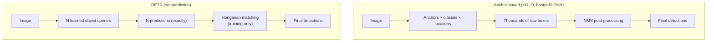
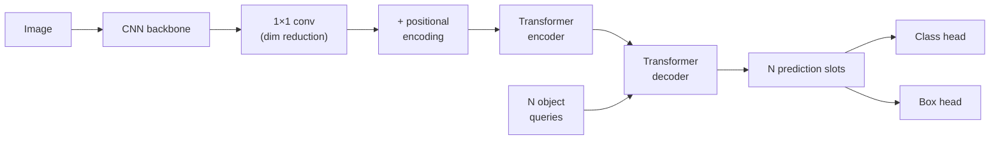
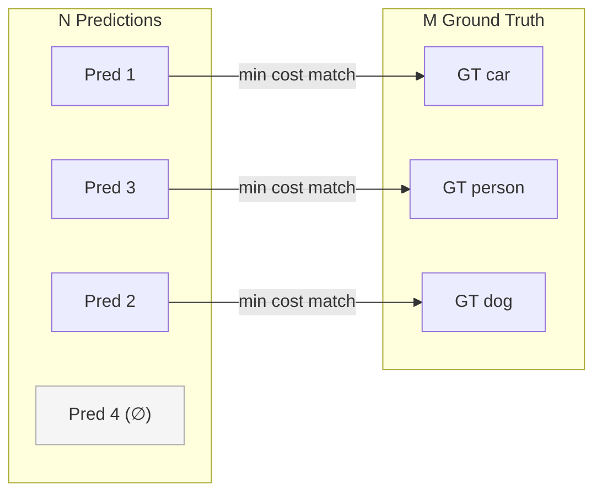
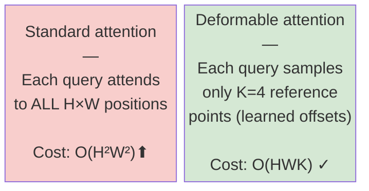
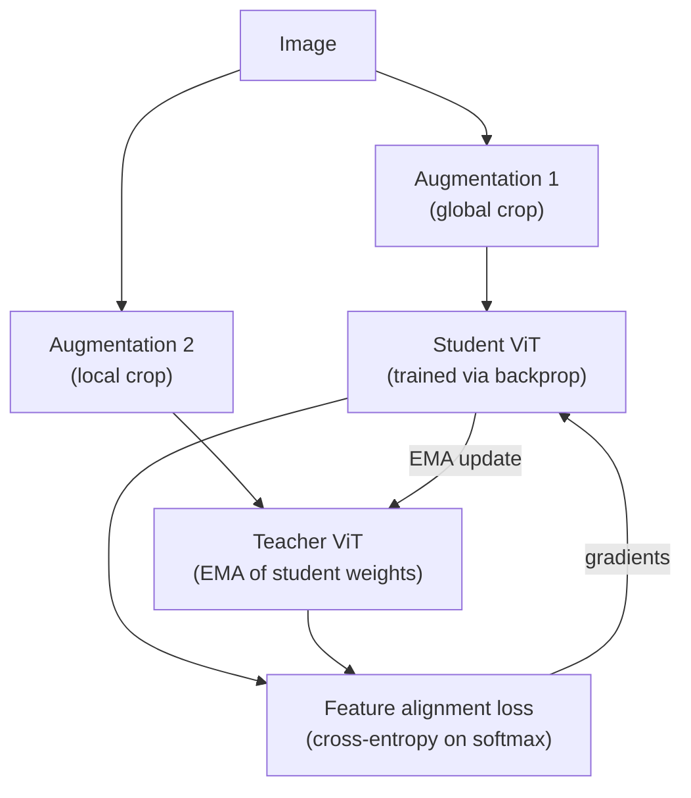

# DETR-Family Mechanics and Modern Backbones

---

## What We're Covering

- Detection as set prediction: the core insight behind DETR
- DETR architecture in detail: backbone, encoder-decoder, positional encodings, object queries
- Hungarian matching: cost matrix, implementation sketch, why it prevents duplicate detections
- Bipartite matching loss and its components
- DETR's known limitations and the fixes introduced by Deformable DETR
- DINO (detection) and RT-DETR improvements
- Modern self-supervised backbones: DINOv2 and why it matters
- Practical code: loading DETR, RT-DETR, and DINOv2 from HuggingFace and timm

---

## Detection as a Set Prediction Problem

- Classical detectors generate hundreds or thousands of candidate boxes, then filter with NMS
- DETR reframes detection: predict the entire set of objects in a single forward pass
- No anchors, no hand-crafted NMS post-processing
- The model outputs exactly N predictions (fixed N, e.g. 100), with most assigned to "no object"
- This is cleaner in principle, but requires a loss that can handle unordered sets



---

## DETR Architecture Overview

- **CNN backbone** (e.g. ResNet-50): extracts a spatial feature map `[B, C, H', W']` from the input image
- **1x1 projection**: reduces channel dimension to `d` (typically 256) before the transformer
- **Transformer encoder**: flattens the feature map into a sequence of length `H'*W'` and applies multi-head self-attention across all spatial positions
- **Transformer decoder**: takes N learned object queries, attends to encoder output via cross-attention, produces N per-object embeddings
- **Prediction heads**: two parallel FFN heads per query: one for class logits `[B, N, num_classes+1]`, one for bounding box coordinates `(cx, cy, w, h)` in `[0,1]` normalized form



---

## DETR: Positional Encodings for 2D Images

**Sine encodings generalized to two spatial dimensions**

Unlike 1D sequence models, the encoder input is a 2D spatial feature map. DETR uses fixed 2D sine-cosine positional encodings:

For a feature map of spatial size `H' x W'`, at position `(i, j)`:
```
PE(i, j, 2k)   = sin(i / 10000^(2k / d_model))      # row dimension
PE(i, j, 2k+1) = cos(i / 10000^(2k / d_model))
PE(i, j, 2k+d_model/2)   = sin(j / 10000^(2k / d_model))  # col dimension
PE(i, j, 2k+d_model/2+1) = cos(j / 10000^(2k / d_model))
```

Both row and column encodings are concatenated along the channel dimension, each occupying half of `d_model`.

These encodings are added to the flattened feature map tokens before the encoder, and also added to the queries/keys (but not values) inside each attention layer.

---

## DETR Positional Encoding in Code

**Implementation sketch for 2D sine-cosine encodings**

```python
import torch
import math

def build_2d_sincos_position_encoding(H, W, d_model):
    """
    Returns positional encoding of shape [H*W, d_model].
    d_model must be divisible by 4.
    """
    assert d_model % 4 == 0
    y_pos = torch.arange(H, dtype=torch.float32)   # [H]
    x_pos = torch.arange(W, dtype=torch.float32)   # [W]

    dim = d_model // 4
    omega = torch.arange(dim, dtype=torch.float32) / dim
    omega = 1.0 / (10000 ** omega)                 # [dim]

    y_enc = torch.outer(y_pos, omega)              # [H, dim]
    x_enc = torch.outer(x_pos, omega)              # [W, dim]

    y_enc = torch.stack([y_enc.sin(), y_enc.cos()], dim=-1)  # [H, dim, 2]
    x_enc = torch.stack([x_enc.sin(), x_enc.cos()], dim=-1)  # [W, dim, 2]

    y_enc = y_enc.flatten(-2)   # [H, d_model//2]
    x_enc = x_enc.flatten(-2)   # [W, d_model//2]

    # Broadcast over grid
    y_enc = y_enc.unsqueeze(1).expand(-1, W, -1)   # [H, W, d_model//2]
    x_enc = x_enc.unsqueeze(0).expand(H, -1, -1)   # [H, W, d_model//2]

    pos = torch.cat([y_enc, x_enc], dim=-1)         # [H, W, d_model]
    return pos.flatten(0, 1)                         # [H*W, d_model]
```

DETR also supports learned positional embeddings as an alternative; both are used in practice.

---

## Object Queries

- Object queries are `N` learned positional embeddings, shape `[N, d_model]`, one per prediction slot
- They are not image-dependent; the same set of queries processes every image
- Each query specializes over training to attend to different regions or object types
- The decoder uses **cross-attention** between queries (as queries/keys) and encoder output (as keys/values) to localize objects
- This mechanism replaces the role that anchors play in traditional detectors

```python
# Simplified decoder cross-attention step
import torch.nn as nn

class DecoderLayer(nn.Module):
    def __init__(self, d_model, nhead):
        super().__init__()
        self.self_attn  = nn.MultiheadAttention(d_model, nhead, batch_first=True)
        self.cross_attn = nn.MultiheadAttention(d_model, nhead, batch_first=True)
        self.ffn = nn.Sequential(
            nn.Linear(d_model, d_model * 4), nn.ReLU(),
            nn.Linear(d_model * 4, d_model)
        )
        self.norm1 = nn.LayerNorm(d_model)
        self.norm2 = nn.LayerNorm(d_model)
        self.norm3 = nn.LayerNorm(d_model)

    def forward(self, queries, encoder_out, query_pos, encoder_pos):
        # Self-attention among queries
        q = queries + query_pos
        queries = self.norm1(queries + self.self_attn(q, q, queries)[0])
        # Cross-attention: queries attend to encoder output
        q  = queries + query_pos
        kv = encoder_out + encoder_pos
        queries = self.norm2(queries + self.cross_attn(q, kv, encoder_out)[0])
        queries = self.norm3(queries + self.ffn(queries))
        return queries
```

---

## Why We Need Hungarian Matching

- During training, we have N predicted boxes and M ground-truth boxes (M << N)
- There is no canonical assignment: which prediction should supervise which ground truth?
- Naively picking the highest-scoring prediction per GT leads to duplicate predictions being rewarded
- We need a one-to-one matching: each GT is matched to exactly one prediction, and vice versa
- Hungarian algorithm finds the globally optimal assignment that minimizes a combined cost

---

## Hungarian Matching in Detail

- Cost matrix `C` is `N x M`: `C[i, j]` = cost of matching prediction `i` to ground-truth `j`

The matching cost combines three terms:

```
C[i, j] = -p̂_i(c_j)  +  λ_L1 * ||b̂_i - b_j||_1  +  λ_giou * L_giou(b̂_i, b_j)
```

- `p̂_i(c_j)`: predicted class probability for class `c_j` (class probability cost, not log-likelihood)
- `λ_L1 * ||b̂_i - b_j||_1`: L1 distance between predicted and GT box coordinates
- `λ_giou * L_giou`: generalized IoU loss between predicted and GT boxes
- The Hungarian algorithm solves the minimum-cost bipartite matching in `O(N^3)`
- Unmatched predictions (N - M of them) are assigned the "no object" class



---

## Hungarian Matching Implementation Sketch

**Using scipy's linear_sum_assignment**

```python
import torch
import numpy as np
from scipy.optimize import linear_sum_assignment
from torchvision.ops import generalized_box_iou

def hungarian_match(pred_logits, pred_boxes, gt_labels, gt_boxes,
                    lambda_l1=5.0, lambda_giou=2.0):
    """
    pred_logits: [N, num_classes+1]
    pred_boxes:  [N, 4] in (cx, cy, w, h) normalized
    gt_labels:   [M] integer class indices
    gt_boxes:    [M, 4] in (cx, cy, w, h) normalized
    Returns: (row_ind, col_ind) matched prediction and GT indices
    """
    N, M = len(pred_logits), len(gt_labels)

    # Class cost: negative softmax probability of GT class
    probs = pred_logits.softmax(-1)             # [N, num_classes+1]
    class_cost = -probs[:, gt_labels]           # [N, M]

    # L1 box cost
    # Expand for pairwise computation
    pb = pred_boxes.unsqueeze(1).expand(-1, M, -1)   # [N, M, 4]
    gb = gt_boxes.unsqueeze(0).expand(N, -1, -1)     # [N, M, 4]
    l1_cost = torch.abs(pb - gb).sum(-1)             # [N, M]

    # GIoU cost (convert cx,cy,w,h -> x1y1x2y2 first)
    def cxcywh_to_xyxy(b):
        return torch.stack([b[..., 0] - b[..., 2]/2,
                            b[..., 1] - b[..., 3]/2,
                            b[..., 0] + b[..., 2]/2,
                            b[..., 1] + b[..., 3]/2], -1)

    pb_xyxy = cxcywh_to_xyxy(pred_boxes)
    gb_xyxy = cxcywh_to_xyxy(gt_boxes)
    giou_cost = -generalized_box_iou(pb_xyxy, gb_xyxy)  # [N, M]

    cost = class_cost + lambda_l1 * l1_cost + lambda_giou * giou_cost
    cost_np = cost.detach().cpu().numpy()
    row_ind, col_ind = linear_sum_assignment(cost_np)
    return row_ind, col_ind
```

---

## The Bipartite Matching Loss

**Training loss applied only to matched pairs**

After matching, the final loss sums over matched pairs:

```
L = Σ_{matched (i,j)} [ L_cls(p̂_i, c_j)
                        + λ_L1 * ||b̂_i - b_j||_1
                        + λ_giou * L_giou(b̂_i, b_j) ]
   + Σ_{unmatched i}  [ -log p̂_i(∅) * w_∅ ]
```

- `L_cls`: cross-entropy over class logits for matched predictions
- `L_giou`: `1 - GIoU`, where GIoU extends IoU to handle non-overlapping boxes with non-zero gradient
- `w_∅`: a small weight (default 0.1 in original DETR) for the "no object" class, balancing the N-M unmatched predictions against M matched ones
- Default DETR values: `λ_L1 = 5`, `λ_giou = 2`

Why GIoU instead of plain IoU:

```
GIoU(A, B) = IoU(A, B) - |C \ (A ∪ B)| / |C|
```

where `C` is the smallest enclosing box of `A` and `B`. When boxes don't overlap, IoU = 0 with zero gradient; GIoU still provides a gradient signal.

---

## DETR Limitations

- **Slow convergence**: DETR needs ~500 epochs on COCO to match Faster R-CNN at 36 epochs
  - The transformer encoder must learn to attend to correct spatial positions from scratch
  - Attention maps at early training are diffuse; they gradually focus on object boundaries
- **Quadratic attention cost**: self-attention in the encoder scales as `O((H'W')^2)` where `H'W'` is the flattened feature map length
  - For a 640x640 input with stride-32 backbone: feature map = 20x20 = 400 tokens; manageable
  - With stride-8 (needed for small objects): 80x80 = 6400 tokens; 6400^2 = 40M attention pairs per layer
- **Small object detection**: DETR underperforms on small objects partly because it uses only a single-scale feature map from the last backbone stage

---

## Deformable DETR

- Replaces dense full self-attention with deformable attention: each query attends to a small fixed number of sampled key locations `K` (typically 4)

```
DeformAttn(q, p, x) = Σ_{m=1}^{M} W_m [ Σ_{k=1}^{K} A_{mk} * W'_m * x(p + Δp_{mk}) ]
```

- `p`: reference point (2D location) for query `q`
- `Δp_{mk}`: learned offset for head `m`, sampling point `k` (predicted by a small linear layer from `q`)
- `A_{mk}`: attention weight (scalar, summing to 1 over `k` per head)
- `W_m`, `W'_m`: linear projections

Complexity drops from `O(H'W')^2` to `O(H'W' * K)` where `K = 4`.



---

## Deformable DETR: Multi-Scale Input

**Enabling FPN-style feature pyramids in the DETR encoder**

```python
# Conceptual multi-scale feature extraction with timm backbone
import timm

backbone = timm.create_model("resnet50", features_only=True,
                              out_indices=(1, 2, 3, 4), pretrained=True)

# Project each scale to d_model=256
proj_layers = nn.ModuleList([
    nn.Conv2d(in_ch, 256, kernel_size=1)
    for in_ch in backbone.feature_info.channels()
])

def extract_multiscale_features(x, backbone, proj_layers):
    feats = backbone(x)   # list of tensors at different scales
    projected = []
    for feat, proj in zip(feats, proj_layers):
        projected.append(proj(feat))  # [B, 256, H_i, W_i]
    return projected
```

Deformable DETR flattens each scale and concatenates them into a single token sequence. Reference points for each token are computed from the spatial location and which scale it came from.

- Converges in ~50 epochs rather than ~500
- Stronger small object detection due to high-resolution feature maps

---

## Other DETR Variants at a Glance

- **DN-DETR**: adds denoising training. Injects noisy GT boxes and labels into the decoder as auxiliary queries, training the decoder to reconstruct clean boxes. This provides direct supervision for the decoder's early training steps, stabilizing bipartite matching and speeding convergence further (50 -> 12 epochs with comparable quality).

- **DAB-DETR**: reformulates object queries as dynamic anchor boxes `(cx, cy, w, h)`. The positional query is explicitly the box coordinates, updated at each decoder layer. This gives the decoder explicit spatial priors rather than opaque learned embeddings.

- **DINO (detection)**: combines DN-DETR + DAB-DETR with contrastive denoising (CDN) and a mixed query selection mechanism. Achieved state-of-the-art on COCO at the time of release (63.3 AP on COCO val with Swin-L backbone).

- **RT-DETR**: real-time variant. Uses an efficient hybrid encoder (CNN + multi-scale attention) instead of a full transformer encoder, targeting inference speed parity with YOLOv8 while retaining the NMS-free property.

---

## Running DETR from HuggingFace

**facebook/detr-resnet-50: the canonical DETR checkpoint**

```python
from transformers import DetrImageProcessor, DetrForObjectDetection
import torch
from PIL import Image

processor = DetrImageProcessor.from_pretrained("facebook/detr-resnet-50")
model = DetrForObjectDetection.from_pretrained("facebook/detr-resnet-50")
model.eval()

image = Image.open("street.jpg")
inputs = processor(images=image, return_tensors="pt")

with torch.no_grad():
    outputs = model(**inputs)
    # outputs.logits:          [1, 100, 92]  -- class logits per query
    # outputs.pred_boxes:      [1, 100, 4]   -- cx,cy,w,h in [0,1]
    # outputs.last_hidden_state: [1, 100, 256] -- decoder output embeddings

# Decode to boxes with confidence threshold
target_sizes = torch.tensor([image.size[::-1]])
results = processor.post_process_object_detection(
    outputs, target_sizes=target_sizes, threshold=0.9
)[0]

for score, label, box in zip(results["scores"],
                              results["labels"],
                              results["boxes"]):
    cls = model.config.id2label[label.item()]
    print(f"{cls}: {score:.3f}  box={[round(v, 1) for v in box.tolist()]}")
```

---

## Running RT-DETR from HuggingFace

**PekingU/rtdetr_r50vd: real-time, NMS-free detection**

```python
from transformers import RTDetrForObjectDetection, RTDetrImageProcessor
import torch
from PIL import Image

processor = RTDetrImageProcessor.from_pretrained("PekingU/rtdetr_r50vd")
model = RTDetrForObjectDetection.from_pretrained("PekingU/rtdetr_r50vd")
model.eval()

image = Image.open("street.jpg")
inputs = processor(images=image, return_tensors="pt")

with torch.no_grad():
    outputs = model(**inputs)

results = processor.post_process_object_detection(
    outputs,
    target_sizes=torch.tensor([image.size[::-1]]),
    threshold=0.5
)[0]

# RT-DETR COCO benchmark: 53.0 mAP@0.5:0.95, 71.6 ms on T4 GPU
for score, label, box in zip(results["scores"],
                              results["labels"],
                              results["boxes"]):
    cls = model.config.id2label[label.item()]
    print(f"{cls}: {score:.3f}")

# Larger variant: PekingU/rtdetr_r101vd  (54.3 mAP@0.5:0.95)
```

---

## What Is DINOv2?

- DINOv2 is a vision backbone trained entirely with self-supervised learning on a large curated dataset (~142M images, called LVD-142M)
- It uses a student-teacher distillation framework: the student learns to match the teacher's representation at patch level and image level
- Training objective combines: patch-level feature matching via cross-attention (local), image-level feature matching via a centering/sharpening loss (global), and masked image modeling (iBOT-style)
- No labels are used during backbone training
- The result is a ViT backbone with unusually strong and general visual features



---

## DINOv2 with timm

**Loading and using DINOv2 features for detection**

```python
import timm
import torch
import torch.nn as nn

# Available DINOv2 variants in timm
# vit_small_patch14_dinov2, vit_base_patch14_dinov2,
# vit_large_patch14_dinov2, vit_giant_patch14_dinov2

backbone = timm.create_model(
    "vit_base_patch14_dinov2",
    pretrained=True,
    img_size=518,              # DINOv2 uses 518x518 at native resolution (14px patches -> 37x37 grid)
    num_classes=0,             # remove classification head
)
backbone.eval()

# For detection, use register tokens + patch tokens
x = torch.randn(1, 3, 518, 518)
with torch.no_grad():
    features = backbone.forward_features(x)
    # features: [1, 37*37 + 1, 768]  (patch tokens + CLS token)
    patch_tokens = features[:, 1:, :]    # [1, 1369, 768]
    # Reshape to spatial grid for detection head
    h = w = int(patch_tokens.shape[1] ** 0.5)
    spatial = patch_tokens.reshape(1, h, w, 768).permute(0, 3, 1, 2)
    # [1, 768, 37, 37]  -- feed to detection neck/head
```

---

## Why DINOv2 Features Transfer Well

- Trained on a diverse, curated dataset with no task-specific label signal, the backbone cannot overfit to class boundaries
- Self-supervised training forces the model to represent object shape, texture, and semantic category simultaneously
- Probing studies show DINOv2 features form geometrically consistent correspondences across very different images (e.g. matching object parts between a dog and a sculpture of a dog)
- This kind of structured feature space is exactly what a detection head needs: it can localize by attending to meaningful spatial features

Published linear probe benchmarks:
| Backbone | ImageNet top-1 (linear probe) |
|---|---|
| ResNet-50 (supervised) | 75.3% |
| ViT-B/16 (supervised) | 81.7% |
| DINOv2 ViT-B/14 (no labels) | 86.2% |
| DINOv2 ViT-L/14 (no labels) | 87.3% |

---

## Backbone vs. Detector Head

- The backbone produces the feature representation; the detector head interprets it
- A weak backbone with a sophisticated head is limited by the quality of its input features
- A strong backbone (DINOv2) with a simple head often outperforms a weaker backbone with a complex head
- Empirical finding: swapping ResNet-50 for a DINOv2 ViT-B backbone in the same detector architecture typically yields larger AP gains than switching from Faster R-CNN to DETR
- The head architecture matters, but the feature quality is the bigger lever in most practical settings

```python
# Drop-in backbone swap example: DINOv2 + simple detection head
class SimpleDetector(nn.Module):
    def __init__(self, num_classes, d_model=768):
        super().__init__()
        self.backbone = timm.create_model(
            "vit_base_patch14_dinov2", pretrained=True,
            num_classes=0, img_size=518
        )
        # Freeze backbone initially
        for p in self.backbone.parameters():
            p.requires_grad = False

        # Lightweight detection head on top of patch features
        self.cls_head = nn.Conv2d(d_model, num_classes + 1, 1)
        self.box_head = nn.Conv2d(d_model, 4, 1)

    def forward(self, x):
        feats = self.backbone.forward_features(x)  # [B, 1+HW, 768]
        spatial = feats[:, 1:].reshape(
            x.shape[0], 37, 37, 768).permute(0, 3, 1, 2)
        return self.cls_head(spatial), self.box_head(spatial)
```

---

## Practical Implications, Backbone Swap

- When to swap to a better backbone:
  - Your current detector is already well-tuned but accuracy has plateaued
  - You have a moderate-size dataset, not enough to benefit from a more complex head
  - Inference latency budget allows for ViT-scale compute
- DINOv2 ViT-B and ViT-L are the common choices: ViT-B is faster, ViT-L is stronger
- Hugging Face transformers and timm both provide pretrained weights

```python
# HuggingFace DINOv2 alternative
from transformers import AutoModel

dinov2 = AutoModel.from_pretrained("facebook/dinov2-base")
# Patch size 14, hidden size 768, 12 layers
# Input images: any size divisible by 14
# Model ID for large: "facebook/dinov2-large"
```

---

## Practical Implications, Detector Head Choice: When to Switch

- When to change the detector architecture itself:
  - You need NMS-free inference (e.g. streaming or multi-camera systems where NMS is awkward to coordinate)
  - You want end-to-end trainability without anchor hyperparameters
  - Your application has strict one-detection-per-object semantics

---

## Practical Implications, Detector Head Choice: When to Stay

- When the head change is probably not worth it:
  - You're already using a well-tuned YOLO or Faster R-CNN variant
  - Training budget is short (DETR variants need more epochs)
  - You care primarily about small objects, where dense-head detectors with FPN still have an edge

---

## Summary

- DETR turns detection into set prediction using Hungarian matching, eliminating anchors and NMS
- 2D sine-cosine positional encodings tell the encoder about spatial structure; object queries specialize as learned spatial priors
- Matching cost: `C[i,j] = -p̂_i(c_j) + λ_L1 ||b̂_i - b_j||_1 + λ_giou L_giou(b̂_i, b_j)`
- Quadratic attention cost and slow convergence are real limitations; Deformable DETR fixes both via sparse `K`-point sampling
- DN-DETR / DAB-DETR / DINO (detection) each add a targeted improvement; RT-DETR achieves real-time speed
- DINOv2 provides a self-supervised backbone whose features transfer extremely well to detection
- In practice, backbone quality is the dominant factor; use `timm` or `transformers` for pretrained checkpoints
