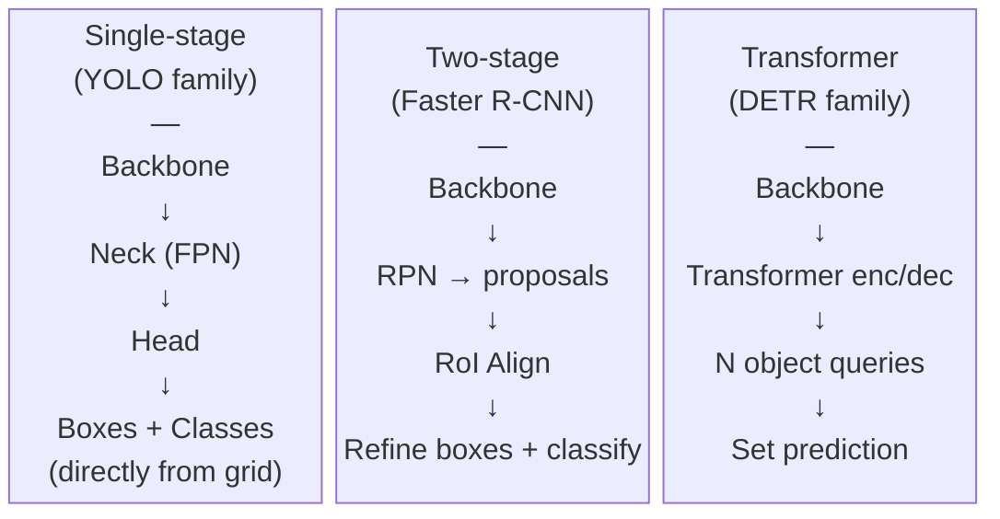

# Detector Family Tradeoffs and Selection

---

## What We're Covering

- The three main families of object detectors and what distinguishes them
- Anchor-based vs. anchor-free detection heads in code
- Neck architectures: FPN, PAN, BiFPN and their role in multi-scale detection
- FLOPs vs. latency: why they diverge and how to measure both
- Speed vs. accuracy tradeoffs with actual COCO benchmark numbers
- Memory and data requirements per family
- Decision framework: picking the right detector for your task

---

## The Three Detector Families

- **One-stage detectors** (YOLO family, RetinaNet): predict classes and boxes directly from feature maps, no explicit region proposal step
- **Two-stage detectors** (Faster R-CNN, Cascade R-CNN): first propose candidate regions, then classify and refine each region separately
- **Query-based detectors** (DETR family): use learned object queries and a transformer decoder, no anchors and no NMS



---

## Anchor-Based vs. Anchor-Free Heads

**Two philosophies for predicting box coordinates**

**Anchor-based**: at each spatial location `(i, j)` and for each of `A` anchor templates, predict 4 offsets `(dx, dy, dw, dh)` relative to the anchor:

```
x_pred = anchor_cx + dx * anchor_w
y_pred = anchor_cy + dy * anchor_h
w_pred = anchor_w  * exp(dw)
h_pred = anchor_h  * exp(dh)
```

**Anchor-free**: at each spatial location `(i, j)`, directly predict distances to the four box sides `(l, t, r, b)` (FCOS-style) or absolute `(cx, cy, w, h)` (CenterNet-style):

```
x1 = stride * i - l
y1 = stride * j - t
x2 = stride * i + r
y2 = stride * j + b
```

YOLOv8 and newer use anchor-free heads. No anchor hyperparameter tuning is needed.

---

## Anchor-Free Head in Code (YOLO-style)

**What the detection head actually outputs**

```python
import torch
import torch.nn as nn

class AnchorFreeHead(nn.Module):
    """
    Simplified single-scale anchor-free detection head (FCOS-style).
    Input: feature map [B, C, H, W]
    Output: cls_logits [B, num_classes, H, W]
             box_preds  [B, 4, H, W]  (l, t, r, b distances)
             centerness [B, 1, H, W]
    """
    def __init__(self, in_channels, num_classes):
        super().__init__()
        self.cls_branch = nn.Sequential(
            nn.Conv2d(in_channels, 256, 3, padding=1), nn.ReLU(),
            nn.Conv2d(256, 256, 3, padding=1), nn.ReLU(),
            nn.Conv2d(256, num_classes, 1)
        )
        self.box_branch = nn.Sequential(
            nn.Conv2d(in_channels, 256, 3, padding=1), nn.ReLU(),
            nn.Conv2d(256, 256, 3, padding=1), nn.ReLU(),
            nn.Conv2d(256, 4, 1)
        )
        self.centerness_branch = nn.Conv2d(256, 1, 1)  # shares box trunk
        self._box_trunk = self.box_branch[:-1]  # reuse for centerness

    def forward(self, feat):
        cls_out = self.cls_branch(feat)
        box_trunk = self._box_trunk(feat)
        box_out  = self.box_branch[-1](box_trunk).exp()   # distances > 0
        cnt_out  = self.centerness_branch(box_trunk)
        return cls_out, box_out, cnt_out
```

---

## Neck Architectures: Why They Matter

**The neck connects the backbone to the detection head**

Detection must handle objects at many scales. A typical ResNet-50 outputs feature maps at:
- `stride 8`  (C3): `80x80` for a 640px input, large spatial detail, small receptive field
- `stride 16` (C4): `40x40`, medium
- `stride 32` (C5): `20x20`, small spatial, large receptive field

Without a neck, a head operating at stride 32 misses small objects; a head at stride 8 lacks context.

**Feature Pyramid Network (FPN)**: top-down pathway with lateral connections.

---

## FPN in Code

**Bottom-up backbone + top-down FPN construction**

```python
import torch
import torch.nn as nn
import torch.nn.functional as F
import timm

class FPN(nn.Module):
    def __init__(self, in_channels_list, out_channels=256):
        super().__init__()
        # 1x1 lateral projections to unify channel count
        self.lateral = nn.ModuleList([
            nn.Conv2d(c, out_channels, 1) for c in in_channels_list
        ])
        # 3x3 output convolutions
        self.output = nn.ModuleList([
            nn.Conv2d(out_channels, out_channels, 3, padding=1)
            for _ in in_channels_list
        ])

    def forward(self, features):
        # features: list of [B, C_i, H_i, W_i] from bottom to top
        # Top-down pass
        laterals = [l(f) for l, f in zip(self.lateral, features)]
        for i in range(len(laterals) - 2, -1, -1):
            # Upsample higher level and add
            up = F.interpolate(laterals[i+1], size=laterals[i].shape[2:],
                               mode="nearest")
            laterals[i] = laterals[i] + up
        return [out(l) for out, l in zip(self.output, laterals)]

backbone = timm.create_model("resnet50", pretrained=True,
                              features_only=True, out_indices=(1, 2, 3, 4))
neck = FPN(in_channels_list=backbone.feature_info.channels(), out_channels=256)

x = torch.randn(1, 3, 640, 640)
feats = backbone(x)
fpn_feats = neck(feats)
for f in fpn_feats:
    print(f.shape)
# [1, 256, 80, 80], [1, 256, 40, 40], [1, 256, 20, 20], [1, 256, 10, 10]
```

---

## PANet and BiFPN

**Improving on FPN with bottom-up augmentation**

**PANet (Path Aggregation Network)**: adds a second bottom-up pathway after FPN's top-down pass. Lower-level detail flows bottom-up again, so deep features also receive high-resolution information.

```
FPN top-down:    C5 -> P5 -> P4 -> P3 -> P2
PANet bottom-up: P2 -> N3 -> N4 -> N5
```

Used in YOLOv8's neck (called "PAN" in their configs).

**BiFPN (EfficientDet)**: bidirectional FPN with learned per-level weights for the feature fusion:

```
P_out^i = w_1 * P_in^i + w_2 * Resize(P_in^{i+1}) + w_3 * P_td^i
          ---------------------------------------------------
          w_1 + w_2 + w_3 + ε
```

Weights are learned and normalized with a fast softmax. BiFPN can be stacked multiple times (EfficientDet uses 3-7 BiFPN layers depending on model size).

---

## FLOPs vs. Latency: Why They Diverge

**FLOPs count operations; latency depends on hardware**

FLOPs (floating point operations) measure theoretical computational cost. Latency (milliseconds per image) depends on:
- **Memory bandwidth**: attention and large feature maps are bandwidth-bound, not compute-bound on modern GPUs
- **Parallelism**: some operations parallelize efficiently (large matrix multiplications); others don't (sequential NMS, small convolutions)
- **Kernel fusion**: frameworks like TensorRT fuse adjacent operations, hiding latency

Examples where FLOPs and latency diverge:
- ViT-based detectors have high FLOPs but good parallelism on GPU; latency can be competitive with CNNs of similar FLOPs
- NMS is nearly free in FLOPs but adds latency proportional to the number of predictions

Always measure latency on your target hardware.

---

## Measuring FLOPs and Latency

**fvcore for FLOPs, torch.cuda for latency**

```python
import torch
from fvcore.nn import FlopCountAnalysis

model = ...
x = torch.randn(1, 3, 640, 640).cuda()

flops = FlopCountAnalysis(model, x)
print(f"GFLOPs: {flops.total() / 1e9:.1f}")

# Measure latency with CUDA events (accurate on GPU)
import torch.cuda as cuda

model.eval()
model.cuda()
x = x.cuda()

# Warmup
for _ in range(20):
    with torch.no_grad():
        _ = model(x)

starter = cuda.Event(enable_timing=True)
ender   = cuda.Event(enable_timing=True)
n_reps  = 100
times   = []

for _ in range(n_reps):
    starter.record()
    with torch.no_grad():
        _ = model(x)
    ender.record()
    cuda.synchronize()
    times.append(starter.elapsed_time(ender))   # milliseconds

import numpy as np
print(f"Mean latency: {np.mean(times):.1f} ms  ({1000/np.mean(times):.1f} FPS)")
print(f"Std:          {np.std(times):.1f} ms")
```

---

## Speed vs. Accuracy: Benchmark Numbers

**Concrete reference points from COCO val2017**

All models at 640px input unless noted. FPS measured on RTX 3090 (ultralytics benchmarks) or A100 (HuggingFace/official).

| Model               | mAP@0.5:0.95 | mAP@0.5 | GFLOPs | FPS (GPU) |
| ------------------- | ------------ | ------- | ------ | --------- |
| YOLOv8n             | 37.3         | 52.5    | 8.7    | ~300      |
| YOLOv8s             | 44.9         | 61.8    | 28.6   | ~200      |
| YOLOv8m             | 50.2         | 67.2    | 78.9   | ~130      |
| YOLOv8l             | 52.9         | 70.1    | 165.2  | ~90       |
| YOLOv8x             | 53.9         | 71.0    | 257.8  | ~65       |
| YOLOv11x            | 54.7         | 72.0    | 194.9  | ~60       |
| RT-DETR-L           | 53.0         | 71.6    | 110    | ~60       |
| Faster RCNN R50-FPN | 42.0         | --      | ~200   | ~15-25    |
| DINO (Swin-L)       | 58.5         | --      | ~3000  | ~5        |

Use these as rough comparisons only. Hardware, batch size, and inference framework all change the numbers.

---

## One-Stage Detectors, YOLO Family

- YOLO (v5, v8, v9, v10, v11) is the most widely used one-stage family
- Single forward pass: predict class + box from grid cells or anchor points directly on the feature map
- YOLOv8 and newer use an anchor-free design with a PANet neck, simplifying hyperparameter tuning
- NMS is still applied at inference (except YOLO variants with set-prediction heads like RT-DETR)
- Key strength: fast inference, low latency, well-optimized deployment tools (ONNX, TensorRT, CoreML)

```python
from ultralytics import YOLO

# Size variants: n (nano), s (small), m (medium), l (large), x (extra-large)
model = YOLO("yolov8m.pt")    # 50.2 mAP, ~130 FPS on RTX 3090

# YOLOv11: newer architecture with improved neck and head
model11 = YOLO("yolo11m.pt")  # 51.5 mAP, similar speed

results = model("image.jpg", conf=0.25, iou=0.45, verbose=False)
r = results[0]
print(r.boxes.xyxy)    # [N, 4] detections
print(r.boxes.conf)    # [N]   confidence
print(r.boxes.cls)     # [N]   class index
```

---

## Two-Stage Detectors, Faster R-CNN Family

- Faster R-CNN introduces the Region Proposal Network (RPN): a lightweight head that proposes candidate boxes
- Proposed regions are then cropped from the feature map (RoI Align), classified, and box-refined independently
- Cascade R-CNN extends this with multiple refinement stages, improving localization at high IoU thresholds

```python
from torchvision.models.detection import (
    fasterrcnn_resnet50_fpn_v2,
    FasterRCNN_ResNet50_FPN_V2_Weights
)
import torch

model = fasterrcnn_resnet50_fpn_v2(
    weights=FasterRCNN_ResNet50_FPN_V2_Weights.DEFAULT,
    box_score_thresh=0.5,
    box_nms_thresh=0.4,
    min_size=800, max_size=1333,   # standard Faster R-CNN input range
)
model.eval()

# Model is ~42M params, ~200 GFLOPs at 800x1333
# COCO mAP@0.5:0.95: ~46.7 (v2 weights with better training recipe)
```

---

## Two-Stage Detectors: Speed vs. Accuracy

**Accuracy vs. speed**

Pros: high accuracy, especially at high IoU thresholds (mAP@0.75 is competitive with one-stage); proposal stage provides a natural soft filter.

Cons: slower than one-stage detectors. The RoI feature extraction step is sequential over proposals, limiting GPU utilization. Typical throughput: 15-25 FPS at 800px for Faster R-CNN R50-FPN.

---

## Speed vs. Accuracy Intuition

- One-stage: fastest inference, moderate accuracy, best throughput at any given compute budget
- Two-stage: slower inference (roughly 2-5x) but higher AP on standard benchmarks, especially for small objects
- Query-based: inference speed is competitive with two-stage on modern hardware, accuracy roughly on par when backbone is strong

Rough mental model:
- If COCO AP is the goal and compute is unconstrained: two-stage or strong query-based
- If latency matters: one-stage

---

## Speed vs. Accuracy: Benchmark Caveat

**Don't treat numbers as exact predictions**

- FPS numbers are hardware-specific: commonly measured on A100 or RTX 3090 at batch=1 with TensorRT or ONNX, not necessarily PyTorch eager mode
- Published checkpoints are often trained with much longer schedules or larger backbones than the default config
- COCO accuracy does not predict accuracy on your domain: distribution shift is real
- Always benchmark on your actual hardware with your actual inference pipeline

---

## Memory Footprint

- One-stage detectors have the smallest memory footprint overall; YOLOv8n fits on devices with 2-4 GB VRAM during training
- Two-stage detectors store intermediate RoI features for each proposal, which multiplies memory usage at high proposal counts
- Query-based detectors with ViT backbones can be large: DINOv2 ViT-L + detection head can require 24+ GB VRAM at training batch size 2
- For deployment, all three families can be quantized; one-stage models quantize most reliably given their simpler architecture

```python
# Estimate peak training memory with torch.cuda.memory_stats
model = YOLO("yolov8m.pt")
torch.cuda.reset_peak_memory_stats()

model.train(data="data.yaml", epochs=1, batch=16,
            imgsz=640, device=0)

peak = torch.cuda.max_memory_allocated() / 1e9
print(f"Peak VRAM: {peak:.1f} GB")
```

---

## Dataset Size Considerations

- **One-stage (YOLO)**: can fine-tune effectively with as few as a few hundred labeled images per class if starting from a good pretrained checkpoint
- **Two-stage (Faster R-CNN)**: slightly more data-hungry than one-stage due to the additional RPN + classification stages, but still practical at moderate dataset sizes
- **Query-based (DETR family)**: needs more data to train well from scratch; convergence issues are exacerbated on small datasets
  - With a frozen DINOv2 backbone, the data requirement drops substantially
- General rule: the weaker your pretrained backbone, the more labeled data you need to compensate

```python
# Rule of thumb: estimate minimum labeled images needed
def estimate_min_images(model_family, has_pretrained_backbone):
    baseline = {"yolo": 200, "faster_rcnn": 500, "detr": 2000}
    reduction = 0.3 if has_pretrained_backbone else 1.0
    return int(baseline[model_family] * reduction)

print(estimate_min_images("yolo", has_pretrained_backbone=True))    # ~60
print(estimate_min_images("detr", has_pretrained_backbone=False))   # ~2000
print(estimate_min_images("detr", has_pretrained_backbone=True))    # ~600
```

---

## When to Pick a One-Stage Detector

- Real-time inference is a hard requirement (e.g. video at 30+ FPS on a single GPU or edge device)
- Deployment target is resource-constrained (embedded GPU, mobile, ONNX runtime)
- You need a simple, well-documented pipeline with minimal custom code
- Your accuracy requirements are moderate, or your objects are mostly large relative to image size
- You want the shortest path from raw data to a working detection system

Recommended starting point: YOLOv8 or YOLOv11 with the appropriate model size (n/s/m/l/x)

```python
# Quick export for deployment
model = YOLO("yolov8m.pt")
model.export(format="onnx", imgsz=640, opset=12)      # ONNX
model.export(format="tflite", imgsz=640)              # TFLite for mobile
model.export(format="engine", half=True, imgsz=640)   # TensorRT FP16
```

---

## When to Pick a Two-Stage Detector

- Accuracy is the primary objective and latency is not critical
- Your task involves high IoU thresholds (e.g. precise localization for medical imaging or document parsing)
- You need the proposal stage as a soft filter (useful when false positives are very costly)
- Your downstream pipeline already integrates with Detectron2 or MMDetection, which have mature two-stage implementations
- Cascade R-CNN is the default strong baseline when you have the compute budget for it

---

## When to Pick a Query-Based Detector

- You want to eliminate NMS from your inference pipeline entirely (multi-camera setups, streaming, ensemble scenarios)
- You have access to a strong pretrained backbone (DINOv2 or similar) and plan to fine-tune it
- You are working in a research or experimental setting where end-to-end differentiability matters
- Training budget is not a constraint (or you are using a well-converged checkpoint like DINO-detection)
- You want one detection model that can handle an open vocabulary with a text-conditioned query mechanism (Grounding DINO)

---

## Reading Detection Benchmarks

- **COCO** is the standard benchmark: 80 classes, ~118K training images, evaluation at multiple IoU thresholds
  - Primary metric: AP@0.5:0.95 (mAP averaged from IoU=0.50 to 0.95 in steps of 0.05)
  - Also report AP50, AP75, AP_S (area < 32^2), AP_M (32^2 to 96^2), AP_L (> 96^2)
- **Objects365**: much larger (365 classes, ~600K images), used for pretraining; published results reflect the benefit of this pretraining
- When comparing models, always check: same input resolution, same backbone, same training data

```python
# COCO evaluation with pycocotools
from pycocotools.coco import COCO
from pycocotools.cocoeval import COCOeval

coco_gt = COCO("annotations/instances_val2017.json")
coco_dt = coco_gt.loadRes("predictions.json")   # COCO-format JSON

coco_eval = COCOeval(coco_gt, coco_dt, "bbox")
coco_eval.evaluate()
coco_eval.accumulate()
coco_eval.summarize()
# Prints: AP@0.5:0.95, AP@0.5, AP@0.75, AP_S, AP_M, AP_L
```

---

## What Benchmark Numbers Don't Tell You

- COCO accuracy does not predict accuracy on your specific domain: distribution shift is real
- FPS numbers are hardware-specific and often measured on A100 or V100 under favorable batch sizes
- Published checkpoints are often trained with much longer schedules or larger backbones than the default config
- The right baseline: pick a model, train it on your data, measure on your validation set, then swap components

---

## A Practical Decision Checklist

Before committing to a detector architecture, answer:
1. What is your latency budget at deployment?
2. What hardware will the model run on?
3. How much labeled training data do you have?
4. Are small objects important in your task?
5. Do you need NMS-free inference?
6. Do you have a pretrained backbone you can reuse?

---

## Decision Checklist: Mapping Answers to Choices

**Using your answers**

| Condition                          | Recommended start                       |
| ---------------------------------- | --------------------------------------- |
| Latency < 33ms (30 FPS), any GPU   | YOLOv8n or YOLOv8s                      |
| Latency < 10ms, edge device        | YOLOv8n with TFLite/TensorRT            |
| Accuracy first, latency secondary  | YOLOv8l or Cascade R-CNN R50-FPN        |
| < 500 labeled images               | YOLOv8s from COCO pretrained            |
| Critical small object detection    | Faster R-CNN R50-FPN or Deformable DETR |
| NMS-free pipeline required         | RT-DETR or DINO-detection               |
| Strong backbone available (DINOv2) | DETR or DINO-detection head on DINOv2   |

Your answers should narrow the choice to one or two options before you run a single experiment.

---

## Summary

- One-stage detectors are the right default for speed-constrained settings; two-stage for accuracy-first settings with larger compute budgets
- Query-based detectors are powerful when you have a strong backbone and want NMS-free inference
- Anchor-free heads (YOLOv8+) simplify training; anchor-based heads still appear in two-stage detectors
- FPN feeds multi-scale features to the detection head; PAN augments FPN with an additional bottom-up path; BiFPN uses learned fusion weights
- FLOPs and latency diverge; always measure latency on your actual deployment hardware with `torch.cuda.Event`
- COCO mAP@0.5:0.95 is the headline metric; pycocotools computes it from a standard JSON format
- Memory, dataset size, and deployment constraints often matter more than raw COCO AP in practice
- Benchmark numbers are a starting point, not a prediction of your task performance
