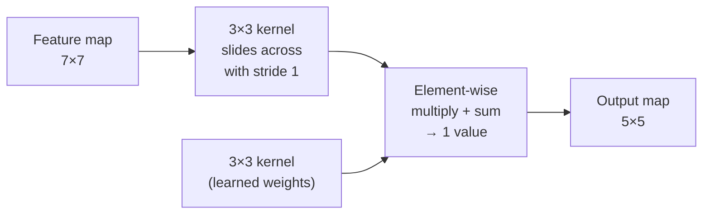
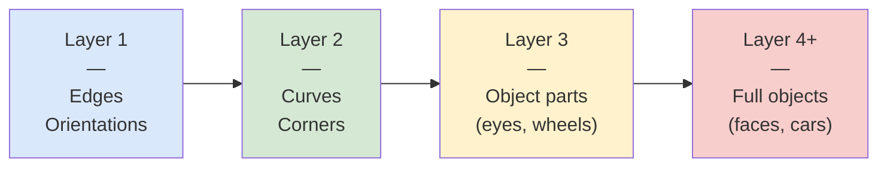
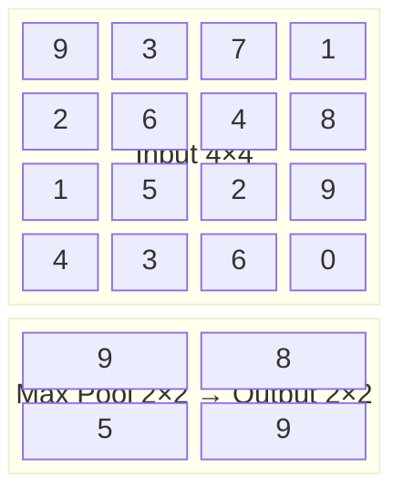
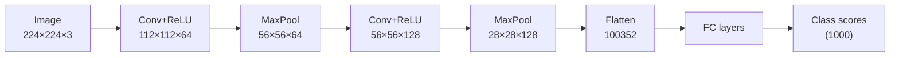
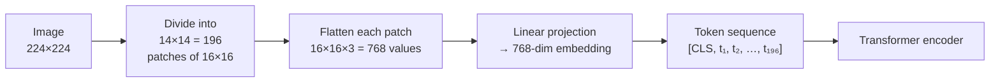

# Computer Vision Fundamentals

How machines see: from pixels to features.

---

## What Is an Image to a Computer?

**An image is a grid of numbers**

- Every image is made up of **pixels**: the smallest addressable element
- Each pixel stores one or more numerical values representing color or intensity
- A grayscale image: one number per pixel (0 = black, 255 = white)
- A color image: three numbers per pixel, one for each color channel

---

## Color Channels and Tensor Shape

**RGB images have three stacked grids of numbers**

- **R (Red), G (Green), B (Blue)**: each channel is an H x W grid of values 0-255
- The full image is a 3D array of shape **(C, H, W)**: channels x height x width
  - Example: a 224x224 color image = shape `[3, 224, 224]` = 150,528 values

```python
import torch
from PIL import Image
import torchvision.transforms as T

img = Image.open("cat.jpg")
tensor = T.ToTensor()(img)   # automatically normalizes to [0, 1]
print(tensor.shape)           # torch.Size([3, 224, 224])
print(tensor.dtype)           # torch.float32
print(tensor.min(), tensor.max())  # tensor(0.) tensor(1.)
```

---

## Loading and Preprocessing with torchvision

**A standard preprocessing pipeline for pretrained models**

Most ImageNet-pretrained models expect: resize to 256, center-crop to 224, normalize with ImageNet mean/std.

```python
import torchvision.transforms as T
from PIL import Image
import torch

transform = T.Compose([
    T.Resize(256),
    T.CenterCrop(224),
    T.ToTensor(),                              # [0, 1] float32, C x H x W
    T.Normalize(
        mean=[0.485, 0.456, 0.406],            # ImageNet channel means
        std=[0.229, 0.224, 0.225]              # ImageNet channel stds
    )
])

img = Image.open("cat.jpg").convert("RGB")
x = transform(img).unsqueeze(0)               # add batch dim -> [1, 3, 224, 224]
```

The mean/std values are fixed constants computed on ImageNet. Use them whenever loading a model pretrained on ImageNet.

---

## Data Augmentation with albumentations

**albumentations is the standard library for detection-grade augmentation**

`torchvision.transforms` works for classification but does not transform bounding boxes. `albumentations` handles both.

```python
import albumentations as A
from albumentations.pytorch import ToTensorV2
import numpy as np

train_transform = A.Compose([
    A.HorizontalFlip(p=0.5),
    A.RandomBrightnessContrast(p=0.3),
    A.GaussianBlur(blur_limit=(3, 7), p=0.2),
    A.Resize(640, 640),
    A.Normalize(mean=(0.485, 0.456, 0.406),
                std=(0.229, 0.224, 0.225)),
    ToTensorV2(),
], bbox_params=A.BboxParams(
    format="yolo",          # or "pascal_voc", "coco"
    label_fields=["labels"]
))

# image must be HxWxC numpy array in [0, 255] uint8
transformed = train_transform(
    image=image_np,
    bboxes=bboxes,
    labels=labels
)
img_tensor = transformed["image"]          # C x H x W float32
aug_boxes  = transformed["bboxes"]
```

---

## Color Channels: Library Conventions

**Channels-first vs. channels-last**

- **Channels-first** `[C, H, W]` is the PyTorch convention
- OpenCV and PIL use channels-last `[H, W, C]`; be careful when mixing libraries

```python
import cv2
import numpy as np

# OpenCV reads BGR, not RGB
bgr_img = cv2.imread("cat.jpg")           # shape: (H, W, 3) BGR
rgb_img = cv2.cvtColor(bgr_img, cv2.COLOR_BGR2RGB)

# Convert HxWxC (PIL/numpy) to CxHxW (PyTorch)
tensor = torch.from_numpy(rgb_img).permute(2, 0, 1).float() / 255.0
```

---

## What Is a Convolution?

**A convolution slides a small filter across an image**

Ingredients:
- **Input**: a 2D (or 3D) array of pixel values
- **Kernel** (filter): a small matrix, e.g., 3x3 or 5x5
- **Operation**: at each position, multiply each kernel value by the corresponding pixel value, then sum everything up



```
Output[i, j] = sum over (k, l) of: Input[i+k, j+l] * Kernel[k, l]
```

- The output is a new 2D array called a **feature map**
- Different kernels detect different patterns

```python
import torch.nn as nn

# A single conv layer: 3 input channels, 64 output channels, 3x3 kernel
conv = nn.Conv2d(in_channels=3, out_channels=64, kernel_size=3,
                 padding=1, bias=False)
# Input:  [batch, 3, 224, 224]
# Output: [batch, 64, 224, 224]  (padding=1 preserves spatial size)
```

---

## What Do Convolutions Detect?

**The kernel weights determine what pattern the filter responds to**

Three classic examples:

| Kernel Type        | What It Detects                        |
| ------------------ | -------------------------------------- |
| Sobel (horizontal) | Horizontal edges                       |
| Sobel (vertical)   | Vertical edges                         |
| Gaussian blur      | Smooths; removes high-frequency detail |

```python
import torch
import torch.nn.functional as F

# Horizontal Sobel kernel
sobel_h = torch.tensor([[-1, 0, 1],
                         [-2, 0, 2],
                         [-1, 0, 1]], dtype=torch.float32)
# Reshape for conv2d: (out_channels, in_channels, kH, kW)
kernel = sobel_h.view(1, 1, 3, 3)

# Apply to single-channel grayscale image
gray = x[:, :1, :, :]   # [1, 1, H, W]
edges = F.conv2d(gray, kernel, padding=1)
```

---

## What Do Convolutions Detect: Learned Kernels

**In a trained CNN, kernels are learned from data**

- A **positive value** in the feature map means the kernel's pattern was present at that location
- In a trained CNN, the model **learns** the kernel weights from data; no manual design needed
- One convolutional layer has many kernels, each looking for a different pattern

```python
import torchvision.models as models

# Load a pretrained ResNet-50
resnet = models.resnet50(weights=models.ResNet50_Weights.IMAGENET1K_V2)

# Inspect first conv layer kernels: shape [64, 3, 7, 7]
# 64 filters, each 3-channel, 7x7 spatial
first_conv = resnet.conv1
print(first_conv.weight.shape)   # torch.Size([64, 3, 7, 7])
```

---

## Stacking Convolutions: Hierarchical Features

**Earlier layers detect simple things; deeper layers detect complex things**



Why does the hierarchy form?
- Each layer's input is the previous layer's feature maps
- A curve detector can be built by combining edge detectors
- An eye detector can be built by combining curve and blob detectors
- The network learns this hierarchy automatically through gradient descent

---

## Stacking Convolutions: Implications for Transfer Learning

**The hierarchy has practical consequences**

Key implications:
- **Early layers** learn features that generalize across datasets (edges are edges everywhere)
- **Deep layers** are more domain-specific
- This is why fine-tuning works: keep early weights, retrain late weights

```python
import torchvision.models as models
import torch.nn as nn

resnet = models.resnet50(weights=models.ResNet50_Weights.IMAGENET1K_V2)

# Freeze all layers
for param in resnet.parameters():
    param.requires_grad = False

# Replace and unfreeze only the final classifier
num_classes = 10
resnet.fc = nn.Linear(resnet.fc.in_features, num_classes)
# resnet.fc parameters have requires_grad=True by default (new layer)

# Optionally unfreeze the last ResNet block (layer4) for better accuracy
for param in resnet.layer4.parameters():
    param.requires_grad = True
```

---

## Pooling and Spatial Hierarchy

**Downsampling builds spatial invariance**

After a convolution, a **pooling layer** reduces the spatial dimensions:
- **Max pooling**: take the maximum value in each pooling window
- **Average pooling**: take the mean



Why pooling matters:
- Makes the feature detector less sensitive to exact position ("a cat eye is a cat eye whether it's 5 pixels left or right")
- Reduces spatial resolution, reducing compute in later layers
- Creates a pyramid: 224x224 -> 112x112 -> 56x56 -> ... -> 7x7 -> global average

---

## CNN at a Glance

**Putting it all together**

A typical CNN architecture:

```
Input image [3, 224, 224]
    -> Conv + ReLU -> [64, 112, 112]
    -> MaxPool     -> [64, 56, 56]
    -> Conv + ReLU -> [128, 56, 56]
    -> MaxPool     -> [128, 28, 28]
    -> ...
    -> Global Avg Pool -> [512]
    -> Linear -> [num_classes]
```

- Each conv layer applies many learned kernels in parallel
- ReLU (Rectified Linear Unit) activation: `max(0, x)` introduces non-linearity
- Global average pooling collapses the spatial dimensions at the end

```python
# Extract features from an intermediate layer using a hook
features = {}

def hook_fn(module, input, output):
    features["layer3"] = output.detach()

resnet.layer3.register_forward_hook(hook_fn)
with torch.no_grad():
    _ = resnet(x)
# features["layer3"] has shape [1, 1024, 14, 14]
```



---

## Backbone Feature Extraction with timm

**timm provides a unified API for hundreds of pretrained models**

```python
import timm
import torch

# List available models matching a pattern
print(timm.list_models("resnet*", pretrained=True)[:5])
# ['resnet18', 'resnet34', 'resnet50', ...]

# Create a feature extractor (no classifier head)
backbone = timm.create_model(
    "resnet50",
    pretrained=True,
    features_only=True,       # return intermediate feature maps
    out_indices=(2, 3, 4)     # which stages to return
)
backbone.eval()

x = torch.randn(1, 3, 640, 640)
with torch.no_grad():
    feats = backbone(x)

# feats is a list of tensors at requested stages
for i, f in enumerate(feats):
    print(f"Stage {i}: {f.shape}")
# Stage 0: torch.Size([1, 512,  40, 40])
# Stage 1: torch.Size([1, 1024, 20, 20])
# Stage 2: torch.Size([1, 2048, 10, 10])
```

This multi-scale output is exactly what FPN and detection necks consume.

---

## Vision Transformers (ViT) — A Different Approach

**Transformers don't use convolutions; they use attention**

The key idea: treat an image as a sequence of patches

1. Divide the image into a grid of fixed-size patches (e.g., 16x16 pixels each)
2. Flatten each patch into a vector and project it with a linear layer: this is the **patch embedding**
3. Add a position embedding to each patch so the model knows where each patch came from
4. Feed the sequence of patch embeddings into a standard Transformer encoder



For a 224x224 image with 16x16 patches:
- Number of patches = (224/16)^2 = 196 tokens
- Each token = a 768-dimensional vector (in ViT-Base)

---

## ViT Inference with timm

**Loading a pretrained ViT and extracting patch features**

```python
import timm
import torch

# ViT-Base/16 pretrained on ImageNet-21k
vit = timm.create_model("vit_base_patch16_224", pretrained=True)
vit.eval()

x = torch.randn(1, 3, 224, 224)

with torch.no_grad():
    # get_intermediate_layers returns patch tokens (no CLS)
    patch_tokens = vit.get_intermediate_layers(x, n=1)[0]
    # shape: [1, 196, 768]  (196 patches, 768-dim each)

# For classification, use the CLS token
features = vit.forward_features(x)  # [1, 197, 768]
cls_token = features[:, 0, :]       # [1, 768]

# DINOv2 via timm
dinov2 = timm.create_model("vit_base_patch14_dinov2", pretrained=True)
```

---

## ViT — Self-Attention on Patches

**Each patch attends to every other patch**

Self-attention lets the model compare every patch to every other patch simultaneously:
- A patch of the sky can attend to another sky patch on the other side of the image
- A patch containing an eye can attend to the patch containing the nose

This gives ViT **global context from the very first layer**, unlike CNNs where global context builds gradually through many layers.

The `[CLS]` token:
- A special learnable token prepended to the sequence
- After Transformer processing, the `[CLS]` token's output is used for classification
- It aggregates information from all patches via attention

---

## CNN vs. ViT — Key Differences

**Two fundamentally different inductive biases**

| Property               | CNN                                | ViT                                    |
| ---------------------- | ---------------------------------- | -------------------------------------- |
| Inductive bias         | Translation equivariance, locality | None (fully learned from data)         |
| Global context         | Needs many layers                  | Available from layer 1                 |
| Data requirements      | Works well with less data          | Needs large datasets or pretraining    |
| Compute (small images) | Very efficient                     | More expensive                         |
| Scalability            | Saturates at large scale           | Scales better with data and compute    |
| Transfer learning      | Strong; early layers are universal | Excellent with large pretrained models |

---

## CNN vs. ViT — When Each Wins

**Data scale determines the winner**

- CNNs have a head start on small datasets because locality and translation invariance are built in
- ViTs catch up and surpass CNNs when pretrained on large datasets (ImageNet-21k, JFT-300M, LAION)

Concrete reference points from published benchmarks:
- ResNet-50 ImageNet-1k top-1: ~76%
- ViT-B/16 ImageNet-1k trained from scratch: ~74% (worse without large-scale pretraining)
- ViT-B/16 fine-tuned from ImageNet-21k: ~86%
- DINOv2 ViT-B/14 linear probe: ~86% (no fine-tuning of backbone at all)

---

## When to Use CNN vs. ViT

**Practical guidance**

**Prefer a CNN when:**
- Your dataset is small (< 10k images) and you're training from scratch
- Inference speed and low memory footprint matter (e.g., mobile deployment)
- You need strong performance on dense prediction tasks with limited compute (segmentation, detection)

**Prefer a ViT when:**
- You have access to a large pretrained ViT checkpoint (CLIP, DINOv2, SAM)
- Your task benefits from global context (long-range relationships in the image)
- You're building a multimodal system where a shared attention-based backbone makes sense

---

## When to Use CNN vs. ViT: Bottom Line

**In practice**

For most tasks, start with a pretrained model regardless of architecture. The pretrained weights matter more than the architectural choice.

A practical starting recipe:
```python
# Option A: fast CNN baseline
model = timm.create_model("resnet50", pretrained=True, num_classes=N)

# Option B: strong ViT baseline
model = timm.create_model("vit_base_patch16_224", pretrained=True, num_classes=N)

# Option C: frozen DINOv2 + linear probe (very data-efficient)
backbone = timm.create_model("vit_base_patch14_dinov2",
                              pretrained=True, num_classes=0)
for p in backbone.parameters():
    p.requires_grad = False
head = torch.nn.Linear(backbone.num_features, N)
```

---

## What We Covered

**The building blocks of computer vision**

1. Images are tensors of shape `[C, H, W]` with pixel values as numbers
2. Convolutions slide a learned kernel across the input, producing feature maps that detect local patterns
3. Stacking convolutions creates a hierarchy: edges -> parts -> objects
4. Pooling builds spatial invariance and reduces resolution
5. ViT patches the image, embeds each patch as a token, and applies standard Transformer self-attention
6. CNN: strong inductive bias, data-efficient; ViT: no built-in bias, scales better, needs pretraining
7. `timm` and `torchvision` provide pretrained checkpoints; `albumentations` handles augmentation with box support

