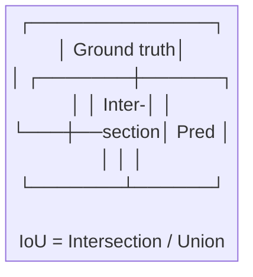
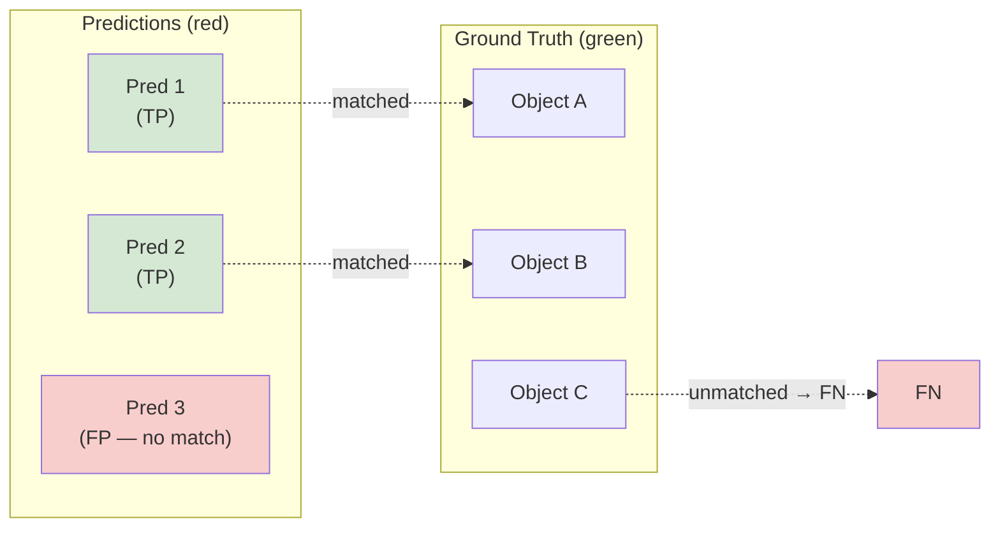
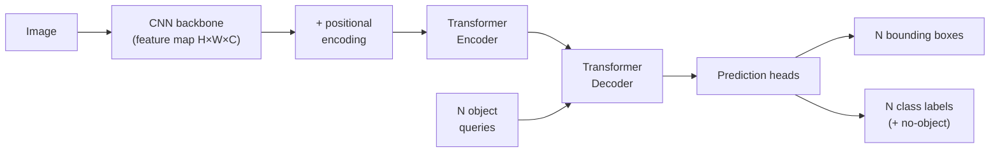
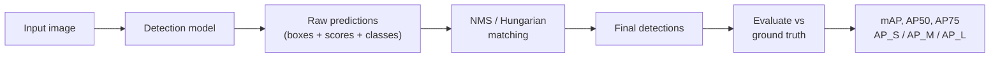

# Object Detection Concepts

Finding and identifying objects in an image.

---

## Classification vs. Detection

**What makes detection fundamentally harder**

| Task           | Output                     | Challenge                                 |
| -------------- | -------------------------- | ----------------------------------------- |
| Classification | One label per image        | Simple; one decision                      |
| Detection      | One or more boxes + labels | Variable number of outputs; must localize |

---

## Detection Challenges

**Additional challenges detection introduces**

- An image may contain **zero, one, or many objects**; the model can't output a fixed-size vector
- Objects vary wildly in **scale**: a person in the foreground vs. a person in the background
- Objects can **overlap**, requiring the model to disentangle multiple instances
- **Background** is the dominant class; most of the image is not an object of interest

---

## The Detection Output Format

**What a detector actually produces**

Each detected object is described by:
- **Bounding box**: a rectangle enclosing the object
- **Confidence score**: how certain the model is that an object is present
- **Class label**: which category the object belongs to

Two common box formats:

| Format                       | Values                          | Notes                     |
| ---------------------------- | ------------------------------- | ------------------------- |
| `(x_center, y_center, w, h)` | Center + dimensions             | Used by YOLO              |
| `(x1, y1, x2, y2)`           | Top-left + bottom-right corners | Used by COCO, Torchvision |

---

## Box Coordinates: Normalization

**Coordinates are often normalized**

Coordinates are often **normalized** to [0, 1] relative to image dimensions for model-agnostic representations.

```python
# Converting between formats
def cxcywh_to_xyxy(boxes):
    """boxes: tensor of shape [N, 4] in (cx, cy, w, h)"""
    cx, cy, w, h = boxes.unbind(-1)
    x1 = cx - w / 2
    y1 = cy - h / 2
    x2 = cx + w / 2
    y2 = cy + h / 2
    return torch.stack([x1, y1, x2, y2], dim=-1)

def xyxy_to_cxcywh(boxes):
    """boxes: tensor of shape [N, 4] in (x1, y1, x2, y2)"""
    x1, y1, x2, y2 = boxes.unbind(-1)
    cx = (x1 + x2) / 2
    cy = (y1 + y2) / 2
    w  = x2 - x1
    h  = y2 - y1
    return torch.stack([cx, cy, w, h], dim=-1)
```

---

## Intersection over Union (IoU)

**The standard measure of bounding box quality**

IoU measures how well a predicted box overlaps with the ground truth box:

```
IoU = |A ∩ B| / |A ∪ B|
    = Area of Intersection / Area of Union
```

Where `|A ∪ B| = |A| + |B| - |A ∩ B|`.



- IoU = 1.0: perfect overlap
- IoU = 0.0: no overlap at all
- IoU = 0.5: the typical threshold for "this prediction counts as a correct detection"

---

## IoU: Implementation in PyTorch

**Computing IoU from raw box coordinates**

```python
import torch

def box_iou(boxes1, boxes2):
    """
    Compute pairwise IoU between two sets of boxes.
    boxes1: [N, 4] in (x1, y1, x2, y2) format
    boxes2: [M, 4] in (x1, y1, x2, y2) format
    Returns: IoU matrix of shape [N, M]
    """
    area1 = (boxes1[:, 2] - boxes1[:, 0]) * (boxes1[:, 3] - boxes1[:, 1])
    area2 = (boxes2[:, 2] - boxes2[:, 0]) * (boxes2[:, 3] - boxes2[:, 1])

    # Intersection
    inter_x1 = torch.max(boxes1[:, None, 0], boxes2[None, :, 0])
    inter_y1 = torch.max(boxes1[:, None, 1], boxes2[None, :, 1])
    inter_x2 = torch.min(boxes1[:, None, 2], boxes2[None, :, 2])
    inter_y2 = torch.min(boxes1[:, None, 3], boxes2[None, :, 3])

    inter_w = (inter_x2 - inter_x1).clamp(min=0)
    inter_h = (inter_y2 - inter_y1).clamp(min=0)
    intersection = inter_w * inter_h

    union = area1[:, None] + area2[None, :] - intersection
    return intersection / union

# torchvision also provides this
from torchvision.ops import box_iou as tv_box_iou
```

Note: `torchvision.ops.box_iou` is the production-quality version; the manual implementation above clarifies the math.

---

## IoU: Interpretation

**What IoU means in practice**

Intuition: IoU penalizes boxes that are too small, too large, or shifted from the true object. A box with IoU < 0.5 is generally considered a **false positive** regardless of the class label.

---

## True Positives, False Positives, False Negatives in Detection

**Before we can talk about mAP, we need to define TP, FP, FN**

Given a set of predictions and ground truth boxes for an image:

- **True Positive (TP)**: a predicted box that matches a ground truth box with IoU >= threshold AND correct class
- **False Positive (FP)**: a predicted box that doesn't match any unmatched ground truth box
- **False Negative (FN)**: a ground truth box that no predicted box matched



One ground truth box can only be matched to **one** prediction (the highest-IoU one). Duplicate predictions for the same object are all FPs.

---

## Precision and Recall for Detection

**Precision: how many predictions were right. Recall: how many objects did we find?**

```
Precision = TP / (TP + FP)    # of all predicted boxes, fraction that were correct
Recall    = TP / (TP + FN)    # of all real objects, fraction that were found
```

The tradeoff:
- **High confidence threshold**: fewer predictions, fewer FPs, lower recall
- **Low confidence threshold**: more predictions, more FPs, higher recall

---

## The Precision-Recall Curve

**Sweeping the confidence threshold**

By sweeping the confidence threshold from 1.0 down to 0.0, we trace out a **precision-recall curve**.

---

## Average Precision (AP) and mAP

**mAP is the headline detection metric**

**Average Precision (AP)** for one class = the area under its precision-recall curve

Formally:
```
AP = integral from r=0 to r=1 of: p(r) dr
   ≈ sum over recall thresholds r_k of: p(r_k) * Δr_k
```

Where `p(r)` is the precision at recall level `r` (interpolated at 11 or 101 points depending on protocol).

**Mean Average Precision (mAP)** = average of AP across all classes:

```
mAP = (1 / C) * sum_{c=1}^{C} AP_c
```

AP = 1.0 means the model found every object and made no false positives at any threshold.

---

## mAP Computation with torchmetrics

**Using torchmetrics for reliable mAP calculation**

```python
from torchmetrics.detection.mean_ap import MeanAveragePrecision
import torch

metric = MeanAveragePrecision(iou_type="bbox")

# Format: list of dicts, one per image
preds = [
    {
        "boxes":  torch.tensor([[10, 20, 100, 200],
                                 [50, 60, 150, 250]], dtype=torch.float32),
        "scores": torch.tensor([0.92, 0.75]),
        "labels": torch.tensor([0, 1]),
    }
]
targets = [
    {
        "boxes":  torch.tensor([[12, 22, 102, 198]], dtype=torch.float32),
        "labels": torch.tensor([0]),
    }
]

metric.update(preds, targets)
results = metric.compute()

print(results["map"])        # mAP@0.50:0.95
print(results["map_50"])     # mAP@0.50
print(results["map_75"])     # mAP@0.75
print(results["map_small"])  # mAP for small objects (area < 32^2 px)
```

---

## mAP Variants: PASCAL VOC vs. COCO

**Two standard evaluation protocols**

- **mAP@0.5**: IoU threshold of 0.5 to count a detection as TP (the older PASCAL VOC standard)
- **mAP@0.5:0.95**: average mAP over IoU thresholds 0.5, 0.55, 0.60, ..., 0.95 (the COCO standard, stricter)
- COCO mAP is lower by design; it penalizes imprecise localization more strongly

Representative COCO benchmark numbers for reference:

| Model     | mAP@0.5:0.95 | mAP@0.5 |
| --------- | ------------ | ------- |
| YOLOv8n   | 37.3         | 52.5    |
| YOLOv8m   | 50.2         | 67.2    |
| YOLOv11x  | 54.7         | 72.0    |
| RT-DETR-L | 53.0         | 71.6    |

---

## Non-Maximum Suppression (NMS)

**Why we get duplicate boxes and how to remove them**

Object detectors generate many candidate boxes (sometimes thousands per image). Multiple candidates often fire on the same object.

The NMS algorithm:
1. Sort all predictions by confidence (highest first)
2. Take the highest-confidence box; this is a kept detection
3. Remove all other boxes that overlap with it above an IoU threshold (typically 0.5)
4. Repeat from step 2 until no boxes remain

Formally, at each step: suppress box `j` if `IoU(kept_box, box_j) > θ_iou` and `score_j < score_kept`.

---

## NMS in Code

**torchvision.ops.nms is the standard implementation**

```python
import torch
from torchvision.ops import nms, batched_nms

# boxes: [N, 4] float32 in xyxy format
# scores: [N] float32 confidence scores
# iou_threshold: float

boxes  = torch.tensor([[10, 20, 100, 200],
                        [12, 22, 102, 198],   # heavily overlaps with box 0
                        [300, 300, 400, 400]], dtype=torch.float32)
scores = torch.tensor([0.92, 0.85, 0.78])

keep = nms(boxes, scores, iou_threshold=0.5)
print(keep)    # tensor([0, 2]) -- box 1 suppressed as it overlaps box 0

# batched_nms suppresses independently per class (prevents cross-class suppression)
labels = torch.tensor([0, 0, 1])
keep2 = batched_nms(boxes, scores, labels, iou_threshold=0.5)
```

---

## NMS: IoU Threshold Behavior

**How suppression aggressiveness is controlled**

- Boxes that overlap a lot with a kept box are suppressed (assumed to be duplicates)
- The IoU threshold controls how aggressive the suppression is
- Lower threshold: more aggressive suppression, fewer retained boxes (can miss nearby objects)
- Higher threshold: less aggressive, more retained boxes (can keep duplicates)

---

## NMS Failure Cases

**NMS is a heuristic; it fails in specific scenarios**

**Crowded scenes**: when two different objects of the same class are close together, one may be suppressed because their boxes overlap above the IoU threshold.

Example: two people standing side-by-side. The lower-confidence person box may be suppressed even though it's a real detection.

**Solutions**:
- **Soft-NMS**: instead of hard removal, multiply the confidence of overlapping boxes by a decay factor
- **Class-agnostic NMS**: suppress boxes regardless of class label (helps with multi-class overlap)
- **DETR-style end-to-end detection**: eliminates NMS entirely by formulating detection as a set prediction problem; the model outputs exactly N predictions and is trained with the Hungarian matching algorithm

---

## YOLO Inference with ultralytics

**Running YOLOv8/v11 and reading detections**

```python
from ultralytics import YOLO
import torch

# Load a pretrained model (downloads automatically on first run)
model = YOLO("yolov8m.pt")    # nano/small/medium/large/xlarge
# For YOLOv11: model = YOLO("yolo11m.pt")

# Run inference on an image
results = model("street.jpg", conf=0.25, iou=0.45)

# Parse detections from the first image
r = results[0]
boxes  = r.boxes.xyxy     # [N, 4] tensor, (x1, y1, x2, y2)
scores = r.boxes.conf     # [N]    confidence scores
labels = r.boxes.cls      # [N]    class indices

for i in range(len(boxes)):
    cls_name = model.names[int(labels[i])]
    print(f"{cls_name}: {scores[i]:.2f}  box={boxes[i].tolist()}")

# Save annotated image
r.save("output.jpg")
```

---

## Fine-tuning YOLO on Custom Data

**Training YOLOv8 on your own dataset**

```python
from ultralytics import YOLO

# Dataset must follow YOLO format:
# data.yaml  ->  train: /path/images/train
#                val:   /path/images/val
#                nc:    3
#                names: ['cat', 'dog', 'bird']

model = YOLO("yolov8m.pt")   # start from COCO pretrained weights

results = model.train(
    data="data.yaml",
    epochs=100,
    imgsz=640,
    batch=16,
    device=0,           # GPU index; "cpu" for CPU
    optimizer="AdamW",
    lr0=1e-3,
    weight_decay=5e-4,
    augment=True,       # mosaic + mixup enabled by default
    project="runs/detect",
    name="custom_yolov8m",
)

# Evaluate on validation set
metrics = model.val()
print(metrics.box.map)     # mAP@0.5:0.95
print(metrics.box.map50)   # mAP@0.5
```

---

## Vocabulary Tour — Anchor-Based Detectors

**Anchors are pre-defined reference boxes**

Anchor-based detectors (Faster R-CNN, YOLOv3-v5, RetinaNet) tile the image with a set of **anchor boxes** at each spatial location:
- Anchors vary in scale (small, medium, large) and aspect ratio (square, wide, tall)
- The model predicts **offsets** from each anchor to the actual object box
- This is easier than predicting absolute coordinates from scratch

---

## Anchor-Based Detectors: Tradeoffs

**Why anchors help and where they hurt**

Why anchors help:
- Give the model a good starting point; regression from an anchor requires only small adjustments
- Different anchor shapes handle different object aspect ratios naturally

Downside: requires careful anchor design; too few anchors hurts recall; too many anchors creates class imbalance between background and foreground.

This class imbalance problem motivated **Focal Loss** in RetinaNet:

```
FL(p_t) = -α_t (1 - p_t)^γ log(p_t)
```

- `p_t`: model's estimated probability for the correct class
- `γ` (gamma): focusing parameter, typically 2.0. When `p_t` is high (easy example), `(1-p_t)^γ` becomes small, down-weighting that example's contribution
- `α_t`: class balancing weight (e.g., 0.25 for foreground)

---

## Vocabulary Tour — Two-Stage Detectors and Proposals

**Proposals: "maybe an object is here"**

Two-stage detectors (Faster R-CNN, Mask R-CNN) split detection into two steps:

**Stage 1: Region Proposal Network (RPN)**
- Scans the feature map and proposes ~2,000 candidate regions that might contain objects
- These are called **proposals** or **region of interest (RoI)**

**Stage 2: RoI Head**
- For each proposal, crop the feature map (RoI Align)
- Run a small classifier and box regressor on each crop

---

## Two-Stage Detectors: Pros and Cons

**Accuracy vs. speed**

Pros: high accuracy, good localization
Cons: slower than one-stage detectors; proposals add latency

Running Faster R-CNN with torchvision:

```python
import torchvision
from torchvision.models.detection import fasterrcnn_resnet50_fpn_v2
import torch

model = fasterrcnn_resnet50_fpn_v2(
    weights="DEFAULT",   # COCO pretrained
    box_score_thresh=0.5,
    box_nms_thresh=0.4,
)
model.eval()

from torchvision.transforms.functional import to_tensor
from PIL import Image
img = to_tensor(Image.open("street.jpg")).unsqueeze(0)

with torch.no_grad():
    preds = model(img)

# preds[0]: dict with keys 'boxes', 'labels', 'scores'
print(preds[0]["boxes"].shape)    # [N, 4]
print(preds[0]["labels"])         # COCO class indices
```

---

## Vocabulary Tour — DETR-Style Queries

**Detection as set prediction, no anchors or NMS needed**

DETR (Detection Transformer) introduced a radically different approach:
- Uses a fixed set of N **object queries** (learnable embeddings), typically 100
- The Transformer decoder attends to both the queries and the encoder's image features
- Each query is trained to output at most one object (or a "no object" prediction)



Training uses the **Hungarian algorithm** (optimal bipartite matching) to assign ground truth objects to query slots, with a no-match penalty for empty slots.

---

## Running DETR from HuggingFace

**Inference with facebook/detr-resnet-50**

```python
from transformers import DetrImageProcessor, DetrForObjectDetection
import torch
from PIL import Image

processor = DetrImageProcessor.from_pretrained("facebook/detr-resnet-50")
model = DetrForObjectDetection.from_pretrained("facebook/detr-resnet-50")
model.eval()

image = Image.open("street.jpg")
inputs = processor(images=image, return_tensors="pt")

with torch.no_grad():
    outputs = model(**inputs)

# Post-process: filter predictions with confidence > 0.9
target_sizes = torch.tensor([image.size[::-1]])  # (height, width)
results = processor.post_process_object_detection(
    outputs,
    target_sizes=target_sizes,
    threshold=0.9
)[0]

for score, label, box in zip(results["scores"],
                              results["labels"],
                              results["boxes"]):
    cls = model.config.id2label[label.item()]
    print(f"{cls}: {score:.2f}  {box.tolist()}")
```

---

## Running RT-DETR from HuggingFace

**RT-DETR: real-time, NMS-free detection**

```python
from transformers import RTDetrForObjectDetection, RTDetrImageProcessor
import torch
from PIL import Image

processor = RTDetrImageProcessor.from_pretrained("PekingU/rtdetr_r50vd")
model = RTDetrForObjectDetection.from_pretrained("PekingU/rtdetr_r50vd")
model.eval()

image = Image.open("street.jpg")
inputs = processor(images=image, return_tensors="pt")

with torch.no_grad():
    outputs = model(**inputs)

results = processor.post_process_object_detection(
    outputs,
    target_sizes=torch.tensor([image.size[::-1]]),
    threshold=0.5
)[0]

# RT-DETR uses no NMS; each output slot is independent
for score, label, box in zip(results["scores"],
                              results["labels"],
                              results["boxes"]):
    cls = model.config.id2label[label.item()]
    print(f"{cls}: {score:.3f}  {[round(v, 1) for v in box.tolist()]}")
```

---

## DETR-Style Queries: Key Properties

**What makes DETR different**

Key properties:
- No anchors, no NMS, no handcrafted components
- Slower to train than anchor-based models; requires longer convergence
- Extensions (Deformable DETR, DINO-DETR, RT-DETR) address speed and convergence issues

---

## What We Covered

**Object detection: the full picture**

1. Detection outputs bounding boxes, confidence scores, and class labels per object
2. Boxes are described as `(cx, cy, w, h)` or `(x1, y1, x2, y2)`; coordinates often normalized
3. `IoU = |A ∩ B| / |A ∪ B|` measures box overlap; 0.5 is the standard TP threshold
4. Precision and recall are computed by sweeping a confidence threshold; AP = area under that curve
5. `mAP = (1/C) * Σ AP_c`; mAP@0.5:0.95 (COCO) is the modern standard
6. NMS removes duplicate predictions; `torchvision.ops.nms` is the standard implementation
7. `torchmetrics.detection.MeanAveragePrecision` computes mAP from prediction/target dicts
8. YOLO (ultralytics), Faster R-CNN (torchvision), DETR and RT-DETR (HuggingFace) are the main practical options

---

## What We Covered: Architecture Families

**The three main detector designs**

9. Architectures split into anchor-based (YOLO, Faster R-CNN), proposal-based (two-stage), and query-based (DETR)
10. Focal Loss (`FL(p_t) = -α_t (1-p_t)^γ log(p_t)`) addresses class imbalance in anchor-based detectors


