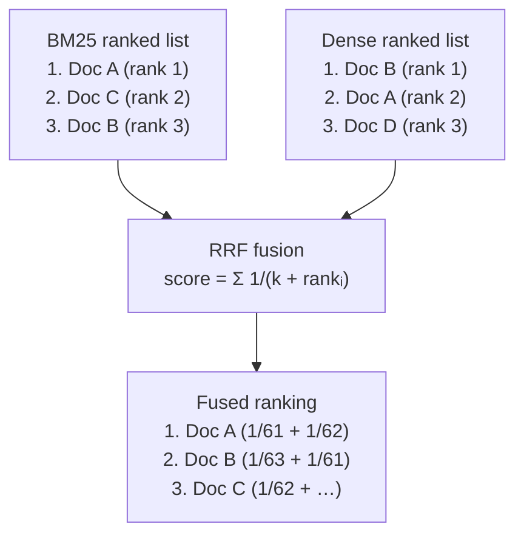
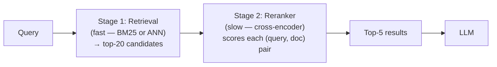
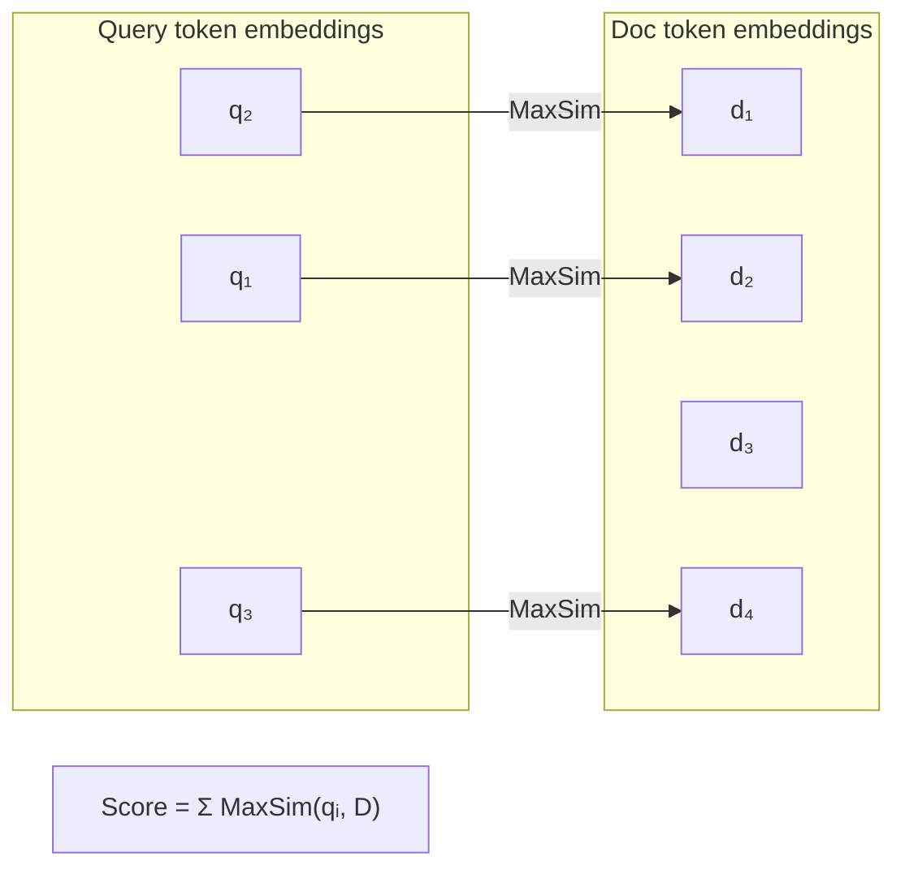
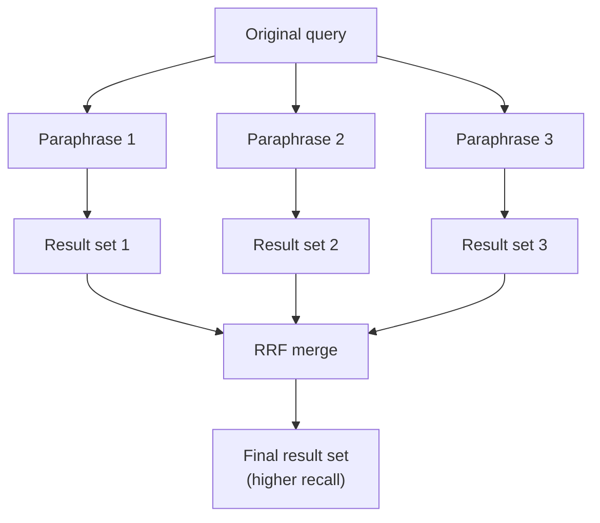

# Hybrid Retrieval and Reranking

---

## What We're Covering

- Sparse retrieval with BM25: how it works and where it excels
- Where dense retrieval outperforms BM25 and vice versa
- Recall numbers: what the benchmarks actually show
- Hybrid retrieval: combining both signals with Reciprocal Rank Fusion
- HNSW index mechanics for scalable dense retrieval
- Cross-encoder rerankers: scoring (query, document) pairs more carefully
- Late interaction models: ColBERT
- Two-stage pipeline implementation end to end
- Query rewriting and query expansion to improve retrieval recall

---

## Sparse Retrieval with BM25: How It Works

- BM25 is a keyword-based ranking function, a refinement of TF-IDF
- For a given query term t and document d:
  - **TF component**: how often does t appear in d? (with diminishing returns past a saturation threshold)
  - **IDF component**: how rare is t across the whole corpus? (rare terms get higher weight)
- BM25 score for a document = sum of per-term scores across all query terms present in the document
- No vectors, no neural network: just an inverted index and some arithmetic

---

## Sparse Retrieval with BM25: The Formula

```
BM25(q, d) = Σᵢ IDF(qᵢ) · [f(qᵢ,d) · (k₁ + 1)] / [f(qᵢ,d) + k₁ · (1 - b + b · |d| / avgdl)]
```

- `f(qᵢ, d)`: raw term frequency of query term `qᵢ` in document `d`
- `|d|`: document length in tokens; `avgdl`: average document length across the corpus
- `k₁` (default 1.5): saturation parameter, controls how quickly TF saturates (high TF does not keep linearly increasing the score)
- `b` (default 0.75): length normalization parameter (0 = no normalization, 1 = full normalization)
- IDF formula: `IDF(qᵢ) = ln((N - n(qᵢ) + 0.5) / (n(qᵢ) + 0.5) + 1)` where `N` is corpus size and `n(qᵢ)` is document frequency of term

---

## BM25 Retrieval in Code

```python
from rank_bm25 import BM25Okapi

# rank_bm25 expects pre-tokenized lists
corpus = [
    "Refund window is 14 days from purchase date",
    "Digital downloads cannot be refunded after access",
    "Contact support within 30 days for hardware defects",
    "Subscriptions auto-renew unless cancelled 48 hours before renewal",
]
tokenized_corpus = [doc.lower().split() for doc in corpus]

bm25 = BM25Okapi(tokenized_corpus)

query = "how long do I have to return a digital product"
tokenized_query = query.lower().split()

scores = bm25.get_scores(tokenized_query)
top_n  = bm25.get_top_n(tokenized_query, corpus, n=2)

for doc in top_n:
    print(doc)
```

BM25 gives exact term matching; a query for "CVE-2024-1234" will score any document containing that string exactly.

---

## Where BM25 Wins

- **Rare technical terms**: a query for "CVSS 9.8 RCE vulnerability CVE-2024-1234" will be matched exactly by BM25
  - Dense retrievers may never have seen this CVE number and cannot embed it meaningfully
- **Product codes, model numbers, proper names**: sparse matching is exact and reliable
- **Short documents with high keyword density**: BM25 excels when the document vocabulary closely matches the query vocabulary
- BM25 is also fast, transparent, and requires no GPU

---

## Dense Retrieval: Recall Numbers on Standard Benchmarks

On the MS MARCO passage retrieval benchmark (8.8M passages):

| Method                       | Recall@100 | MRR@10 |
| ---------------------------- | ---------- | ------ |
| BM25                         | 85.7%      | 0.184  |
| DPR (dense)                  | 89.1%      | 0.318  |
| SPLADE (sparse-dense hybrid) | 97.9%      | 0.368  |
| Hybrid BM25 + DPR + RRF      | ~93%       | ~0.34  |

- Dense retrieval substantially improves MRR (precision at top ranks)
- BM25 is surprisingly competitive on Recall@100 because it casts a wide net
- Hybrid consistently closes the gap between the two

---

## Where Dense Retrieval Wins

- **Semantic paraphrase**: "how do I cancel my subscription" vs. "steps to terminate service contract"
  - No overlapping keywords, but the meaning is identical; dense vectors capture this
- **Cross-lingual queries**: dense models trained multilingually can match a French query to an English document
- **Implicit concepts**: "the CEO resigned" could match a document about "leadership transition" without sharing keywords
- Dense retrieval degrades gracefully on out-of-vocabulary terms; BM25 gives zero score if no keywords match

---

## HNSW Index Mechanics

FAISS `IndexHNSWFlat` uses Hierarchical Navigable Small Worlds, the graph structure behind most production vector databases:

- **Construction**: each vector is inserted into a multi-layer proximity graph; higher layers are sparse (long-range connections), lower layers are dense (local connections)
- **Search**: start at the top layer, greedily navigate toward the query, descend to lower layers when stuck, terminating in the dense bottom layer
- **Key parameters**:
  - `M` (default 32): number of edges per node; higher M = better recall, more RAM, slower build
  - `efConstruction` (default 200): beam width during build; higher = better index quality, slower build
  - `efSearch`: beam width during query; increase at search time to trade speed for recall

```python
import faiss
from sentence_transformers import SentenceTransformer

model = SentenceTransformer("BAAI/bge-large-en-v1.5")
doc_vecs = model.encode(corpus, normalize_embeddings=True).astype("float32")
dim = doc_vecs.shape[1]  # 1024

# HNSW: approximate, very fast at query time, no training needed
index = faiss.IndexHNSWFlat(dim, 32)          # 32 edges per node
index.hnsw.efConstruction = 200
index.add(doc_vecs)

index.hnsw.efSearch = 64                       # increase for better recall at query time
scores, indices = index.search(q_vec, k=20)
```

HNSW typically achieves >99% recall@10 at 5-10x the speed of `IndexFlatIP` for large corpora.

---

## Hybrid Retrieval: Combining BM25 and Dense

- Use both BM25 and dense retrieval, then merge the ranked lists into a single ranking
- **Reciprocal Rank Fusion (RRF)**: a simple, effective merging strategy

```
RRF(d) = Σᵢ  1 / (k + rankᵢ(d))
```

- For each document `d`, sum `1 / (k + rank)` across all ranked lists
- `k` is a smoothing constant (default 60); prevents top-ranked documents from dominating excessively
- Documents ranked highly in both lists score very high; documents ranked highly in only one list score moderately
- No tuning of score scales needed: RRF only uses rank positions, not raw scores



---

## RRF Implementation

```python
from collections import defaultdict

def reciprocal_rank_fusion(
    ranked_lists: list[list[str]],
    k: int = 60,
) -> list[tuple[str, float]]:
    """
    ranked_lists: list of lists of document IDs, each sorted best-first
    Returns: list of (doc_id, rrf_score) sorted best-first
    """
    scores: dict[str, float] = defaultdict(float)
    for ranked in ranked_lists:
        for rank, doc_id in enumerate(ranked, start=1):
            scores[doc_id] += 1.0 / (k + rank)
    return sorted(scores.items(), key=lambda x: x[1], reverse=True)


# BM25 results (list of doc IDs, best-first)
bm25_results  = ["doc_3", "doc_1", "doc_7", "doc_2"]
# Dense results (list of doc IDs, best-first)
dense_results = ["doc_1", "doc_3", "doc_9", "doc_7"]

fused = reciprocal_rank_fusion([bm25_results, dense_results])
print(fused[:3])
# [('doc_3', 0.0328), ('doc_1', 0.0327), ('doc_7', 0.0254)]
```

`doc_3` and `doc_1` both appear near the top of both lists, so they score highest after fusion.

---

## Why Hybrid Consistently Outperforms Either Alone

- BM25 and dense retrieval make different types of errors
- BM25 fails on paraphrase; dense fails on rare keywords; they fail on different queries
- Combining them increases the probability that at least one method retrieves the relevant document
- In practice, hybrid retrieval consistently outperforms either single method by several percentage points on standard recall benchmarks
- It is one of the highest-leverage, lowest-cost improvements you can make to a RAG pipeline

---

## Two-Stage Retrieval Pipeline in Code

```python
from rank_bm25 import BM25Okapi
from sentence_transformers import SentenceTransformer, CrossEncoder
import faiss
import numpy as np
from collections import defaultdict

# ---- Setup ----
corpus = [...]   # list of document strings
doc_ids = [f"doc_{i}" for i in range(len(corpus))]

embed_model = SentenceTransformer("BAAI/bge-large-en-v1.5")
reranker    = CrossEncoder("cross-encoder/ms-marco-MiniLM-L-6-v2")

# BM25 index
tokenized = [d.lower().split() for d in corpus]
bm25 = BM25Okapi(tokenized)

# Dense index (HNSW)
vecs = embed_model.encode(corpus, normalize_embeddings=True).astype("float32")
dim  = vecs.shape[1]
hnsw = faiss.IndexHNSWFlat(dim, 32)
hnsw.hnsw.efConstruction = 200
hnsw.add(vecs)

def two_stage_retrieve(query: str, recall_k: int = 20, final_k: int = 5) -> list[dict]:
    # Stage 1a: BM25
    bm25_scores = bm25.get_scores(query.lower().split())
    bm25_top = np.argsort(bm25_scores)[::-1][:recall_k]
    bm25_ids  = [doc_ids[i] for i in bm25_top]

    # Stage 1b: Dense
    q_vec = embed_model.encode([query], normalize_embeddings=True).astype("float32")
    hnsw.hnsw.efSearch = 64
    _, dense_top = hnsw.search(q_vec, recall_k)
    dense_ids = [doc_ids[i] for i in dense_top[0]]

    # Stage 1c: RRF fusion
    fused = reciprocal_rank_fusion([bm25_ids, dense_ids])
    candidate_ids = [doc_id for doc_id, _ in fused[:recall_k]]

    # Stage 2: Cross-encoder reranking
    candidate_docs = [corpus[int(doc_id.split("_")[1])] for doc_id in candidate_ids]
    pairs  = [[query, doc] for doc in candidate_docs]
    scores = reranker.predict(pairs)

    ranked = sorted(zip(candidate_ids, candidate_docs, scores),
                    key=lambda x: x[2], reverse=True)
    return [{"id": r[0], "text": r[1], "score": float(r[2])} for r in ranked[:final_k]]
```

---

## Cross-Encoder Rerankers

- Retrieval (whether BM25, dense, or hybrid) optimizes for **recall**: get the right documents into the top-K
- A reranker then optimizes for **precision**: from those top-K, which ones are actually most relevant?
- A cross-encoder takes the (query, document) pair as a single input and outputs a relevance score
- This allows the model to compare the query and document jointly, capturing subtle relevance signals that retrieval misses
- Common architecture: a small BERT or RoBERTa model fine-tuned on query-document relevance pairs



---

## Cross-Encoder Reranking in Code

```python
from sentence_transformers import CrossEncoder

# cross-encoder/ms-marco-MiniLM-L-6-v2: 22M parameters, fast on CPU, strong English baseline
# BAAI/bge-reranker-large: 560M parameters, strong multilingual performance
reranker = CrossEncoder("cross-encoder/ms-marco-MiniLM-L-6-v2", max_length=512)

query = "How long do I have to return a digital product?"
candidates = [
    "Refund window is 14 days from purchase date.",
    "Digital downloads cannot be refunded after access.",
    "Hardware defects covered for 30 days.",
    "All returns must include original packaging.",
]

# Score each (query, document) pair jointly
pairs  = [[query, doc] for doc in candidates]
scores = reranker.predict(pairs)

ranked = sorted(zip(candidates, scores), key=lambda x: x[1], reverse=True)
for doc, score in ranked:
    print(f"{score:.4f}  {doc}")
```

The cross-encoder attends to both the query and document together, producing much more calibrated relevance scores than a dot product between independent embeddings.

---

## Recall vs. Precision in the Pipeline

- **Recall-focused stage (retrieval)**: retrieve more than you need, tolerate some noise
  - Retrieve top-20 or top-50; acceptable if the right document is somewhere in the list
- **Precision-focused stage (reranker)**: select the most relevant k from the recall set
  - The LLM only sees top-3 to top-5 after reranking
- This two-stage design keeps the expensive reranker call bounded: it only scores 20-50 pairs, not the entire corpus
- The overall pipeline improves because you inject less noise into the LLM context

---

## Practical Reranker Options

| Model                                   | Size   | Speed        | Strengths                      |
| --------------------------------------- | ------ | ------------ | ------------------------------ |
| `cross-encoder/ms-marco-MiniLM-L-6-v2`  | 22M    | Fast (CPU)   | English, good baseline         |
| `cross-encoder/ms-marco-MiniLM-L-12-v2` | 33M    | Medium       | English, better quality        |
| `BAAI/bge-reranker-large`               | 560M   | Slower (GPU) | Multilingual, top-tier quality |
| Cohere Rerank v3                        | Hosted | API call     | Production-grade, multilingual |

Integration pattern: retrieve top-K with your existing retriever, call `reranker.predict(pairs)`, sort by score, take top-k.

---

## Late Interaction Models: ColBERT

- Bi-encoders (standard dense retrieval) encode query and document independently, then compare with a single dot product
- Cross-encoders encode them jointly but are too slow to run on the full corpus
- **ColBERT** is a middle ground: late interaction

```
ColBERT score(q, d) = Σ over each query token qᵢ of  max over each doc token dⱼ of  (Eqᵢ · Edⱼ)
```

- Each query token finds its best-matching document token (MaxSim operator)
- The final score is the sum of per-query-token MaxSim scores
- Enables **pre-computing** document token embeddings at index time; only query-side embeddings are computed at runtime
- Much more expressive than a single dot product, while being faster than full cross-encoder joint encoding



---

## ColBERT: When to Use It

- ColBERT requires storing one embedding per token per document, not one per document: higher memory (roughly 128-dim float32 per token)
- The `RAGatouille` library wraps ColBERT v2 for simple integration with standard RAG pipelines
- Use ColBERT when you need cross-encoder quality at retrieval speed, and you can afford the storage overhead

```python
from ragatouille import RAGPretrainedModel

RAG = RAGPretrainedModel.from_pretrained("colbert-ir/colbertv2.0")
RAG.index(collection=corpus, index_name="policy_docs", max_document_length=256)

results = RAG.search(query="return policy digital download", k=5)
for r in results:
    print(r["score"], r["content"])
```

---

## Query Rewriting

- The user's raw query is often underspecified or phrased poorly for retrieval
- Query rewriting: before searching, use an LLM to rephrase the query into a form that retrieves better
- Example: user asks "what did they say about the deadline?" -> rewritten to "project deadline announcement from management"
- Handles: missing context (pronouns like "they"), colloquial phrasing, multi-part questions
- Adds one LLM call to the pipeline; the rewritten query is used for retrieval, the original is shown to the user

---

## Query Expansion: HyDE and Multi-Query

- Query expansion adds related terms or reformulations alongside the original query
- **Hypothetical Document Embeddings (HyDE)**: generate a hypothetical answer to the query, embed it, and use that embedding for search
  - Rationale: a plausible answer likely has a similar vector to the actual relevant document
- **Multi-query expansion**: generate N paraphrases of the query, retrieve for each, merge the results
  - Increases recall by covering different phrasings; merge with RRF to deduplicate

---

## Multi-Query Expansion with RRF

```python
from transformers import pipeline as hf_pipeline

llm = hf_pipeline("text-generation", model="meta-llama/Llama-3.1-8B-Instruct",
                  device_map="auto")

def generate_query_variants(query: str, n: int = 3) -> list[str]:
    prompt = (
        f"Generate {n} different phrasings of the following search query. "
        f"Return only the queries, one per line.\n\nQuery: {query}"
    )
    output = llm(prompt, max_new_tokens=150, do_sample=True, temperature=0.7)
    lines = output[0]["generated_text"][len(prompt):].strip().split("\n")
    return [q.strip() for q in lines if q.strip()][:n]

# Retrieve for each variant, then fuse
original_query = "can I return a downloaded ebook"
variants = generate_query_variants(original_query, n=3)
all_variants = [original_query] + variants

all_result_lists = []
for variant in all_variants:
    q_vec = embed_model.encode([variant], normalize_embeddings=True).astype("float32")
    _, idxs = hnsw.search(q_vec, 10)
    all_result_lists.append([doc_ids[i] for i in idxs[0]])

fused = reciprocal_rank_fusion(all_result_lists)
print([doc_id for doc_id, _ in fused[:5]])
```



---

## When to Apply Each Technique

| Situation                                     | Recommended Addition                              |
| --------------------------------------------- | ------------------------------------------------- |
| Keyword-heavy domain (legal, medical, code)   | Add BM25 hybrid                                   |
| Dense retrieval alone has low precision       | Add cross-encoder reranker                        |
| Users phrase queries conversationally         | Add query rewriting                               |
| Low recall on specific topics                 | Add multi-query expansion or HyDE                 |
| Need cross-encoder quality at retrieval scale | ColBERT late interaction                          |
| All of the above apply                        | Layer them: hybrid -> reranker -> query rewriting |

---

## Summary

- BM25 and dense retrieval are complementary: BM25 excels on keyword matching, dense on semantic similarity; each has measurable advantages on different query types
- HNSW indexes provide near-exact recall at a fraction of the cost of brute-force search; tune `M` and `efSearch` for your recall/latency target
- RRF fusion (`Σ 1/(k + rankᵢ(d))`) merges ranked lists without requiring score calibration between systems
- Cross-encoder rerankers (`cross-encoder/ms-marco-MiniLM-L-6-v2`, `BAAI/bge-reranker-large`) improve precision by scoring query-document pairs jointly; run on the top-20 to top-50 recall set only
- ColBERT's MaxSim operator gives late-interaction expressiveness at indexing speed, at the cost of higher storage
- Query rewriting and multi-query expansion with RRF increase recall for poorly-specified queries
