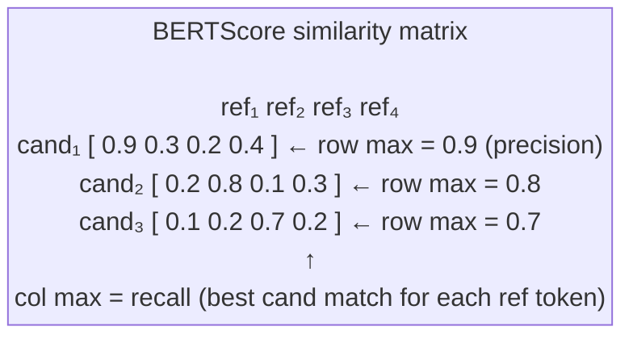
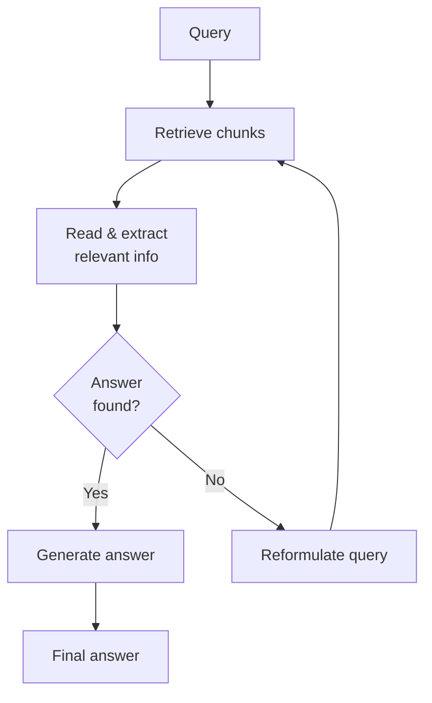
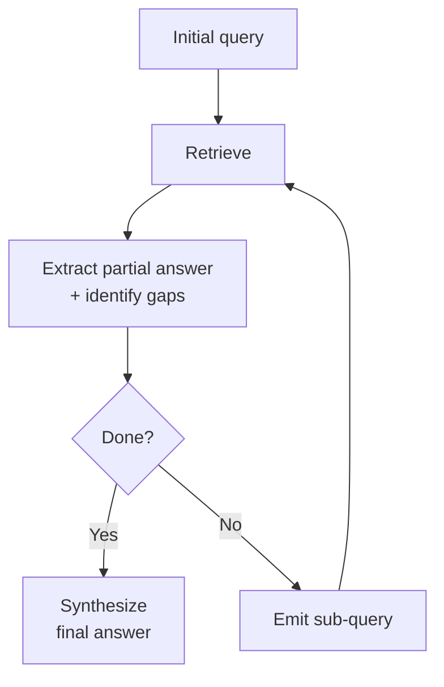

# Evaluation Depth and Frontier Topics in RAG

---

## What We're Covering

- Faithfulness and groundedness: what they mean and why they are distinct
- Retrieval metrics with exact formulas: Precision@k, Recall@k, MRR, NDCG
- How to measure faithfulness automatically using NLI and LLM-as-judge
- The RAGAS framework: metric implementations in code
- BERTScore and why it outperforms ROUGE for RAG evaluation
- RAG failure mode taxonomy with detection approaches
- Multi-hop retrieval: questions that require combining information across documents
- Agentic and iterative retrieval: systems that decide when to retrieve more
- Open research problems

---

## Faithfulness

- **Faithfulness** asks: does the generated answer accurately reflect what is in the retrieved context?
- A faithful answer does not add facts beyond what the context supports
- Example violation: context says "the drug was tested in Phase 2 trials"; answer says "the drug has completed clinical trials" (overstates the evidence)
- Faithfulness is about the relationship between the output and the input context, not about external truth
- A faithful answer can still be wrong if the retrieved context itself is wrong

---

## Groundedness

- **Groundedness** asks: can every factual claim in the answer be traced to a specific retrieved source?
- Groundedness is claim-level: you decompose the answer into individual assertions and check each one
- Example: answer has three factual claims; two are supported by retrieved chunks, one is not; groundedness = 2/3
- Groundedness subsumes faithfulness in some definitions, but the distinction is useful: faithfulness catches cases where the model paraphrases the context inaccurately; groundedness catches cases where claims have no source at all

---

## Retrieval Metrics: Precision and Recall at k

Let `rel(i)` = 1 if the document at rank `i` is relevant, 0 otherwise. `R` = total relevant documents in the corpus.

```
Precision@k = (number of relevant documents in top k) / k
            = (1/k) · Σᵢ₌₁ᵏ rel(i)

Recall@k    = (number of relevant documents in top k) / R
            = (1/k) · Σᵢ₌₁ᵏ rel(i)  /  R
```

- Precision@k measures how much noise is in what you retrieved
- Recall@k measures how much of what you needed you actually found
- For RAG pipelines, Recall@k is often the more critical metric: missing the relevant document is worse than including an extra irrelevant one

---

## Retrieval Metrics: MRR

Mean Reciprocal Rank measures how quickly the first relevant document appears:

```
MRR = (1/|Q|) · Σ_{q ∈ Q}  1 / rank_q
```

- `rank_q`: the rank position of the first relevant document for query `q`
- If the first relevant doc is at rank 1: contributes 1.0. At rank 2: 0.5. At rank 5: 0.2.
- MRR is high when the system consistently places a relevant document near the top

```python
def mean_reciprocal_rank(results: list[list[str]], relevant: list[set[str]]) -> float:
    """
    results:  list of ranked doc-ID lists (one per query)
    relevant: list of sets of relevant doc IDs (one per query)
    """
    rr_sum = 0.0
    for ranked, rel_set in zip(results, relevant):
        for rank, doc_id in enumerate(ranked, start=1):
            if doc_id in rel_set:
                rr_sum += 1.0 / rank
                break
    return rr_sum / len(results)
```

---

## Retrieval Metrics: NDCG

Normalized Discounted Cumulative Gain rewards placing highly relevant documents at the top:

```
DCG@k = Σᵢ₌₁ᵏ  rel(i) / log₂(i + 1)

NDCG@k = DCG@k / IDCG@k
```

- `IDCG@k`: DCG of the ideal (perfect) ranking, used to normalize to [0, 1]
- Documents at rank 1 contribute the most; relevance at rank 5 is discounted by `log₂(6) ≈ 2.58`
- Unlike MRR, NDCG handles graded relevance (0/1/2/3) and considers all top-k results

```python
import numpy as np

def ndcg_at_k(ranked_relevance: list[int], k: int) -> float:
    """ranked_relevance: relevance grade (0/1/2) for each retrieved doc in order"""
    gains = np.array(ranked_relevance[:k], dtype=float)
    discounts = np.log2(np.arange(2, k + 2))      # log2(2), log2(3), ..., log2(k+1)
    dcg  = np.sum(gains / discounts)
    ideal = np.sort(gains)[::-1]
    idcg = np.sum(ideal / discounts)
    return dcg / idcg if idcg > 0 else 0.0

# Example: relevant doc at rank 1, irrelevant at rank 2, relevant at rank 3
print(ndcg_at_k([1, 0, 1, 0, 0], k=5))   # 0.785
```

---

## Measuring Faithfulness with NLI

- Natural Language Inference (NLI) models classify whether a premise entails, contradicts, or is neutral toward a hypothesis
- For RAG faithfulness: premise = retrieved context, hypothesis = a claim from the generated answer
- If the context entails the claim: faithful. If it contradicts or is neutral: not faithful.
- Models like DeBERTa fine-tuned on MNLI or NLI4CT (clinical NLI) work well for this

```python
from transformers import pipeline

nli = pipeline(
    "text-classification",
    model="cross-encoder/nli-deberta-v3-large",
    device=0,
)

context = "The drug was tested in Phase 2 trials with 200 patients."
claim   = "The drug has completed all clinical trials."

# NLI: premise = context, hypothesis = claim
result = nli(f"{context} [SEP] {claim}")
print(result)
# [{'label': 'contradiction', 'score': 0.89}]
# -> not faithful: the claim overstates what the context says
```

Limitation: NLI models trained on short sentence pairs can struggle with long, complex context passages.

---

## LLM-as-Judge for Faithfulness and Groundedness

```python
from transformers import pipeline as hf_pipeline

judge_llm = hf_pipeline(
    "text-generation",
    model="meta-llama/Llama-3.1-8B-Instruct",
    device_map="auto",
)

FAITHFULNESS_PROMPT = """You are an evaluation assistant.
Given a retrieved context and a generated answer, rate the faithfulness of the answer on a scale 1-5.
Faithfulness means every factual claim in the answer is directly supported by the context.

Context:
{context}

Answer:
{answer}

Return a JSON object with keys "score" (int 1-5) and "reason" (one sentence).
"""

context = "The drug was tested in Phase 2 trials with 200 patients."
answer  = "The drug has completed clinical trials."

prompt  = FAITHFULNESS_PROMPT.format(context=context, answer=answer)
output  = judge_llm(prompt, max_new_tokens=100, do_sample=False)
print(output[0]["generated_text"][len(prompt):])
# {"score": 2, "reason": "The answer overstates Phase 2 as all clinical trials."}
```

Best practice: use LLM-as-judge for development diagnostics; run on a representative sample after each pipeline change.

---

## The RAGAS Framework

RAGAS automates computation of four complementary metrics in a single library call:

| Metric              | What it measures                                                                                         |
| ------------------- | -------------------------------------------------------------------------------------------------------- |
| `faithfulness`      | Fraction of answer claims entailed by retrieved context                                                  |
| `answer_relevancy`  | How well the answer addresses the question (uses LLM to generate hypothetical questions from the answer) |
| `context_precision` | Are the retrieved chunks actually useful? (relevant chunks ranked above irrelevant ones)                 |
| `context_recall`    | What fraction of ground-truth answer facts appear in the retrieved context?                              |

---

## RAGAS: Running the Evaluation

```python
from datasets import Dataset
from ragas import evaluate
from ragas.metrics import (
    faithfulness,
    answer_relevancy,
    context_precision,
    context_recall,
)

# Prepare evaluation data: list of examples with all required fields
data = {
    "question":        ["What is the refund window for digital products?"],
    "answer":          ["The refund window is 14 days from purchase."],
    "contexts":        [["Refund window is 14 days from purchase date.",
                         "Digital downloads are non-refundable after access."]],
    "ground_truth":    ["The refund window is 14 days from the date of purchase."],
}
dataset = Dataset.from_dict(data)

result = evaluate(
    dataset,
    metrics=[faithfulness, answer_relevancy, context_precision, context_recall],
)
print(result)
# {'faithfulness': 1.0, 'answer_relevancy': 0.94,
#  'context_precision': 1.0, 'context_recall': 1.0}
```

RAGAS uses an LLM internally for some metrics; set `OPENAI_API_KEY` or configure a local model via `ragas.llms`.

---

## RAGAS Metric Internals: Faithfulness

RAGAS faithfulness decomposes the answer into atomic claims, then checks each against the context:

```
faithfulness = |verified claims| / |total claims in answer|
```

Internally:
1. LLM extracts N atomic claims from the generated answer
2. For each claim, NLI or LLM checks whether the retrieved context entails it
3. Score = fraction of claims that are entailed

Example: answer has 4 claims, 3 are supported by context, 1 is fabricated -> faithfulness = 0.75

---

## RAGAS Metric Internals: Context Precision

Context precision measures whether the useful chunks are ranked above the useless ones:

```
Context Precision@k = (1/|relevant chunks|) · Σᵢ₌₁ᵏ  Precisionᵢ · rel(i)
```

- Penalizes pipelines that retrieve the right chunks but bury them behind irrelevant ones
- A pipeline that returns 2 relevant chunks followed by 8 irrelevant ones scores lower than one returning the same 2 chunks first

---

## Why ROUGE Falls Short for RAG Evaluation

- ROUGE measures n-gram overlap between the generated answer and a reference answer
- It does not care whether two phrases have the same meaning; "terminated the contract" gets no credit for matching "ended the agreement"
- In RAG, the model is often synthesizing and paraphrasing rather than copying the reference verbatim; ROUGE penalizes this
- For factual Q&A, ROUGE also cannot detect hallucinated additions that do not appear in the reference

---

## BERTScore: How It Works

**BERTScore** computes token-level cosine similarities between candidate and reference using contextual embeddings (typically DeBERTa or RoBERTa):

```
P_BERT = (1/|c|) · Σ_{cᵢ ∈ c}  max_{rⱼ ∈ r}  cos(cᵢ, rⱼ)   (Precision)
R_BERT = (1/|r|) · Σ_{rⱼ ∈ r}  max_{cᵢ ∈ c}  cos(cᵢ, rⱼ)   (Recall)
F_BERT = 2 · P_BERT · R_BERT / (P_BERT + R_BERT)             (F1)
```

- Each candidate token finds its most similar reference token (max cosine similarity)
- BERTScore catches paraphrase because semantically equivalent tokens map to nearby vectors

```python
from bert_score import score as bert_score

candidates  = ["The refund window is two weeks from purchase."]
references  = ["Refunds are accepted within 14 days of the purchase date."]

P, R, F1 = bert_score(candidates, references, lang="en", model_type="deberta-xlarge-mnli")
print(f"BERTScore F1: {F1.mean():.4f}")   # ~0.93, much higher than ROUGE-1 would give
```



---

## BERTScore: Limitations

- Still reference-based: you need a ground-truth answer to compare against, which limits use in open-ended generation
- Sensitive to the choice of underlying encoder model: results vary across model families

---

## RAG Failure Mode Taxonomy

Understanding how RAG can fail guides both debugging and evaluation design:

| Failure Mode           | Description                                        | Detection Method                            |
| ---------------------- | -------------------------------------------------- | ------------------------------------------- |
| Retrieval miss         | Relevant document not in top-k                     | Recall@k on labeled queries                 |
| Context overload       | Too many chunks dilute the signal                  | RAGAS context_precision                     |
| Faithfulness violation | Answer adds facts not in context                   | RAGAS faithfulness / NLI                    |
| Grounding gap          | Claim has no traceable source                      | Claim extraction + NLI                      |
| Abstention failure     | Model answers when context is insufficient         | Trigger known OOC queries                   |
| Source leakage         | Model uses parametric knowledge instead of context | Compare answer with context-only generation |
| Chunk boundary split   | Answer spans a chunk split                         | Inspect retrieval hits for cut-off context  |

---

## Detecting Faithfulness Violations at Scale

```python
from transformers import pipeline
from typing import NamedTuple

nli_model = pipeline("text-classification",
                     model="cross-encoder/nli-deberta-v3-large", device=0)
claim_extractor = pipeline("text-generation",
                           model="meta-llama/Llama-3.1-8B-Instruct", device_map="auto")

class FaithfulnessResult(NamedTuple):
    score: float
    unfaithful_claims: list[str]

def check_faithfulness(context: str, answer: str) -> FaithfulnessResult:
    # Step 1: extract atomic claims from the answer
    prompt = f"Extract all atomic factual claims from this text as a numbered list:\n{answer}"
    raw = claim_extractor(prompt, max_new_tokens=200, do_sample=False)[0]["generated_text"]
    claims = [l.strip("0123456789. ") for l in raw[len(prompt):].strip().split("\n") if l.strip()]

    # Step 2: check each claim against the context
    unfaithful = []
    for claim in claims:
        result = nli_model(f"{context} [SEP] {claim}")[0]
        if result["label"] in ("contradiction", "neutral") and result["score"] > 0.7:
            unfaithful.append(claim)

    score = 1.0 - len(unfaithful) / max(len(claims), 1)
    return FaithfulnessResult(score=score, unfaithful_claims=unfaithful)

result = check_faithfulness(
    context="The drug was tested in Phase 2 trials.",
    answer="The drug completed all clinical trials and is FDA approved.",
)
print(result)
# FaithfulnessResult(score=0.5, unfaithful_claims=['The drug completed all clinical trials.', ...])
```

---

## Multi-Hop Retrieval

- Some questions require combining information from multiple documents that individually do not contain the full answer
- Example: "What company acquired the startup that built the model used in product X?"
  - Document A: product X uses model M
  - Document B: model M was built by startup S
  - Document C: startup S was acquired by company Z
- A single retrieval step finds documents relevant to the surface-level query but does not traverse the chain

---

## Why Multi-Hop Is Hard

- A single query vector captures the intent of the original question, but not the intermediate entities needed to find later hops
- Retrieving for "product X" returns document A but not documents B or C, which don't mention product X
- Naive retrieval at each hop risks error propagation: if hop 1 retrieves the wrong document, hop 2 is built on a wrong premise
- Standard chunking also breaks multi-hop: the answer chain may span chunks from different documents with no textual connection between them

---

## Agentic and Iterative Retrieval

- Rather than retrieving once, an agentic system iterates: retrieve, read the result, decide whether more retrieval is needed
- Basic loop:
  1. Retrieve for the current question
  2. Read the results; extract key entities or partial answers
  3. If the question is not yet answerable, formulate a new query based on what was learned and retrieve again
  4. Repeat until an answer can be synthesized
- This mirrors how a human researcher works: look something up, find a new lead, look that up too



---

## IRCoT and Related Approaches

- **IRCoT (Interleaved Retrieval with Chain-of-Thought)**: interleaves retrieval with chain-of-thought reasoning steps
  - At each reasoning step, the model decides what to retrieve next based on its current partial answer
- **ReAct (Reason + Act)**: the model alternates between reasoning steps and tool calls (including retrieval)
- These approaches consistently outperform single-shot retrieval on multi-hop benchmarks (HotpotQA, MuSiQue, 2WikiMultiHopQA)
- Tradeoff: multiple LLM + retrieval calls per query, higher latency and cost

---

## LLM-as-Judge: Setup and Pitfalls

LLM-as-judge is powerful but must be used carefully:

```python
JUDGE_PROMPT = """
Rate the following answer on two dimensions. Return JSON only.

Context: {context}
Question: {question}
Answer: {answer}

Dimensions:
1. faithfulness (1-5): Is every claim in the answer supported by the context?
2. relevance (1-5): Does the answer actually address the question?

Return: {{"faithfulness": int, "relevance": int, "notes": "brief reason"}}
"""

def llm_judge(context, question, answer):
    prompt = JUDGE_PROMPT.format(context=context, question=question, answer=answer)
    output = judge_llm(prompt, max_new_tokens=100, do_sample=False)
    import json
    text = output[0]["generated_text"][len(prompt):].strip()
    return json.loads(text)
```

Common pitfalls:
- **Position bias**: judges tend to favor the first or longest answer; randomize order when comparing two systems
- **Verbosity bias**: longer answers often score higher regardless of quality; penalize explicitly in the rubric
- **Self-preference**: a model used to generate answers should not also judge them; use a different model or family

---

## Agentic Retrieval



---

## Open Research Problems

- **Retrieval evaluation is still hard**: NDCG and recall@k measure retrieval quality, but end-to-end answer quality depends on both retrieval and generation in ways that are difficult to decouple
- **Long-context vs. retrieval**: as LLM context windows grow, when does stuffing everything in beat selective retrieval? Open question with no settled answer
- **Hallucination in retrieved content**: RAG assumes retrieved documents are trustworthy; adversarial or noisy corpora can inject false grounding
- **Faithfulness under paraphrase**: current faithfulness metrics struggle when the model heavily paraphrases context rather than quoting it
- **Efficient multi-hop at scale**: agentic retrieval is accurate but slow; making it practical for production workloads remains an active area

---

## Summary

- Precision@k, Recall@k, MRR, and NDCG each measure a different aspect of retrieval quality; use all four for a complete picture
- Faithfulness (claim-level accuracy relative to context) and groundedness (source traceability per claim) are distinct and both necessary
- NLI-based detection and LLM-as-judge are the practical tools for measuring these; RAGAS (`faithfulness`, `answer_relevancy`, `context_precision`, `context_recall`) automates the workflow
- BERTScore is a better fit for RAG evaluation than ROUGE because it handles paraphrase via token-level cosine similarity
- RAG has a structured taxonomy of failure modes; each can be targeted with a specific detection strategy
- Multi-hop questions expose the limits of single-pass retrieval; iterative and agentic retrieval (IRCoT, ReAct) address this at the cost of higher latency
- Evaluation methodology for RAG systems is still evolving; knowing the limitations of your metrics is as important as knowing the metrics themselves
