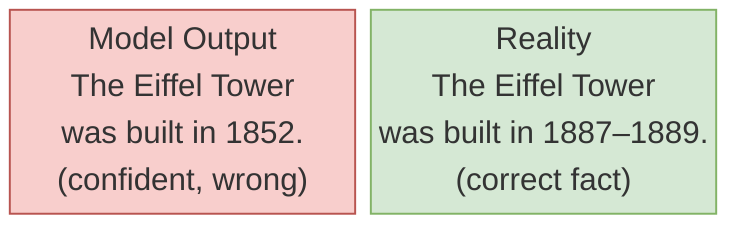
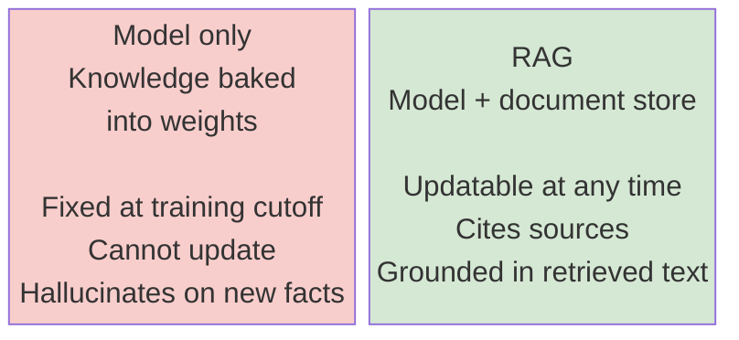
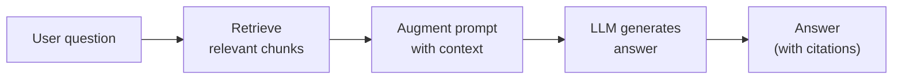

# Why RAG: Retrieval-Augmented Generation

---

## What We're Covering

- Why large language models have a knowledge problem, and what that means in practice
- What hallucination is and a simple mental model for why it happens
- Why retraining the model is not a practical solution
- What retrieval-augmented generation (RAG) is and how it works at a high level
- Where RAG is a good fit and where it is not

---

## The Knowledge Cutoff Problem

- Every LLM is trained on a snapshot of text data collected up to a specific date
- After that date, the model has no knowledge of new events, new publications, or new policies
- Example: ask a model trained in 2023 about a law passed in 2025 and it genuinely does not know
- This is not a bug, it is a fundamental property of how these models are built
- For many real applications (customer support, research assistants, document Q&A), stale knowledge is a serious problem

---

## What Hallucination Is

- A model "hallucinates" when it confidently states something that is false
- It does not know it is wrong; it produces text that sounds correct because it matches common patterns in its training data
- Mental model: the model is very good at generating *plausible* text, but plausibility is not the same as accuracy
- Hallucination is worst when the model is asked about something it has no training signal for, like your internal documents, or recent events



---

## A Concrete Example of Hallucination

- You ask: "What is our company's current refund policy?"
- The model has never seen your policy document, so it generates a plausible-sounding policy based on similar text it has seen before
- The answer may be completely fabricated, yet stated with full confidence
- This is not a reasoning failure, the model is doing exactly what it was trained to do: predict the next most likely token

---

## Why Not Just Retrain the Model?

- Training a large language model costs millions of dollars and takes weeks on large GPU clusters
- That cost applies every time you want to add new information
- Your internal documents, your latest product specs, yesterday's policy update: none of these justify a full retraining run
- Fine-tuning is cheaper than full training, but it is still slow, risky (can degrade general capabilities), and does not scale to frequent updates

---

## The Core Idea of RAG

- Instead of baking all knowledge into the model's weights, keep the knowledge in an external store
- At query time: retrieve the relevant pieces of knowledge, hand them to the model as context, then generate an answer
- The model's job shifts from "recall from memory" to "read the provided documents and answer"
- This is closer to how a human answers a question using a reference book than from pure memory



---

## The Basic RAG Pipeline

1. **Query**: the user asks a question
2. **Retrieve**: search the document store for the most relevant chunks of text
3. **Augment**: insert those chunks into the prompt along with the question
4. **Generate**: the model reads the context and produces an answer
5. **Answer**: the response is grounded in retrieved documents, not model memory



---

## RAG in Code: The Minimal Pipeline

This end-to-end example uses `sentence-transformers` for embedding, FAISS for retrieval, and a small LLM for generation.

```python
from sentence_transformers import SentenceTransformer
import faiss
import numpy as np
from transformers import pipeline

# 1. Embed your documents
model = SentenceTransformer("BAAI/bge-large-en-v1.5")
docs = [
    "Refunds are accepted within 14 days of purchase.",
    "Digital products are non-refundable after download.",
    "Contact support@example.com for all refund requests.",
]
doc_embeddings = model.encode(docs, normalize_embeddings=True)

# 2. Build a FAISS index
index = faiss.IndexFlatIP(doc_embeddings.shape[1])  # inner product = cosine on normalized vecs
index.add(doc_embeddings.astype("float32"))

# 3. Retrieve at query time
query = "Can I get a refund on a digital product?"
query_vec = model.encode([query], normalize_embeddings=True).astype("float32")
scores, indices = index.search(query_vec, k=2)
retrieved = [docs[i] for i in indices[0]]

# 4. Generate with context
context = "\n".join(retrieved)
prompt = f"Context:\n{context}\n\nQuestion: {query}\nAnswer:"
generator = pipeline("text-generation", model="meta-llama/Llama-3.1-8B-Instruct")
answer = generator(prompt, max_new_tokens=100)[0]["generated_text"]
print(answer)
```

---

## Why Retrieval is Often Better Than Fine-Tuning for Knowledge Updates

- Adding a new document to a vector database takes seconds
- Fine-tuning takes hours to days, requires labeled examples, and must be re-run whenever knowledge changes
- Retrieval is transparent: you can inspect exactly which documents the model used to form its answer
- Fine-tuning is opaque: new knowledge is distributed across billions of weights with no easy audit trail
- For frequently-changing knowledge (policies, product catalogs, news), retrieval wins on practicality

---

## Retrieval vs. Fine-Tuning: A Practical Comparison

| Criterion | RAG | Fine-Tuning |
|---|---|---|
| Update cost | Add document to DB (seconds) | Retrain (hours to days) |
| Latency per query | Adds retrieval round-trip | No extra latency |
| Auditability | Can inspect retrieved chunks | Weights are opaque |
| Best for | Frequently changing facts | Style, format, task behavior |
| Risk of knowledge degradation | Low | Medium (catastrophic forgetting) |

---

## Where RAG Works Well

- Q&A over a private document collection (internal wikis, legal documents, support knowledge bases)
- Keeping answers current without retraining (news, regulatory updates, live databases)
- Tasks where you need an audit trail of sources
- Multi-document synthesis where the answer requires combining facts from several places

---

## Where RAG Does Not Work Well

- Questions that require deep reasoning across many documents, not just lookup
- Tasks where the answer is not in any document (creative generation, general reasoning)
- Very low-latency applications: retrieval adds a network or disk round-trip
- Cases where the document collection is so large and noisy that retrieval quality is poor
- RAG is not a cure for hallucination; it reduces it by providing grounding, but the model can still ignore or misread the retrieved context

---

## The Key Intuition

- RAG is essentially: give the model a cheat sheet before the exam
- The cheat sheet has to contain the right information (retrieval quality matters)
- The model has to know how to use the cheat sheet (prompt design matters)
- Without good retrieval, RAG just gives the model irrelevant text to confuse it

---

## Summary

- LLMs have fixed knowledge cutoffs and can hallucinate confidently
- Retraining is too slow and expensive for frequent knowledge updates
- RAG keeps knowledge outside the model and fetches it at query time
- The pipeline is: retrieve relevant documents, inject them into the prompt, generate a grounded answer
- RAG works well for document Q&A and knowledge update tasks; it has real limits for reasoning-heavy and latency-sensitive applications
