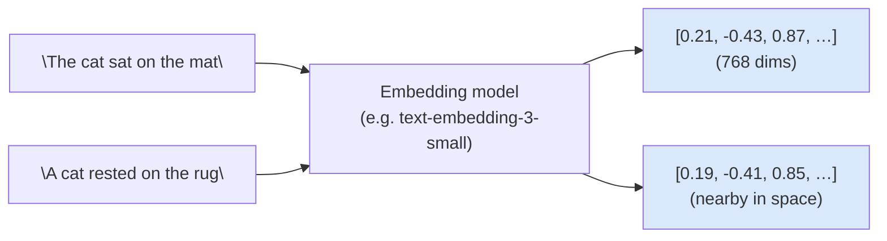
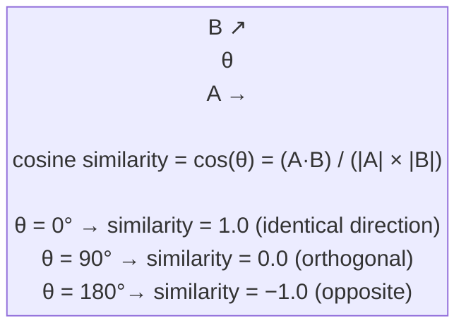
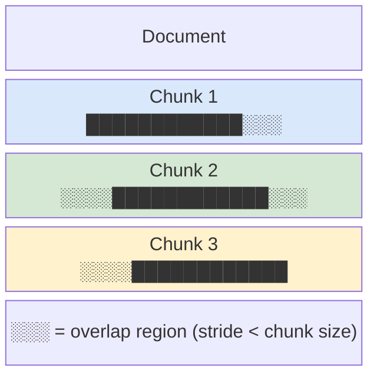
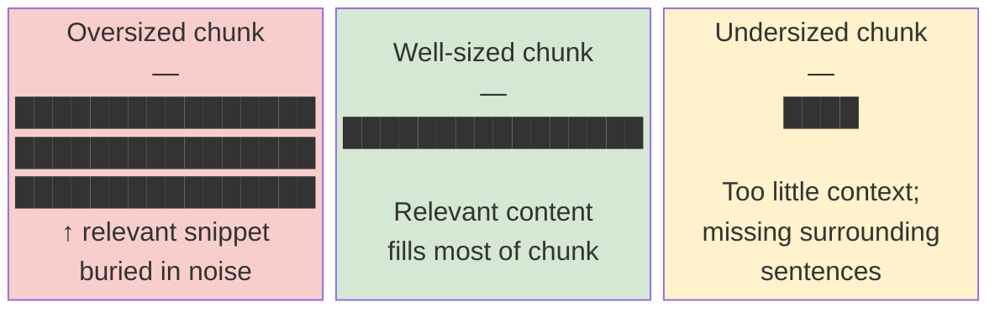

# Embeddings, Vector Search, and Chunking

---

## What We're Covering: Embeddings and Search

- What an embedding is and why it is useful for retrieval
- How similar meaning translates to similar vectors
- Cosine similarity: the math and the intuition
- Nearest-neighbor search and why it scales

---

## What We're Covering: Chunking

- Vector databases and what problem they solve
- Why you can't just embed whole documents
- Chunking strategies and how they affect retrieval quality

---

## What Is an Embedding?

- An embedding is a list of numbers (a vector) that represents the meaning of a piece of text
- Example: the sentence "the cat sat on the mat" becomes a vector like [0.12, -0.45, 0.78, ...]
- The vector has a fixed length (e.g. 384 or 1536 dimensions) regardless of the input length
- Crucially, two sentences with similar meaning produce vectors that are numerically close
- This is what makes vector search possible: you can measure "closeness" with arithmetic



---

## Generating Embeddings in Code

```python
from sentence_transformers import SentenceTransformer

# BAAI/bge-large-en-v1.5: 1024-dimensional, strong English retrieval benchmark performance
# intfloat/e5-large-v2: 1024-dimensional, prepend "query: " / "passage: " to inputs
model = SentenceTransformer("BAAI/bge-large-en-v1.5")

sentences = [
    "How do I reset my password?",
    "Steps to change my login credentials",
    "Recipe for chocolate cake",
]

# normalize_embeddings=True: output vectors have L2 norm 1, so dot product == cosine similarity
embeddings = model.encode(sentences, normalize_embeddings=True)
print(embeddings.shape)  # (3, 1024)
```

The two password-related sentences will have a high dot product; the cake sentence will be far from both.

---

## Why Similar Meaning Produces Similar Vectors

- Embedding models are trained to place semantically related text near each other in vector space
- During training, the model sees pairs of related sentences and learns to make their vectors similar
- "How do I reset my password?" and "Steps to change my login credentials" will end up near each other
- "Recipe for chocolate cake" will be far from both
- This semantic structure is what distinguishes embeddings from older approaches like bag-of-words, which treat every word as independent

---

## Cosine Similarity: Formula and Intuition

The standard way to measure how similar two embedding vectors are:

```
cos(u, v) = (u · v) / (||u|| ||v||)
```

- The dot product of `u` and `v`, divided by the product of their magnitudes
- Result is between -1 and 1: 1 means identical direction (very similar), 0 means orthogonal (unrelated), -1 means opposite
- Why cosine and not Euclidean distance? Cosine ignores magnitude and focuses on direction, which better captures semantic similarity regardless of text length

---

## Cosine Similarity: Practical Notes

- In practice: most embedding APIs return vectors that are already L2-normalized, so cosine similarity equals a simple dot product

```python
import numpy as np
from sentence_transformers import SentenceTransformer

model = SentenceTransformer("BAAI/bge-large-en-v1.5")

a = model.encode("How do I reset my password?", normalize_embeddings=True)
b = model.encode("Steps to change my login credentials", normalize_embeddings=True)
c = model.encode("Recipe for chocolate cake", normalize_embeddings=True)

# On normalized vectors, dot product == cosine similarity
print(np.dot(a, b))  # ~0.87 (high similarity)
print(np.dot(a, c))  # ~0.21 (low similarity)
```



---

## Nearest-Neighbor Search

- Given a query vector, find the document vectors most similar to it
- Naive approach: compare the query to every document vector (exact nearest neighbor)
- Exact NN is O(N * D) per query where N is the number of documents and D is the vector dimension
- At millions of documents this becomes slow, so in practice we use **approximate nearest neighbor (ANN)** algorithms
- ANN trades a small amount of accuracy for large speed gains (e.g. HNSW, IVF indexes in FAISS)

---

## Building a FAISS Index

FAISS (Meta) is the standard in-process vector search library for prototyping and local use.

```python
import faiss
import numpy as np
from sentence_transformers import SentenceTransformer

model = SentenceTransformer("BAAI/bge-large-en-v1.5")

docs = [
    "Refund window is 14 days from purchase date.",
    "Digital downloads cannot be refunded after access.",
    "Contact support within 30 days for hardware defects.",
    "Subscriptions auto-renew unless cancelled 48 hours before.",
]

# Encode all documents once at indexing time
doc_vecs = model.encode(docs, normalize_embeddings=True).astype("float32")

# IndexFlatIP: exact search, inner product (= cosine on normalized vecs)
dim = doc_vecs.shape[1]  # 1024 for bge-large
index = faiss.IndexFlatIP(dim)
index.add(doc_vecs)

# Query at runtime
query = "Can I return a downloaded ebook?"
q_vec = model.encode([query], normalize_embeddings=True).astype("float32")
scores, indices = index.search(q_vec, k=2)

for rank, (score, idx) in enumerate(zip(scores[0], indices[0])):
    print(f"Rank {rank+1} (score={score:.3f}): {docs[idx]}")
```

---

## Scaling Up: IVF Index for Large Collections

`IndexFlatIP` does exact search but scans every vector. For 1M+ documents, use `IndexIVFFlat`:

```python
import faiss

dim = 1024
nlist = 100   # number of Voronoi cells (clusters)

# Quantizer defines the cell centroids
quantizer = faiss.IndexFlatIP(dim)
index = faiss.IndexIVFFlat(quantizer, dim, nlist, faiss.METRIC_INNER_PRODUCT)

# IVF requires a training step to learn cluster centroids
index.train(doc_vecs)   # needs at least 39 * nlist vectors
index.add(doc_vecs)

# nprobe: how many cells to search (higher = more accurate but slower)
index.nprobe = 10
scores, indices = index.search(q_vec, k=2)
```

`IndexIVFFlat` cuts search time roughly by `nlist / nprobe` at the cost of small recall loss.

---

## Vector Databases

- A vector database stores embeddings and supports fast similarity search over them
- Unlike a SQL database that filters by exact value, a vector database finds the K most similar vectors to a query
- **FAISS**: open-source library from Meta, runs in-process, great for prototyping and local use
- **ChromaDB**: easy-to-use open-source database with a Python API, persists to disk
- **Pinecone**: managed cloud service, handles scaling and indexing infrastructure for you
- For a hackathon, FAISS or ChromaDB are the fastest to get running; Pinecone is better when you need managed hosting

---

## ChromaDB: Collection Creation and Similarity Search

ChromaDB handles embedding, storage, and retrieval in a single API:

```python
import chromadb
from chromadb.utils import embedding_functions

# Use the same model for indexing and querying
ef = embedding_functions.SentenceTransformerEmbeddingFunction(
    model_name="BAAI/bge-large-en-v1.5"
)

client = chromadb.PersistentClient(path="./chroma_db")
collection = client.get_or_create_collection(
    name="policy_docs",
    embedding_function=ef,
    metadata={"hnsw:space": "cosine"},
)

# Add documents (ChromaDB embeds them automatically)
collection.add(
    documents=[
        "Refund window is 14 days from purchase date.",
        "Digital downloads cannot be refunded after access.",
        "Contact support within 30 days for hardware defects.",
    ],
    ids=["doc1", "doc2", "doc3"],
    metadatas=[{"source": "policy.pdf"}, {"source": "policy.pdf"}, {"source": "faq.txt"}],
)

# Query: returns top-k most similar documents
results = collection.query(
    query_texts=["Can I return a downloaded ebook?"],
    n_results=2,
    include=["documents", "metadatas", "distances"],
)
print(results["documents"])
print(results["metadatas"])
```

---

## Why You Can't Just Embed Whole Documents

- Two reasons:
  1. **Context window limits**: embedding models have a maximum token input (often 512 tokens for older models, up to 8192 for newer ones); long documents exceed this
  2. **Retrieval granularity**: if you embed a 50-page document, the retrieved "chunk" is the entire document; the relevant paragraph is buried inside it
- The model then receives too much irrelevant text, which dilutes the useful signal and can push the actual answer out of the context window
- Solution: split documents into smaller chunks before embedding

---

## Fixed-Size Chunking With Overlap

- The simplest chunking strategy: split the document into chunks of N tokens (or characters)
- Add an overlap of O tokens between consecutive chunks
- Example: chunk size 512 tokens, overlap 64 tokens
  - Chunk 1: tokens 1-512
  - Chunk 2: tokens 449-960
  - Chunk 3: tokens 897-1408
- Overlap ensures that a sentence spanning a chunk boundary is not split and lost



---

## Fixed-Size Chunking in Code

```python
def chunk_fixed(text: str, chunk_size: int = 512, overlap: int = 64) -> list[str]:
    """Split text into fixed-size character chunks with overlap."""
    chunks = []
    start = 0
    while start < len(text):
        end = start + chunk_size
        chunks.append(text[start:end])
        start += chunk_size - overlap  # step forward by (size - overlap)
    return chunks

# Example
document = "A" * 1200  # 1200-character dummy document
chunks = chunk_fixed(document, chunk_size=512, overlap=64)
print(f"Number of chunks: {len(chunks)}")   # 3
print(f"Chunk lengths: {[len(c) for c in chunks]}")  # [512, 512, 272]
```

---

## Sentence-Aware Chunking in Code

Fixed-size chunking can slice mid-sentence. Sentence-aware chunking respects natural boundaries:

```python
import re

def chunk_by_sentences(text: str, sentences_per_chunk: int = 5, overlap: int = 1) -> list[str]:
    """Group sentences into chunks with one-sentence overlap."""
    # Split on sentence-ending punctuation followed by whitespace
    sentences = re.split(r'(?<=[.!?])\s+', text.strip())
    chunks = []
    step = sentences_per_chunk - overlap
    for i in range(0, len(sentences), step):
        chunk = " ".join(sentences[i : i + sentences_per_chunk])
        if chunk:
            chunks.append(chunk)
    return chunks

text = (
    "The policy was updated in March 2025. "
    "All digital purchases are final. "
    "Hardware items may be returned within 30 days. "
    "Proof of purchase is required for all returns. "
    "Refund processing takes 5 to 7 business days."
)
for i, chunk in enumerate(chunk_by_sentences(text, sentences_per_chunk=3, overlap=1)):
    print(f"Chunk {i}: {chunk}\n")
```

---

## What Overlap Buys You

- Without overlap, a sentence that straddles a chunk boundary is cut in half
- The first half lands at the end of chunk N, the second half at the start of chunk N+1
- If only one chunk is retrieved, the model sees an incomplete thought
- Overlap duplicates the boundary region so that both neighboring chunks contain the full sentence
- The cost: slightly more storage and slightly more chunks to search through

---

## Chunk Too Large vs. Chunk Too Small: The Tradeoff

- **Too large** (e.g. 2000+ tokens):
  - Each chunk contains a lot of text, including many topics
  - The retrieved chunk is less precise; the relevant sentence is surrounded by unrelated text
  - The model has more noise to filter through

- **Too small** (e.g. 50 tokens):
  - Each chunk is very precise but has little context
  - A retrieved chunk might be a single sentence with no surrounding information
  - The model lacks the context needed to interpret that sentence

---

## Chunk Size: Visual Comparison



---

## How Chunking Affects Retrieval Quality

- The chunk is the unit of retrieval: you retrieve chunks, not documents
- A good chunk contains one coherent idea with enough context to be self-contained
- Chunking strategy interacts with embedding model quality: a better embedding model can tolerate noisier chunks, but good chunking helps any model
- Common heuristic starting point: 256-512 tokens with 10-20% overlap
- The right size depends on your document type: dense technical text benefits from smaller chunks; narrative text can tolerate larger ones

---

## Smarter Chunking Strategies

- Fixed-size chunking is simple but ignores document structure
- **Sentence-based chunking**: split on sentence boundaries, then group N sentences per chunk
- **Recursive/semantic chunking**: split on paragraphs or sections first, fall back to sentence splits when a section is too long
- **Document-aware chunking**: for HTML or Markdown, split on headings; for PDFs, split on detected page sections
- For most starting purposes, fixed-size with overlap is good enough; switch to structure-aware chunking when retrieval quality plateaus

---

## Summary

- Embeddings convert text into vectors where semantic similarity corresponds to geometric closeness
- Cosine similarity is `(u · v) / (||u|| ||v||)` and is the standard way to compare embeddings; equals dot product on normalized vectors
- FAISS (`IndexFlatIP` for exact, `IndexIVFFlat` for approximate) and ChromaDB are the standard local tools for vector search
- Documents must be chunked before embedding; the chunk is the unit of retrieval
- Fixed-size chunking with overlap is the practical starting point; sentence-aware chunking avoids mid-sentence cuts
