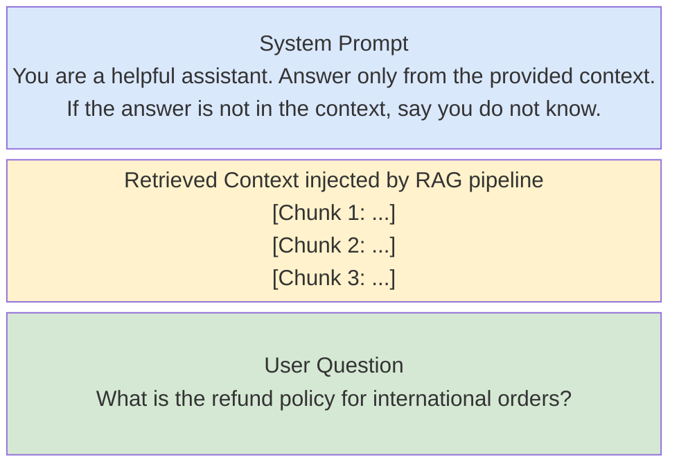
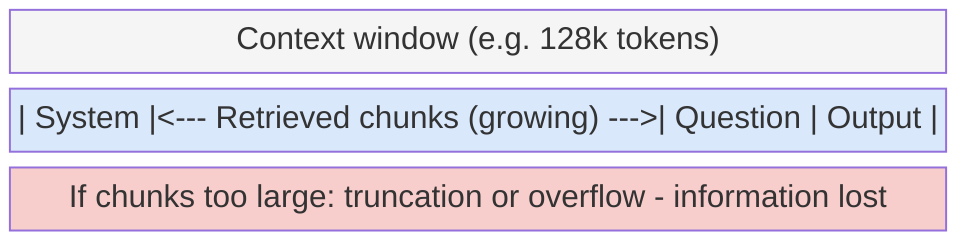

# Prompt Patterns for RAG

---

## What We're Covering

- How to inject retrieved context into a prompt so the model uses it correctly
- A concrete prompt template you can adapt
- Citation prompting: asking the model to tell you which source it drew from
- Teaching the model to say "I don't know" when context is insufficient
- Common prompt mistakes and how to avoid them
- Context window limits and what happens when you retrieve too much

---

## The Basic Injection Pattern

- A RAG prompt has three parts:
  1. **System prompt**: tells the model its role and how to use the context
  2. **Retrieved context**: the chunks you fetched from your vector database
  3. **User question**: the actual query

- Order matters: put the system instructions first, then the context, then the question

---

## The Basic Injection Pattern: Why Order Matters

- The model reads everything before generating a response; it needs to understand the rules before seeing the material



---

## A Concrete Prompt Template

```
System:
You are a helpful assistant. Answer the user question using ONLY
the context provided below. If the context does not contain enough
information to answer the question, say “I do not have enough information to answer that.”

Context:
[CHUNK 1]
Source: internal_policy_v2.pdf, page 4

[CHUNK 2]
Source: faq_2025.txt, section 3

User:
What is the current refund window for digital products?
```

---

## Prompt Construction in Python

Building the prompt programmatically from retrieved chunks:

```python
def build_rag_prompt(query: str, retrieved_chunks: list[dict]) -> str:
    """
    retrieved_chunks: list of dicts with keys "text" and "source"
    """
    system = (
        "You are a helpful assistant. Answer the user question using ONLY "
        "the context provided below. If the context does not contain enough "
        "information to answer the question, say exactly: "
        "The provided documents do not contain information about [topic].\n"
        "After your answer, list the sources you used in a Sources: section."
    )

    context_parts = []
    for i, chunk in enumerate(retrieved_chunks, 1):
        context_parts.append(f"[Chunk {i}]\n{chunk["text"]}\nSource: {chunk["source"]}")
    context_block = "\n\n".join(context_parts)

    return f"{system}\n\nContext:\n{context_block}\n\nUser: {query}"


# Example usage with ChromaDB results
chunks = [
    {"text": "Refund window is 14 days from purchase.", "source": "policy.pdf, p.4"},
    {"text": "Digital downloads are non-refundable after access.", "source": "faq.txt, s.3"},
]
prompt = build_rag_prompt("Can I refund a digital download?", chunks)
print(prompt)
```

---

## End-to-End RAG with Llama 3 8B

A complete pipeline from query to answer using a local open-weight model:

```python
from sentence_transformers import SentenceTransformer
import faiss
import numpy as np
from transformers import pipeline

embed_model = SentenceTransformer("BAAI/bge-large-en-v1.5")

# --- Indexing ---
docs = [
    {"text": "Refund window is 14 days from purchase.", "source": "policy.pdf p.4"},
    {"text": "Digital downloads are non-refundable after access.", "source": "faq.txt s.3"},
    {"text": "Hardware defects covered for 30 days.", "source": "warranty.pdf p.1"},
]
doc_vecs = embed_model.encode(
    [d["text"] for d in docs], normalize_embeddings=True
).astype("float32")
index = faiss.IndexFlatIP(doc_vecs.shape[1])
index.add(doc_vecs)

# --- Retrieval + Generation ---
generator = pipeline(
    "text-generation",
    model="meta-llama/Llama-3.1-8B-Instruct",
    device_map="auto",
)

def rag_answer(query: str, k: int = 2) -> str:
    q_vec = embed_model.encode([query], normalize_embeddings=True).astype("float32")
    scores, idxs = index.search(q_vec, k)
    retrieved = [docs[i] for i in idxs[0]]
    prompt = build_rag_prompt(query, retrieved)
    output = generator(prompt, max_new_tokens=200, do_sample=False)
    return output[0]["generated_text"][len(prompt):]

print(rag_answer("Can I get a refund on a downloaded ebook?"))
```

---

## How to Use the Template

- Keep the system instruction short and explicit about the rules
- Label each chunk with its source so the model can cite it
- Put the question at the end so it is the last thing the model "reads" before generating

---

## Citation Prompting

- You can instruct the model to name the source it used for each claim
- Add a line to the system prompt: "After your answer, list the sources you used in a 'Sources:' section."
- This lets users verify the answer and builds trust in the system
- Example output:

```
The current refund window for digital products is 14 days from
the date of purchase.

Sources: internal_policy_v2.pdf, page 4
```

- Citation only works if your chunks include source metadata; store it at indexing time

---

## Storing Source Metadata at Index Time

Source information must be stored alongside the vector at indexing time so it can be retrieved later:

```python
import chromadb
from chromadb.utils import embedding_functions

ef = embedding_functions.SentenceTransformerEmbeddingFunction(
    model_name="BAAI/bge-large-en-v1.5"
)
client = chromadb.PersistentClient(path="./chroma_db")
collection = client.get_or_create_collection("docs", embedding_function=ef)

collection.add(
    documents=["Refund window is 14 days.", "Digital products are non-refundable."],
    ids=["chunk_001", "chunk_002"],
    # Source metadata travels with each chunk through retrieval
    metadatas=[
        {"source": "policy.pdf", "page": 4, "section": "Returns"},
        {"source": "faq.txt", "section": "3"},
    ],
)

# At query time, metadata comes back with the results
results = collection.query(query_texts=["refund ebook"], n_results=2,
                           include=["documents", "metadatas"])
for doc, meta in zip(results["documents"][0], results["metadatas"][0]):
    print(f"{doc}  [Source: {meta["source"]}]")
```

---

## Why Citations Are More Than a Nice Feature

- Without citations, users have no way to judge the reliability of the answer
- With citations, a user can navigate directly to the source if the stakes are high
- Citations also make debugging easier: if the answer is wrong, you can check whether the right chunk was retrieved
- In a competition context, a cited answer is more defensible than a confident uncited one

---

## Handling "I Don't Know" Gracefully

- If the retrieved context does not contain the answer, the model will hallucinate without explicit instructions
- You must explicitly tell the model to abstain: "If the context does not answer the question, say so directly."
- A good abstention message is specific, not generic: "Based on the documents I have access to, I cannot find information about X."
- Do not use vague instructions like "answer only if you're confident"; the model does not have a calibrated sense of its own confidence

---

## A Tested Abstention Instruction

```
System:
You are a document assistant. Answer questions using only the
provided context.

If the answer is not in the context, respond with exactly:
“The provided documents do not contain information about [topic].”

Do not guess or use knowledge from outside the provided context.
```

---

## Why the Abstention Template Works

- The "respond with exactly" phrasing gives the model a clear template to fall back on
- Explicit negative instructions ("do not guess") outperform soft instructions ("only answer if sure")

---

## Common Prompt Anti-Pattern: Context Overload

- Stuffing 20 chunks into the prompt because more context might help
- What actually happens: the model's attention is spread across too much text
- Relevant information can get "lost in the middle": models perform worse on information placed far from the question
- Better approach: retrieve 3-6 high-quality chunks rather than 15-20 mediocre ones

---

## Common Prompt Anti-Pattern: Underspecified Instructions

- Vague system prompt: "Use the context to answer the question."
- This leaves too many decisions to the model: how long should the answer be? Should it cite sources? What if the context is insufficient?
- Each of these should be explicit in the system prompt
- Think of the system prompt as a contract with the model; ambiguous contracts produce unpredictable behavior

---

## Common Prompt Anti-Pattern: No Abstention Instruction

- If you do not tell the model what to do when context is insufficient, it will fill the gap with its own knowledge or fabrication
- This is the most common RAG failure mode in production systems
- Every RAG prompt should have an explicit abstention instruction, even if you think the retrieval is reliable
- Retrieval will sometimes fail; the abstention instruction is your safety net

---

## Context Window Limits

- LLMs have a maximum number of tokens they can process in one call (the context window)
- GPT-4o: 128K tokens. Claude 3.5 Sonnet: 200K tokens. Smaller or older models: 4K-8K tokens
- Each retrieved chunk uses some of those tokens; the question, system prompt, and generated answer use the rest
- If you retrieve too much, you run out of space, and the API call either errors or silently truncates the input



---

## Token Budget Calculation in Code

Always verify your token budget before sending to the API to avoid silent truncation:

```python
from transformers import AutoTokenizer

tokenizer = AutoTokenizer.from_pretrained("meta-llama/Llama-3.1-8B-Instruct")

CONTEXT_WINDOW   = 8192   # max tokens for this model
RESERVED_OUTPUT  = 512    # tokens to leave for the generated answer

system_prompt = "You are a helpful assistant..."
user_query    = "Can I get a refund on a digital product?"

system_tokens = len(tokenizer.encode(system_prompt))
query_tokens  = len(tokenizer.encode(user_query))
budget        = CONTEXT_WINDOW - RESERVED_OUTPUT - system_tokens - query_tokens

print(f"Tokens available for context chunks: {budget}")

# Greedily add chunks until budget is exhausted
selected_chunks = []
used = 0
for chunk_text in candidate_chunks:
    chunk_tokens = len(tokenizer.encode(chunk_text))
    if used + chunk_tokens > budget:
        break
    selected_chunks.append(chunk_text)
    used += chunk_tokens

print(f"Using {len(selected_chunks)} chunks ({used} tokens)")
```

---

## What to Do When Context Is Too Long

- Limit the number of retrieved chunks (k) to stay within your token budget
- Truncate individual chunks to a maximum length before injection
- Use a reranker to select only the top 3-5 most relevant chunks from a larger retrieved set
- Calculate your token budget before running: (context window) - (system prompt tokens) - (question tokens) - (reserved output tokens) = tokens available for context

---

## Summary

- The core prompt structure is: system instructions + labeled context chunks + user question
- Always include an explicit abstention instruction; it is your most important safeguard against hallucination
- Citation prompting is simple to add and significantly improves answer verifiability; store source metadata at indexing time
- Avoid context overload: fewer high-quality chunks beat many low-quality ones
- Know your context window budget and use token counting to stay within it
