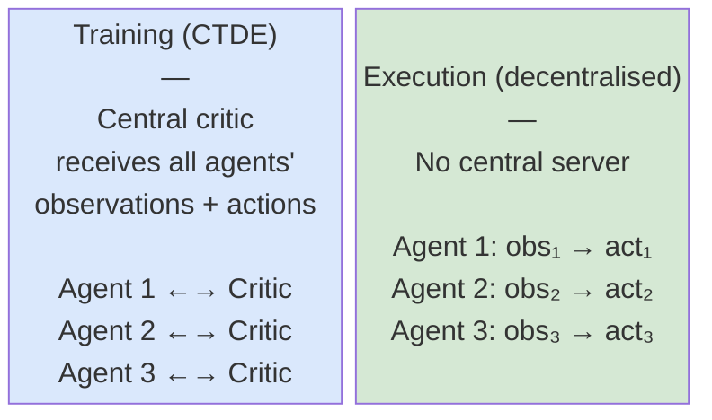

# Multi-Agent RL: Technical Depth

When multiple learning agents share an environment, the theoretical guarantees of single-agent RL largely break down.

---

## Non-Stationarity: The Core Problem

In single-agent RL, the environment is **stationary**: the transition and reward functions don't change over time.

When multiple agents are learning simultaneously, each agent experiences the other agents as part of the environment. But the other agents are also learning, meaning their behavior is constantly changing.

From agent $i$'s perspective:
- At time $t$, agent $j$ uses policy $\pi_j^t$
- At time $t+1000$, agent $j$ uses a different policy $\pi_j^{t+1000}$
- The environment (from $i$'s view) is non-stationary

---

## Non-Stationarity: Formal Definition

Formally, in a multi-agent system the transition distribution is:

$$P(s' | s, \mathbf{a}) = P(s' | s, a_1, a_2, \ldots, a_n)$$

where $\mathbf{a} = (a_1, \ldots, a_n)$ is the joint action of all agents. Agent $i$ only controls $a_i$, so from its perspective, the "environment" dynamics depend on the policies of all other agents:

$$P_i(s' | s, a_i) = \sum_{a_{-i}} \left[\prod_{j \neq i} \pi_j(a_j | o_j)\right] P(s' | s, a_i, a_{-i})$$

As $\pi_j$ changes during training, $P_i$ is non-stationary.

---

## Why This Breaks Single-Agent Guarantees

Standard convergence proofs for Q-learning and policy gradient methods assume a **stationary MDP**.

What goes wrong in multi-agent settings:

- **Q-learning**: the Bellman target $r + \gamma \max_{a'} Q(s', a')$ assumes the optimal $Q$ is fixed. When other agents change, $Q^*$ is a moving target
- **Policy gradient**: the advantage estimate $A(s, a)$ is computed under the current joint policy. As others change, the advantage estimates become stale
- **Experience replay**: off-policy methods assume replayed data is still valid. In MARL, data collected under old joint policies can be seriously off-distribution

The practical consequence: training can cycle, oscillate, or diverge in ways that are hard to diagnose with single-agent tools.

---

## Game Theory Basics for MARL

Multi-agent RL connects to **game theory**. Key concepts:

**Nash Equilibrium**: a joint policy $(\pi_1^*, \ldots, \pi_n^*)$ where no agent can improve its expected return by changing its policy unilaterally:

$$J_i(\pi_i^*, \pi_{-i}^*) \geq J_i(\pi_i, \pi_{-i}^*) \quad \forall \pi_i, \forall i$$

where $\pi_{-i}^* = (\pi_1^*, \ldots, \pi_{i-1}^*, \pi_{i+1}^*, \ldots, \pi_n^*)$ denotes the policies of all agents except $i$.

- Nash equilibria are the stable fixed points of multi-agent learning
- They may not be unique. They may not be reachable by gradient descent
- In cooperative settings, the Nash equilibrium may coincide with the joint optimum

---

## Game Theory: Zero-Sum vs. Cooperative

**Zero-sum vs. cooperative**:
- Zero-sum: $\sum_i r_i = 0$ at every step (one agent's gain is another's loss, e.g., adversarial games)
- Cooperative: all agents share the same reward $r_i = r$ (e.g., multi-robot mapping)
- Mixed: agents have partially aligned incentives

For autonomous exploration in a competition with multiple teams, the setting is often mixed or competitive.

In a cooperative setting, a joint policy $\pi^* = (\pi_1^*, \ldots, \pi_n^*)$ is optimal if it maximizes the shared return:

$$\pi^* = \arg\max_{\pi_1, \ldots, \pi_n} J(\pi_1, \ldots, \pi_n) = \arg\max_\pi \mathbb{E}_\pi\left[\sum_{t=0}^\infty \gamma^t r_t\right]$$

---

## Opponent Modeling

One response to non-stationarity: explicitly **model the other agents** and condition your policy on that model.

The idea:
- Maintain a belief over what policy each other agent is using: $\hat{\pi}_j$
- Update this belief based on observed behavior
- Condition your own policy on this belief: $\pi_i(a | s, \hat{\pi}_{-i})$

---

## Opponent Modeling: Practical Implementations

```python
import torch
import torch.nn as nn

class OpponentModel(nn.Module):
    """Predicts opponent's next action given their observation history."""
    def __init__(self, obs_dim, n_actions, hidden=64):
        super().__init__()
        self.rnn = nn.GRU(obs_dim, hidden, batch_first=True)
        self.head = nn.Linear(hidden, n_actions)

    def forward(self, obs_history):
        # obs_history: (batch, T, obs_dim)
        out, _ = self.rnn(obs_history)
        logits = self.head(out[:, -1, :])   # use last hidden state
        return torch.distributions.Categorical(logits=logits)
```

Limitations: works well when opponents are few and predictable. Breaks down in large populations or when opponents change rapidly.

---

## CTDE: Centralized Training, Decentralized Execution

**CTDE** is the dominant paradigm in cooperative MARL:

- **Centralized training**: during training, agents have access to the full global state, including other agents' observations and actions
- **Decentralized execution**: at deployment, each agent acts only on its local observation $o_i$

Why this is appealing:
- Training is easier with global information (better value estimates, less non-stationarity)
- Deployment is realistic: real robots can't communicate full state at inference time

The core insight: we can use global information to train better critics without requiring global information at test time.

---

## CTDE: Architecture



The central component is typically a **centralized value function** or **critic** that takes the joint state as input, used only during training.

```python
class CTDECritic(nn.Module):
    """Centralized critic: takes global state + all agents' obs."""
    def __init__(self, global_state_dim, n_agents, obs_dim, hidden=128):
        super().__init__()
        # Input: global state + concatenated observations of all agents
        input_dim = global_state_dim + n_agents * obs_dim
        self.net = nn.Sequential(
            nn.Linear(input_dim, hidden),
            nn.ReLU(),
            nn.Linear(hidden, hidden),
            nn.ReLU(),
            nn.Linear(hidden, 1),
        )

    def forward(self, global_state, all_obs):
        # all_obs: (batch, n_agents * obs_dim)
        x = torch.cat([global_state, all_obs], dim=-1)
        return self.net(x).squeeze(-1)
```

---

## MAPPO: Multi-Agent PPO with Centralized Critic

**MAPPO** extends PPO to the multi-agent cooperative setting using CTDE.

Architecture:
- Each agent $i$ has a local **actor** $\pi_{\theta_i}(a_i | o_i)$, conditioned only on local observation $o_i$
- A shared (or per-agent) **critic** $V_\phi(s)$ or $V_\phi(s, o_i)$ is conditioned on the **global state** $s$ during training
- The critic provides better advantage estimates than a local-only critic could

---

## MAPPO: Loss Function and Hyperparameter

Advantage for agent $i$:

$$A_i(s, a_i) = r_i + \gamma V_\phi(s') - V_\phi(s)$$

The actor update uses this centralized advantage in the standard PPO clipped objective:

$$L^{CLIP}_i(\theta_i) = \mathbb{E}_t\left[\min\left(r_t(\theta_i)\hat{A}_i, \text{clip}(r_t(\theta_i), 1-\epsilon, 1+\epsilon)\hat{A}_i\right)\right]$$

MAPPO is competitive with more complex MARL algorithms on many cooperative benchmarks. It's a good starting point for cooperative exploration tasks.

Key hyperparameter: how much state to share in the critic. Too little and you lose the CTDE advantage; too much and the critic doesn't generalize.

---

## MAPPO: Implementation with Parameter Sharing

```python
class MAPPOAgent:
    def __init__(self, n_agents, obs_dim, global_state_dim, n_actions):
        self.n_agents = n_agents
        # Shared actor: same weights for all agents
        self.actor = nn.Sequential(
            nn.Linear(obs_dim + 1, 64),  # +1 for agent ID
            nn.Tanh(),
            nn.Linear(64, 64),
            nn.Tanh(),
            nn.Linear(64, n_actions),
        )
        self.critic = CTDECritic(global_state_dim, n_agents, obs_dim)
        self.actor_opt = torch.optim.Adam(self.actor.parameters(), lr=3e-4)
        self.critic_opt = torch.optim.Adam(self.critic.parameters(), lr=1e-3)

    def select_action(self, obs, agent_id):
        agent_id_tensor = torch.tensor([agent_id], dtype=torch.float32)
        x = torch.cat([torch.tensor(obs, dtype=torch.float32), agent_id_tensor])
        logits = self.actor(x.unsqueeze(0))
        dist = torch.distributions.Categorical(logits=logits)
        action = dist.sample()
        return action.item(), dist.log_prob(action).item()
```

---

## QMIX: Value Decomposition for Cooperative MARL

**QMIX** (Rashid et al., 2018) is an off-policy MARL algorithm that factorizes the joint action-value function.

The key constraint: the joint $Q_{tot}$ must be **monotonically increasing** in each agent's individual Q-value $Q_i$:

$$\frac{\partial Q_{tot}}{\partial Q_i} \geq 0 \quad \forall i$$

This means: if increasing $Q_i$ always increases $Q_{tot}$, then argmax over joint actions equals argmax over individual actions.

The mixing network enforces monotonicity using **non-negative weights** (produced by a hypernetwork conditioned on the global state):

```python
class QMIXMixer(nn.Module):
    """Mixes per-agent Q-values into a joint Q_tot."""
    def __init__(self, n_agents, state_dim, embed_dim=32):
        super().__init__()
        self.n_agents = n_agents
        # Hypernetworks: produce mixing weights conditioned on global state
        self.hyper_w1 = nn.Linear(state_dim, embed_dim * n_agents)
        self.hyper_w2 = nn.Linear(state_dim, embed_dim)
        self.hyper_b1 = nn.Linear(state_dim, embed_dim)
        self.hyper_b2 = nn.Linear(state_dim, 1)

    def forward(self, agent_qs, state):
        bs = agent_qs.size(0)
        # First mixing layer (non-negative weights via abs)
        w1 = torch.abs(self.hyper_w1(state)).view(bs, self.n_agents, -1)
        b1 = self.hyper_b1(state).view(bs, 1, -1)
        hidden = torch.relu(torch.bmm(agent_qs.unsqueeze(1), w1) + b1)
        # Second mixing layer
        w2 = torch.abs(self.hyper_w2(state)).view(bs, -1, 1)
        b2 = self.hyper_b2(state).view(bs, 1, 1)
        q_tot = torch.bmm(hidden, w2) + b2
        return q_tot.view(bs)
```

---

## Parameter Sharing

A common simplification in cooperative MARL: all agents share the same policy network weights $\theta$.

- Agents are distinguished by an agent ID or index fed as input
- Effectively treats all agents as instances of the same policy

Advantages:
- Fewer parameters to train
- Natural generalization: a policy that works for agent 1 is trained to also work for agent 2
- Scales to large numbers of agents

---

## Parameter Sharing: Disadvantages and Use Case

Disadvantages:
- Can't represent agents with fundamentally different roles
- May converge to homogeneous behavior even when heterogeneity is beneficial

For cooperative exploration, parameter sharing often works well since all agents have the same goal.

```python
# With parameter sharing, train a single model across all agents
# by treating each (agent_obs, agent_id) pair as a separate sample in the batch

def collect_rollout_shared(env, model, n_agents):
    obs_list, action_list, reward_list, log_prob_list = [], [], [], []
    obs, _ = env.reset()  # obs: list of n_agents observations
    for _ in range(2048 // n_agents):
        actions, log_probs = [], []
        for i, o in enumerate(obs):
            a, lp = model.select_action(o, agent_id=i)
            actions.append(a)
            log_probs.append(lp)
        obs, rewards, dones, _, _ = env.step(actions)
        obs_list.append(obs)
        action_list.append(actions)
        reward_list.append(rewards)
        log_prob_list.append(log_probs)
    return obs_list, action_list, reward_list, log_prob_list
```

---

## Self-Play and League Training

**Self-play**: train an agent by having it compete (or cooperate) with past versions of itself.

Basic self-play (AlphaGo style):
- At each training step, the current policy plays against a snapshot of itself from earlier in training
- Prevents the agent from overfitting to a fixed opponent
- Produces a policy that is robust to a range of behaviors

---

## League Training

**League training** (AlphaStar style):
- Maintain a population of agents: the main agent, "exploiters" that target the main agent's weaknesses, and "league exploiters" that target the whole population
- Each agent trains against a mixture of opponents sampled from the league
- The mixture is designed to prevent any strategy from dominating without counters

Self-play is practical for competitive settings. League training is more complex but produces more robust policies.

---

## Population-Based Methods and Diversity

A population of identical agents trained with self-play can collapse to a narrow region of policy space. **Diversity** in the training population prevents this.

Why diversity matters:
- An agent trained only against aggressive opponents will be vulnerable to passive strategies it never encountered
- A diverse population creates coverage over the strategy space

---

## Population-Based Methods: Techniques

Methods to encourage diversity:
- **Behavioral diversity metrics**: reward agents for behaving differently from each other (e.g., different state visitation distributions)
- **Quality-Diversity (QD) algorithms**: maintain an archive of agents that are diverse in some descriptor space while being individually high-performing
- **Population-Based Training (PBT)**: evolve hyperparameters across the population, replacing low-performing agents with mutations of high-performing ones

```python
# PBT-style: replace bottom 20% with perturbed versions of top 20%
def pbt_step(population, performances, perturb_factor=0.2):
    n = len(population)
    ranked = sorted(range(n), key=lambda i: performances[i], reverse=True)
    top_quartile = ranked[:n//5]
    bottom_quartile = ranked[-n//5:]
    for bot_idx in bottom_quartile:
        src_idx = top_quartile[torch.randint(len(top_quartile), (1,)).item()]
        # Copy weights
        population[bot_idx].load_state_dict(population[src_idx].state_dict())
        # Perturb hyperparameters
        for param_group in population[bot_idx].optimizer.param_groups:
            param_group["lr"] *= (1 + perturb_factor * (torch.rand(1).item() * 2 - 1))
```

---

## Active Problems in MARL

Current open problems worth knowing about:

**Credit assignment in cooperative MARL**
- When all agents share a team reward, how do you tell which agent's action was responsible?
- Counterfactual multi-agent baselines (COMA) address this with a counterfactual baseline:

$$A_i(s, \mathbf{a}) = Q(s, \mathbf{a}) - \sum_{a_i'} \pi_i(a_i' | o_i) Q(s, (a_i', \mathbf{a}_{-i}))$$

- This measures the marginal contribution of agent $i$'s action versus the average action it would have taken.

**Scalability**
- Most theory and algorithms work for 2-5 agents. Scaling to hundreds is an open research area
- Mean-field approximations are one approach

---

## Active Problems in MARL: Communication and Sample Efficiency

**Communication**
- When agents can send learned messages to each other, what should they say?
- Learned communication protocols (CommNet, DIAL, TarMAC) are an active area
- Emergent language: agents learn discrete protocols not designed by humans

**Sample efficiency in non-stationary settings**
- Replay buffers become problematic when the joint policy changes rapidly
- Off-policy MARL (QMIX, MADDPG) requires careful staleness handling
- MADDPG extends DDPG to multi-agent: centralized critic conditions on all agents' actions

Papers to look at: MAPPO (Yu et al., 2022), QMIX (Rashid et al., 2018), AlphaStar (Vinyals et al., 2019), OpenAI Five (Berner et al., 2019).

---

## Practical Guidance for Multi-Agent Exploration

Applying MARL in a competition context:

1. **Start with independent PPO**: train each agent separately, treating others as part of the environment. Often works better than expected
2. **Add a centralized critic if coordination is needed**: MAPPO is worth the implementation cost if agents need to divide territory
3. **Use parameter sharing for homogeneous roles**: simpler to implement, often performs comparably

---

## Practical Guidance: Monitoring and Modeling

4. **Monitor for non-stationarity symptoms**: training loss oscillates, policy collapses suddenly, or agents develop cyclic behaviors

```python
import wandb

# Log per-agent metrics to detect non-stationarity symptoms
for i, agent_metrics in enumerate(agents_metrics):
    wandb.log({
        f"agent_{i}/policy_entropy": agent_metrics["entropy"],
        f"agent_{i}/mean_reward": agent_metrics["reward"],
        f"agent_{i}/kl_from_old": agent_metrics["kl"],
    }, step=global_step)
```

5. **Consider opponent modeling only if you have a strong prior** about opponent behavior patterns

Don't assume you need the most sophisticated MARL algorithm. Independent learning with well-shaped rewards solves more problems than it has any right to.

---

## What to Take Away

Multi-agent RL introduces problems that don't exist in single-agent settings:

- Non-stationarity: $P_i(s'|s, a_i)$ changes as other agents' policies change
- Nash equilibrium: $J_i(\pi_i^*, \pi_{-i}^*) \geq J_i(\pi_i, \pi_{-i}^*)$ for all $\pi_i$, the stable fixed point
- Single-agent convergence guarantees no longer hold
- CTDE: train with full information, deploy with local information
- MAPPO: PPO with a centralized critic, the practical starting point for cooperative tasks
- QMIX: value decomposition with monotonicity constraint for off-policy cooperative MARL

---

## What to Take Away: Diversity, Open Problems, and Outlook

- Population diversity: prevents collapse to a narrow strategy
- Credit assignment in cooperative MARL: COMA counterfactual baselines
- Active research: scalability, learned communication, off-policy stability

The field is moving fast. The papers cited here represent the current state of practice, not the final word.
