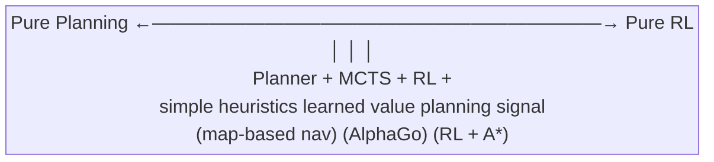
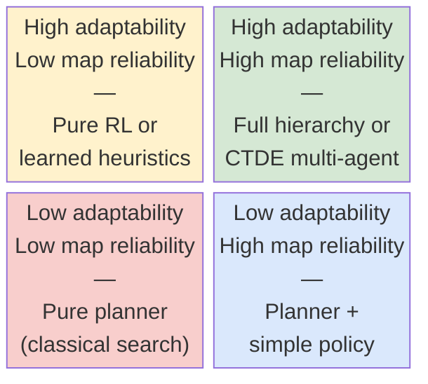

# Hybrid Search and Learned Policies

Pure RL and pure classical planning each have failure modes that the other approach handles well.

---

## Why Pure RL Underperforms in Structured Environments

RL learns everything from scratch through trial and error. In structured environments, this is often wasteful.

Problems with pure RL:

- **Sample inefficiency**: an RL agent may take millions of steps to learn behavior that a planner can compute in milliseconds (e.g., pathfinding in a known map)
- **Ignores available structure**: if you know the grid layout, optimal local navigation is a solved problem. RL shouldn't have to rediscover it
- **Generalization within a map**: RL policies can overfit to specific map configurations seen during training
- **Long-horizon credit assignment**: reward signals for reaching a distant region must propagate back through hundreds of steps

---

## Why Pure RL Underperforms: The Implication

The more structure you can extract from the problem and hand to a planner, the less the RL component has to discover on its own.

---

## Why Pure Classical Search Can Fail

Classical methods (BFS, A*, frontier-based exploration) work in clean, deterministic, fully observable settings. Real environments don't cooperate.

Problems with pure classical search:

- **Noisy perception**: sensor errors produce incorrect obstacle estimates. A* on a noisy map leads to invalid paths or repeated failures
- **Dynamic environments**: other agents, moving obstacles, or map changes break precomputed plans
- **Unknown maps**: frontier-based methods assume you can always compute a path to the frontier. In practice, the map updates incrementally and prior paths may be invalidated
- **No global strategy**: classical exploration methods (e.g., always go to nearest frontier) are locally greedy and can be globally suboptimal

---

## Why Pure Classical Search Can Fail: The Conclusion

Neither approach alone is sufficient for robust performance. The question is where to draw the boundary.

---

## The Spectrum from Pure Planning to Pure Learning

Think of a spectrum of hybrid architectures:

```
[Pure Planner] ---+---+---+--- [Pure RL]
                  |   |   |
                  A   B   C
```

- **A**: Planner handles everything; RL only adjusts weights or heuristics
- **B**: Planner sets goals; RL handles execution
- **C**: RL handles most behavior; planner handles specific failure cases

---

## The Spectrum: How to Choose

No single point is best for all problems. The right location depends on:
- How much structure you can rely on (map accuracy, obstacle stability)
- How much of the behavior is learned vs. hand-specified
- Your compute budget during deployment



---

## Pattern 1: Learned Local Policy, Classical Global Planner

The most common hybrid pattern:

- **Global planner**: given the current (partial) map, compute a path to a distant goal (e.g., a frontier cell). Uses A* or similar.
- **Local policy**: given the planned path, execute the next few steps in the presence of local obstacles, sensor noise, and dynamic elements. Uses a learned policy.

Why this works:
- Global planning is a solved problem once you have a map
- Local execution requires adaptability that's hard to hand-code
- The two components can be developed and tested independently

---

## A* Implementation

A* finds the lowest-cost path between two cells in a known (partial) grid map. The cost function $f(n) = g(n) + h(n)$ where $g(n)$ is the true path cost so far and $h(n)$ is a heuristic estimate of cost to goal.

```python
import heapq

def astar(grid, start, goal):
    """
    grid: 2D numpy array, 0=free, 1=obstacle, -1=unknown
    start, goal: (row, col) tuples
    Returns list of (row, col) positions forming the path, or None.
    """
    rows, cols = grid.shape

    def heuristic(a, b):
        return abs(a[0] - b[0]) + abs(a[1] - b[1])  # Manhattan distance

    open_set = [(0, start)]
    came_from = {}
    g_score = {start: 0}

    while open_set:
        _, current = heapq.heappop(open_set)
        if current == goal:
            # Reconstruct path
            path = []
            while current in came_from:
                path.append(current)
                current = came_from[current]
            return list(reversed(path))

        r, c = current
        for dr, dc in [(-1,0),(1,0),(0,-1),(0,1)]:
            nb = (r + dr, c + dc)
            nr, nc = nb
            if 0 <= nr < rows and 0 <= nc < cols and grid[nr, nc] != 1:
                tentative_g = g_score[current] + 1
                if nb not in g_score or tentative_g < g_score[nb]:
                    g_score[nb] = tentative_g
                    f = tentative_g + heuristic(nb, goal)
                    heapq.heappush(open_set, (f, nb))
                    came_from[nb] = current
    return None   # no path found
```

---

## Pattern 1: Example and Visualization

Example: global planner says "reach cell (15, 30)". Local policy decides whether to go around the unexpected obstacle at (10, 22) that wasn't in the map when the plan was computed.

---

## Frontier-Based Exploration: Algorithm

**Frontier-based exploration** (Yamauchi, 1998) is the classical baseline for exploration. A frontier is any free cell adjacent to an unknown cell.

```python
import numpy as np
from collections import deque

def extract_frontiers(occupancy_map):
    """
    occupancy_map: 2D array, 0=free/explored, 1=obstacle, -1=unknown
    Returns list of frontier cells (row, col).
    """
    rows, cols = occupancy_map.shape
    frontiers = []
    for r in range(rows):
        for c in range(cols):
            if occupancy_map[r, c] == 0:   # free cell
                for dr, dc in [(-1,0),(1,0),(0,-1),(0,1)]:
                    nr, nc = r + dr, c + dc
                    if 0 <= nr < rows and 0 <= nc < cols:
                        if occupancy_map[nr, nc] == -1:   # unknown neighbor
                            frontiers.append((r, c))
                            break
    return frontiers

def select_frontier(agent_pos, frontiers, strategy="nearest"):
    if not frontiers:
        return None
    if strategy == "nearest":
        return min(frontiers, key=lambda f: abs(f[0]-agent_pos[0]) + abs(f[1]-agent_pos[1]))
    if strategy == "largest_cluster":
        # Pick frontier closest to centroid of largest connected frontier cluster
        # (simplified: just return nearest for now)
        return min(frontiers, key=lambda f: abs(f[0]-agent_pos[0]) + abs(f[1]-agent_pos[1]))
```

---

## Pattern 2: Planner Proposes Subgoals, Policy Executes (Hierarchical)

**Hierarchical RL** decomposes the problem into two levels:

- **High level (manager)**: selects subgoals or options from a discrete set
- **Low level (worker)**: executes actions to achieve the subgoal

The planner can operate at the high level:
- Given the current map, the planner identifies a frontier cell as the next subgoal
- The low-level policy navigates from the current position to that subgoal
- When the subgoal is reached (or times out), the high level selects the next one

---

## Pattern 2: Benefits and Implementation

Benefits:
- Temporal abstraction: the high level reasons over long horizons without every step being a decision
- Reusable low-level skills: the same navigation policy can be used for many different subgoal sequences

```python
class HierarchicalExplorer:
    def __init__(self, low_level_policy, astar_fn, n_steps_per_subgoal=30):
        self.policy = low_level_policy
        self.astar = astar_fn
        self.n_steps = n_steps_per_subgoal
        self.current_subgoal = None
        self.steps_toward_subgoal = 0

    def act(self, obs, agent_pos, occupancy_map):
        # High level: select new subgoal if needed
        if self.current_subgoal is None or self.steps_toward_subgoal >= self.n_steps:
            frontiers = extract_frontiers(occupancy_map)
            self.current_subgoal = select_frontier(agent_pos, frontiers)
            self.steps_toward_subgoal = 0

        if self.current_subgoal is None:
            return 0   # no frontier: random fallback

        # Low level: follow A* path toward subgoal
        path = self.astar(occupancy_map, agent_pos, self.current_subgoal)
        self.steps_toward_subgoal += 1
        if path and len(path) > 0:
            next_cell = path[0]
            return self._cell_to_action(agent_pos, next_cell)
        return self.policy(obs)   # learned fallback for local obstacles

    def _cell_to_action(self, pos, target):
        dr = target[0] - pos[0]
        dc = target[1] - pos[1]
        if dr == -1: return 0   # up
        if dr == 1:  return 1   # down
        if dc == -1: return 2   # left
        if dc == 1:  return 3   # right
        return 0
```

---

## Pattern 3: Learned Heuristics for Classical Search

Classical search algorithms require a heuristic function $h(n)$ that estimates the cost from node $n$ to the goal. The standard choice for grid navigation is Manhattan distance.

**Learned heuristics** replace or augment this with a trained model:

- Train a neural network to predict the true cost-to-go from any map state
- Use this as the heuristic in A*
- The result is a planner that is "aware" of the structure the RL component has learned

The admissibility condition: $h(n) \leq h^*(n)$ (never overestimate) ensures A* finds the optimal path. A learned heuristic can be scaled by a factor $w < 1$ to guarantee admissibility: $h_{learned}^w(n) = w \cdot h_{net}(n)$.

---

## Pattern 3: Learned Heuristic Network

```python
import torch
import torch.nn as nn

class CostToGoNetwork(nn.Module):
    """Predicts cost-to-go h*(s, goal) from local map patch."""
    def __init__(self, map_patch_size=7, hidden=128):
        super().__init__()
        # CNN to encode local map patch
        self.cnn = nn.Sequential(
            nn.Conv2d(1, 16, kernel_size=3, padding=1),
            nn.ReLU(),
            nn.Conv2d(16, 32, kernel_size=3, padding=1),
            nn.ReLU(),
            nn.Flatten(),
        )
        cnn_out = 32 * map_patch_size * map_patch_size
        self.fc = nn.Sequential(
            nn.Linear(cnn_out + 4, hidden),   # +4: agent pos (r,c) + goal pos (r,c)
            nn.ReLU(),
            nn.Linear(hidden, 1),
            nn.ReLU(),   # cost-to-go is non-negative
        )

    def forward(self, map_patch, agent_pos, goal_pos):
        # map_patch: (batch, 1, H, W)
        features = self.cnn(map_patch)
        pos_features = torch.cat([agent_pos, goal_pos], dim=-1)
        return self.fc(torch.cat([features, pos_features], dim=-1)).squeeze(-1)

def astar_learned_heuristic(grid, start, goal, heuristic_net, admissibility_scale=0.9):
    """A* with a learned heuristic instead of Manhattan distance."""
    def h(pos):
        # Extract local patch around pos, pass through network
        patch = extract_patch(grid, pos, size=7)
        with torch.no_grad():
            h_val = heuristic_net(
                torch.tensor(patch).unsqueeze(0).unsqueeze(0).float(),
                torch.tensor([pos], dtype=torch.float32),
                torch.tensor([goal], dtype=torch.float32),
            ).item()
        return admissibility_scale * h_val  # scale for admissibility
    # ... standard A* body with h replaced ...
```

---

## Pattern 3: Why It's Powerful

Why this is powerful:
- A* with a perfect heuristic expands zero unnecessary nodes
- A learned heuristic that is closer to the true cost-to-go dramatically reduces search effort
- The learned model can incorporate information that is hard to encode by hand (e.g., typical traffic patterns from other agents)

Relevant work: Neural A* (Yonetani et al., 2021), Value-based planning in learned latent spaces (MuZero).

---

## Random Network Distillation for Exploration

**RND (Burda et al., 2018)** produces an intrinsic reward signal based on how well a predictor network can predict the output of a fixed random target network.

$$r^{int}_t = \| f(s_t) - \hat{f}(s_t) \|^2$$

- $f$: fixed randomly initialized target network (frozen throughout training)
- $\hat{f}$: predictor network that is trained to match $f$'s outputs

Novel states (never seen before) produce high prediction error, hence high intrinsic reward. Frequently visited states have low error.

```python
import torch
import torch.nn as nn

class RNDModule(nn.Module):
    def __init__(self, obs_dim, embed_dim=64):
        super().__init__()
        # Fixed target: random weights, never updated
        self.target = nn.Sequential(
            nn.Linear(obs_dim, 64), nn.ReLU(),
            nn.Linear(64, embed_dim),
        )
        for p in self.target.parameters():
            p.requires_grad_(False)

        # Predictor: trained to match target
        self.predictor = nn.Sequential(
            nn.Linear(obs_dim, 64), nn.ReLU(),
            nn.Linear(64, 64), nn.ReLU(),
            nn.Linear(64, embed_dim),
        )

    def intrinsic_reward(self, obs: torch.Tensor) -> torch.Tensor:
        with torch.no_grad():
            target_feat = self.target(obs)
        pred_feat = self.predictor(obs)
        return (pred_feat - target_feat).pow(2).mean(dim=-1)

    def update_predictor(self, obs: torch.Tensor):
        target_feat = self.target(obs).detach()
        pred_feat = self.predictor(obs)
        loss = (pred_feat - target_feat).pow(2).mean()
        return loss
```

---

## RND: Integrating into PPO Training

```python
class PPOWithRND:
    def __init__(self, env, rnd_coef=0.1):
        self.env = env
        self.actor_critic = ActorCritic(obs_dim, n_actions)
        self.rnd = RNDModule(obs_dim)
        self.rnd_coef = rnd_coef
        self.opt = torch.optim.Adam(
            list(self.actor_critic.parameters()) +
            list(self.rnd.predictor.parameters()), lr=3e-4
        )

    def compute_combined_reward(self, obs_batch, ext_rewards):
        obs_t = torch.tensor(obs_batch, dtype=torch.float32)
        int_rewards = self.rnd.intrinsic_reward(obs_t).detach().numpy()
        # Normalize intrinsic rewards
        int_rewards = int_rewards / (int_rewards.std() + 1e-8)
        return ext_rewards + self.rnd_coef * int_rewards
```

RND works particularly well for exploration in sparse-reward environments because it is count-agnostic: novel states are rewarded regardless of whether they're visited or not.

---

## The Interface Design Problem

Where you draw the line between planner and policy determines the difficulty of each component.

**What does the planner output?**
- A full path to follow? (Rigid, sensitive to map errors)
- A next-waypoint? (More flexible, policy handles deviations)
- A subgoal with a time budget? (More flexible still)

**What information does the policy receive?**
- Raw sensor data only? (Hard to learn from, but fully general)
- The planned path or next waypoint? (Easier to learn, but policy is coupled to planner quality)
- Both local observation + high-level intent signal? (Common in practice)

---

## The Interface Design Problem: Replanning

**Who handles replanning?**
- Planner runs every step? (Expensive but always fresh)
- Planner runs on trigger? (Cheaper, but need to detect when current plan is invalid)

```python
def needs_replan(current_path, occupancy_map, agent_pos):
    """Check if any cell in the remaining path is now blocked."""
    if current_path is None:
        return True
    for cell in current_path[:5]:   # check next 5 steps
        r, c = cell
        if occupancy_map[r, c] == 1:   # now known to be obstacle
            return True
    return False
```

There is no universal answer. Profile the system and choose based on where the bottleneck actually is.

---

## Practical Implementation Notes

When building a hybrid system:

1. **Test the planner in isolation first.** Verify it finds optimal or near-optimal paths before adding the learned component.
2. **Test the policy in isolation with a fixed goal.** Make sure it can reliably reach a nearby target before introducing dynamic replanning.
3. **Define a clean interface.** The planner should produce a simple, interpretable signal. The policy should treat that signal as just another feature.

---

## Practical Implementation Notes: Failure Handling and Logging

4. **Handle planner failures gracefully.** If the planner can't find a path (e.g., disconnected map), the policy needs a fallback behavior.
5. **Log both components separately.** Separate metrics for planner success rate and policy tracking error make debugging much easier.

```python
import wandb

wandb.log({
    "planner/frontier_count": len(frontiers),
    "planner/path_length": len(current_path) if current_path else 0,
    "planner/replan_rate": replans_this_episode / total_steps,
    "policy/subgoal_success_rate": subgoals_reached / subgoals_assigned,
    "policy/mean_tracking_error": mean_dist_from_path,
})
```

The integration layer is where most bugs live.

---

## Failure Modes Specific to Hybrid Systems

New failure modes emerge at the interface:

**Planner commands an infeasible action**: the planned path goes through a cell the policy can't reach because of a sensor error not reflected in the map. The policy gets stuck trying to execute an impossible command.

**Policy ignores the planner**: if the policy reward doesn't explicitly incentivize following the plan, the policy may learn to ignore the high-level signal and act purely on local observations.

**Replanning too frequently**: replanning every step prevents the policy from building momentum toward a subgoal. The agent oscillates.

**Replanning too infrequently**: a stale plan leads the policy toward obsolete goals, wasting time.

Debug these by logging the frequency and cause of replanning events and measuring how often the policy actually reaches the subgoal it was assigned.

---

## Conceptual Map of the Design Space



Reading the map:
- **Reliable map, low adaptability needed**: use a classical planner, augment with a learned heuristic if speed matters
- **Reliable map, high adaptability**: Pattern 1 (local policy + global planner)
- **Unreliable map, high adaptability**: Pattern 2 (hierarchical) or pure RL with strong reward shaping
- **Unreliable map, low adaptability**: reconsider the problem framing

---

## Design Space: Caveats

This is a rough heuristic, not a formula. The axes are continuous in practice.

---

## Reading List

For participants who want to push further:

**Hierarchical and goal-conditioned RL**
- Nachum et al., "Data-Efficient Hierarchical Reinforcement Learning" (HIRO, 2018)
- Schaul et al., "Universal Value Function Approximators" (2015)

**Learned planning and search**
- Yonetani et al., "Path Planning using Neural A*" (2021)
- Schrittwieser et al., "Mastering Atari, Go, Chess and Shogi by Planning with a Learned Model" (MuZero, 2020)

---

## Reading List: Classical and Model-Based RL

**Frontier-based exploration (classical baseline)**
- Yamauchi, "Frontier-Based Exploration Using Multiple Robots" (1998) — still the standard reference

**Exploration bonuses**
- Burda et al., "Exploration by Random Network Distillation" (2018)
- Pathak et al., "Curiosity-driven Exploration by Self-Supervised Prediction" (ICM, 2017)

**Model-based RL**
- Hafner et al., "Dream to Control" (Dreamer, 2020)
- Chua et al., "Deep Reinforcement Learning in a Handful of Trials using Probabilistic Dynamics Models" (PETS, 2018)

---

## What to Take Away

Hybrid systems combine the strengths of planning and learning:

- Pure RL: sample-inefficient, ignores available structure
- Pure planning: brittle to noise, dynamic elements, and unknown maps
- Pattern 1: classical global plan (A*), learned local execution
- Pattern 2: planner proposes subgoals, policy executes (hierarchical RL)
- Pattern 3: learned heuristics improve classical search (Neural A*)
- RND: intrinsic reward $r^{int}_t = \|f(s_t) - \hat{f}(s_t)\|^2$ for count-free exploration

---

## What to Take Away: Interface and Final Advice

- Frontier extraction: identify free cells adjacent to unknown cells, select by nearest/largest cluster
- Interface design: what the planner outputs and what the policy receives determines system reliability
- Debug the two components independently before integrating

The best competition systems are rarely pure anything. They exploit as much problem structure as possible.
