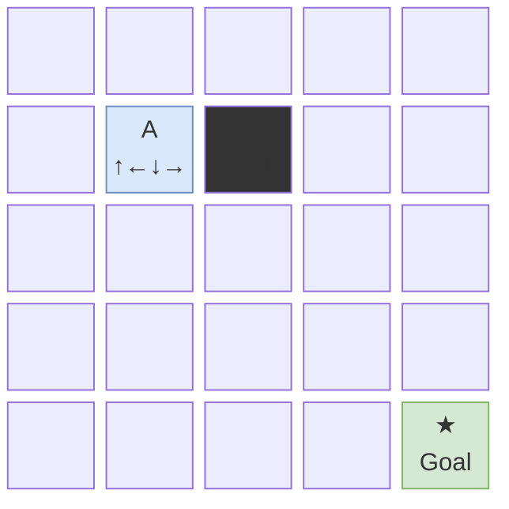
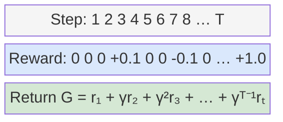
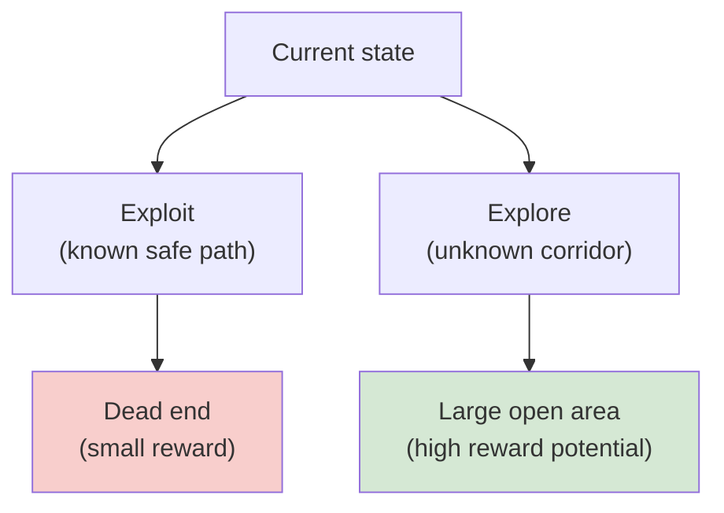
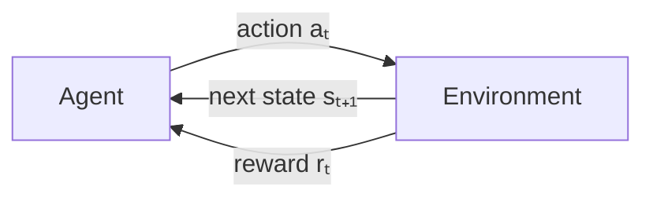
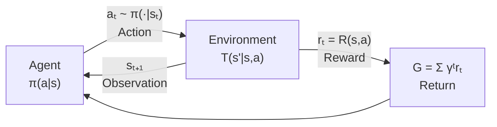

# Framing the Problem: Autonomous Exploration

Welcome to the autonomous exploration track.

---

## What Is Autonomous Exploration?

An agent must navigate an **unknown environment** to gather information, without a human telling it where to go.

- The agent doesn't have a map handed to it upfront
- It must decide where to move based only on what it has seen so far
- The goal is usually to **map as much of the environment as possible** in limited time
- Real-world examples: planetary rovers, warehouse robots, search-and-rescue drones

---

## Autonomous Exploration vs. Navigation

This is different from a navigation problem where the map is known. Here, discovering the map is the task itself.

---

## The Gridworld Abstraction

To reason clearly, we simplify the environment into a **gridworld**.

- The world is a 2D grid of cells
- Each cell is either walkable or an obstacle
- The agent occupies exactly one cell at a time

**States** represent where the agent is, typically written as a coordinate `(row, col)`.

---

## Working with Gymnasium

The standard library for RL environments in Python is **Gymnasium** (the maintained fork of OpenAI Gym). Every environment follows the same interface.

```python
import gymnasium as gym

env = gym.make("MiniGrid-Empty-5x5-v0")
obs, info = env.reset()          # reset to a fresh episode

for step in range(100):
    action = env.action_space.sample()    # random action
    obs, reward, terminated, truncated, info = env.step(action)
    if terminated or truncated:
        obs, info = env.reset()

env.close()
```

The return tuple from `env.step()` is always `(observation, reward, terminated, truncated, info)`. `terminated` means the episode ended naturally (e.g., goal reached). `truncated` means it hit a time limit.

---

## The Gridworld Abstraction: Actions and Transitions

**Actions** are the four moves the agent can take: up, down, left, right.

**Transitions** define where the agent ends up after taking an action in a given state.
- Example: in state `(2, 3)`, action `right` leads to state `(2, 4)` if that cell is walkable

```python
# Inspecting the action and observation spaces
print(env.action_space)        # Discrete(4) for a 4-action gridworld
print(env.observation_space)   # Box or Dict, depends on env

# For a custom gridworld, action encoding might be:
ACTIONS = {0: "up", 1: "down", 2: "left", 3: "right"}
```



---

## Rewards: The Signal That Guides Learning

The agent doesn't know your intentions. It only knows one thing: a **reward signal** it receives at each step.

- A reward is a scalar number the environment gives back after each action
- Positive reward: the agent did something good
- Negative reward (penalty): the agent did something bad
- Zero: neutral

The agent's entire goal is to **maximize total reward** over time.

---

## Rewards: An Example

```python
# A simple reward function for a custom environment
def compute_reward(prev_state, new_state, goal_reached):
    reward = 0.0
    reward += 0.5 * len(new_state.newly_observed_cells)  # discovery bonus
    reward -= 0.01                                        # small step penalty
    if goal_reached:
        reward += 10.0                                    # terminal bonus
    return reward
```

```
Step 1: move right  -> reward = 0
Step 2: move up     -> reward = 0
Step 3: reach goal  -> reward = +10
```

Everything the agent learns, it learns through this signal. If your reward is poorly designed, the agent will behave in ways you don't want, even if it's technically "doing well."

---

## Episodes: One Run from Start to Finish

An **episode** is a single run of the agent through the environment.

- Starts at an initial state (e.g., spawn point)
- Ends when a terminal condition is met: goal reached, time limit hit, or agent fails

The **return** is the total reward collected over the course of one episode.

The **discounted return** weights future rewards by $\gamma^t$:

$$G_t = \sum_{k=0}^{T-t} \gamma^k r_{t+k+1}$$

where $r_{t+1}, r_{t+2}, \ldots$ are the rewards at each step and $\gamma \in [0, 1)$ is the discount factor.

---

## Episodes: Training Progression

Training typically involves running many episodes:
- Early episodes: agent moves randomly, collects little reward
- Later episodes: agent has learned, collects more reward

```python
from stable_baselines3 import PPO

model = PPO("MlpPolicy", env, verbose=1)
model.learn(total_timesteps=500_000)

# After training, run an evaluation episode
obs, info = env.reset()
total_reward = 0
for _ in range(500):
    action, _ = model.predict(obs, deterministic=True)
    obs, reward, terminated, truncated, info = env.step(action)
    total_reward += reward
    if terminated or truncated:
        break
print(f"Evaluation return: {total_reward:.2f}")
```



---

## Discounting: Why Later Rewards Are Worth Less

Imagine two scenarios:
- Scenario A: you receive $100 today
- Scenario B: you receive $100 in a year

Most people prefer Scenario A. The same logic applies to RL.

We use a **discount factor gamma** (written as $\gamma$, a number between 0 and 1) to weight future rewards:

$$G_t = r_{t+1} + \gamma r_{t+2} + \gamma^2 r_{t+3} + \gamma^3 r_{t+4} + \cdots = \sum_{k=0}^{\infty} \gamma^k r_{t+k+1}$$

---

## Discounting: Choosing Gamma

- $\gamma = 0.99$: agent cares a lot about the future, rewards 100 steps away still count for $0.99^{100} \approx 0.37$
- $\gamma = 0.9$: rewards 10 steps away are worth $0.9^{10} \approx 0.35$
- $\gamma = 0.5$: rewards 10 steps away are worth only ~0.1% of immediate rewards
- $\gamma = 1.0$: no discounting, all rewards equal weight

Discounting also helps mathematically: it keeps the return from growing unbounded in long or infinite tasks.

```python
# Computing discounted return from a list of rewards
import numpy as np

def discounted_return(rewards, gamma=0.99):
    G = 0.0
    returns = []
    for r in reversed(rewards):
        G = r + gamma * G
        returns.insert(0, G)
    return returns

rewards = [0, 0, 0, 10]
print(discounted_return(rewards, gamma=0.99))
# [0.297, 0.3, 0.0, 10.0]  -- approximate
```

---

## The Bellman Equation: Value of a State

A core result in RL is the **Bellman equation**, which gives a recursive definition of how good a state is under a policy $\pi$.

The **state-value function** $V^\pi(s)$ equals the expected return starting from $s$ and following $\pi$:

$$V^\pi(s) = \sum_a \pi(a|s) \sum_{s'} P(s'|s,a) \left[ R(s,a,s') + \gamma V^\pi(s') \right]$$

For the **optimal** policy:

$$V^*(s) = \max_a \sum_{s'} P(s'|s,a) \left[ R(s,a,s') + \gamma V^*(s') \right]$$

Interpretation: the value of being in state $s$ equals the immediate reward you expect to get, plus the discounted value of wherever you end up next.

---

## Partial Observability: The Agent Can't See Everything

In a real exploration task, the agent doesn't have a full view of the map.

- It can only see cells **within a certain radius** of its current position
- Cells it hasn't visited yet are unknown
- The agent must decide where to go without knowing what's there

```python
# MiniGrid provides partial observations by default
# The agent sees a 7x7 egocentric view in front of it
import minigrid
env = gym.make("MiniGrid-FourRooms-v0")
obs, _ = env.reset()
# obs["image"] is a (7, 7, 3) array: each cell encodes
# (object_type, color, state) within the agent's field of view
print(obs["image"].shape)  # (7, 7, 3)
```

---

## Partial Observability: Why It's Hard

This is called **partial observability**. It makes exploration fundamentally harder:
- The agent must remember what it has already seen
- It must reason about what might exist in unexplored regions
- A single observation isn't enough to determine the full state of the world

Compare to a fully observable game like chess, where both players see the entire board.

One practical solution: give the agent a **map channel** as part of its observation, tracking which cells it has visited.

```python
# Augmenting observation with an occupancy map
import numpy as np

class ExplorationWrapper(gym.Wrapper):
    def reset(self, **kwargs):
        obs, info = self.env.reset(**kwargs)
        self.visited = np.zeros(self.env.unwrapped.grid.shape, dtype=np.float32)
        return self._augment(obs), info

    def _augment(self, obs):
        # Concatenate visited map into the observation dict
        obs["visited_map"] = self.visited.copy()
        return obs
```

---

## Why Exploration Is a Sequential Decision Problem

Every action the agent takes affects not just immediate reward, but all **future options**.

Example: the agent reaches a fork in the path.
- Go left: explores a dead end quickly, then has to backtrack
- Go right: reaches an unexplored region that opens into a large area

The "best" choice depends on what comes next, not just what's immediately visible.

---

## Sequential Decisions: The Consequences

This is what makes it a **sequential decision problem**:
- Short-sighted decisions can be globally suboptimal
- The agent needs to reason about the consequences of actions over time
- Credit for a good outcome may belong to an action taken many steps earlier



---

## The Credit Assignment Problem

Closely related: if the agent reaches the goal after 50 steps, which of those 50 actions were actually responsible for the success?

- This is the **credit assignment problem**
- In short episodes, it's manageable
- In long episodes with sparse rewards, it becomes very difficult

The agent receives a reward at the end, but needs to figure out that the decision made at step 12 was the critical one. This is one of the core challenges RL tries to solve.

---

## Core Vocabulary: Agent and Environment

Two fundamental entities in every RL problem:

**Agent**
- The decision-maker
- Observes the world, picks actions, receives rewards
- Your code

**Environment**
- Everything the agent interacts with
- Responds to actions by returning a new state and a reward
- The gridworld simulator in this competition

---

## Core Vocabulary: The Agent-Environment Loop



The agent and environment exchange information at every step. This loop repeats until the episode ends.

```python
# The agent-environment loop in code
obs, info = env.reset()
done = False

while not done:
    action = agent.select_action(obs)       # policy: obs -> action
    obs, reward, terminated, truncated, info = env.step(action)
    agent.store_transition(obs, action, reward)  # for learning
    done = terminated or truncated

agent.update()   # learn from collected transitions
```

---

## Core Vocabulary: State, Action, Reward

**State (s)**
- A description of the current situation
- Could be the agent's position, its local observation, a history of past observations
- What the agent uses to decide what to do next

**Action (a)**
- A choice the agent makes
- In gridworld: up, down, left, right (typically encoded as integers 0-3)

**Reward (r)**
- A scalar signal from the environment
- Tells the agent how good the last action was
- Immediate feedback, not a measure of long-term success

---

## Core Vocabulary: Policy and Episode

**Policy ($\pi$)**
- The agent's strategy: given a state, what action to take
- Can be a lookup table, a rule, or a neural network
- The thing you're training when you do RL

```python
import torch
import torch.nn as nn

# A simple neural network policy
class SimplePolicy(nn.Module):
    def __init__(self, obs_dim, n_actions):
        super().__init__()
        self.net = nn.Sequential(
            nn.Linear(obs_dim, 64),
            nn.ReLU(),
            nn.Linear(64, 64),
            nn.ReLU(),
            nn.Linear(64, n_actions),
        )

    def forward(self, obs):
        logits = self.net(obs)
        return torch.distributions.Categorical(logits=logits)
```

---

## Core Vocabulary: Random vs. Trained Policy

A **random policy** picks actions uniformly at random. A **trained policy** has learned which actions lead to higher returns.

```python
# Random policy
action = env.action_space.sample()

# Trained policy: sample from the learned distribution
dist = policy(torch.tensor(obs, dtype=torch.float32))
action = dist.sample().item()

# Greedy (deterministic) execution at test time
action = dist.probs.argmax().item()
```

---

## Putting It Together: The Full Picture

At every step of an episode:

1. Agent receives an **observation** of the current state
2. Agent selects an **action** according to its **policy**
3. **Environment** applies the action, computes the next state and reward
4. Agent receives the new state and reward
5. Repeat until episode ends

The goal: find a policy that maximizes **expected return** (total discounted reward) across episodes.

$$J(\theta) = \mathbb{E}_{\pi_\theta} \left[ G_0 \right] = \mathbb{E}_{\pi_\theta} \left[ \sum_{t=0}^{T} \gamma^t r_{t+1} \right]$$

---

## The Full Picture: Visualization



This loop is the foundation of everything in RL.

---

## What Makes Autonomous Exploration Specifically Challenging

Combining everything from this session:

- **Partial observability**: the agent can't see the full map
- **Sparse rewards**: it's hard to tell which decisions led to good coverage
- **Long horizons**: an episode can be hundreds of steps long
- **Sequential decisions**: early choices constrain later options
- **Unknown map**: there's no pre-built graph to search over

---

## Challenges: Why They Compound

None of these is insurmountable, but they all compound each other. Good reward design and a sensible exploration strategy are your two biggest levers.

---

## What to Take Away

Key ideas from this session:

- The gridworld gives us a clean model: states, actions, transitions
- Gymnasium is the standard Python interface: `env.reset()` and `env.step(action)`
- Rewards are the only signal the agent learns from
- An episode is one full run; the discounted return $G_t = \sum_k \gamma^k r_{t+k+1}$
- Discount factor $\gamma$ controls how much the agent values the future
- Partial observability means the agent must act under uncertainty
- The Bellman equation: $V^*(s) = \max_a \sum_{s'} P(s'|s,a)[R + \gamma V^*(s')]$

---

## What to Take Away: Vocabulary and Next Steps

- Every action affects future options, not just immediate reward
- Vocabulary: agent, environment, state, action, reward, policy, episode
- Code: a policy is just a function from observations to action distributions
- Training: stable-baselines3 provides PPO, SAC, and DQN with one-line setup

You now have the foundation to think carefully about how to design your agent's reward and policy.
