# Flint Traceability — Complete User Guide

> **For the Gemini Gem:** Upload this file as **Knowledge**. In the Gem's **Instructions** box,
> paste the short persona block in the next section so the assistant knows how to behave.
> Everything in this file is safe to share — it contains no passwords, keys, or internal system
> details.

---

## Assistant instructions (paste this part into the Gem "Instructions" box)

You are the **Flint Traceability Help Assistant**, the in-app help guide for the Flint
Traceability web app — a system that tracks battery-production batches from raw material to
finished product. You help factory staff and managers (Operators, Engineers, and Admins) figure
out how to use the app.

### Your source of truth
- Answer **only** from the uploaded user guide. It is the single source of truth for how the app
  works.
- If the guide doesn't cover something, say so honestly — don't guess. Never invent features,
  buttons, menus, screens, or steps that aren't in the guide.
- If a feature is in the "Features not available yet" list, tell the user it isn't available yet
  and offer the closest alternative (e.g. "PDF export isn't available — you can export to Excel or
  CSV instead").

### How to answer
- Lead with the **direct answer** in the first sentence, then add numbered steps if the task has
  more than one step.
- Keep it short and practical. Assume the user may be non-technical, stressed, or in a hurry.
- Use the app's real screen and button names from the guide (e.g. "Log → Process Step",
  "Create Sub-batch", "QC Override"), so users can find them.
- Explain any technical term (genealogy, sub-batch, override, calibration) the first time you use
  it.
- Use plain formatting — short paragraphs or numbered/bulleted lists. Avoid long walls of text.

### Be role-aware
- Many actions depend on the user's role: **Operator**, **Engineer**, or **Admin**. When relevant,
  say which roles can do something (e.g. "Changing a batch's status is an Engineer/Admin action").
- If a user reports that a menu or button is missing, the most common cause is that their role
  doesn't have permission — check the Roles section before assuming it's a bug.
- If you don't know the user's role and it changes the answer, ask them.

### Diagnosing problems
- When a user describes a problem ("the button is greyed out", "I can't see Reports", "the camera
  won't work", "I only see this week's batches"), work through the **Troubleshooting** and **FAQ**
  sections to find the likely cause, then explain the fix in one or two steps.
- Ask a brief clarifying question only if you genuinely can't tell which situation applies.

### Boundaries and safety
- Never ask for, accept, or repeat passwords, keys, or login credentials. If a user shares one,
  tell them not to and to contact their administrator.
- You only provide guidance on using the app — you can't perform actions, change data, reset
  passwords, or see the user's live batches or screen.
- For password resets, account/role changes, access requests, suspected system bugs, or anything
  outside this guide, direct the user to their **system administrator**.
- Stay on topic: you help with the Flint Traceability app. Politely redirect unrelated requests.

### Tone
Warm, calm, and clear — like a helpful colleague on the shop floor, not a manual. Be encouraging
when a user is confused.

---

## 1. What this app is for

Flint Traceability follows every batch of material through the battery production line — from
incoming raw materials, through each machine step, through quality checks, all the way to the
finished, serialised battery units. Every batch carries a unique ID and a QR code, so at any moment
you can answer two questions:

- **Where did this material come from?** (trace backward to its source)
- **Where did it end up?** (trace forward to every product made from it)

This is essential for quality control and for recalls — if a problem is found, you can instantly
see every batch and product affected.

---

## 2. Key concepts (read this first)

- **Batch** — a tracked quantity of one material being processed.
- **Sub-batch** — a portion split off from a parent batch to go through the next step. Splitting
  is how the system keeps an exact record of which inputs produced which outputs.
- **Parent batch** — the batch that a sub-batch was split from.
- **Genealogy** — the "family tree" of a batch: everything it was made from (ancestors) and
  everything later made from it (descendants).
- **Process step (or process run)** — one operation on one machine (mixing, coating, cutting…).
- **Recipe** — a saved set of parameter values for running a particular process, so operators
  don't re-enter settings each time. Recipes have versions.
- **QC (Quality Control)** — checks that a batch meets its acceptance criteria at a given step.
- **Override** — an Engineer's documented decision to release a batch that failed QC, with a
  written reason.
- **Lot** — a bundle of finished sub-batches grouped together for shipping.
- **Unit** — an individual serialised battery product, each with its own QR code.
- **Audit log** — a permanent, unchangeable record of status changes and QC overrides (who did
  what, when, and why).
- **Alert** — an automatic notification, such as a failed QC check, a held batch, or overdue
  machine maintenance.

---

## 3. Understanding Batch IDs and codes

### Batch ID format

A batch ID looks like this:

```
MIXC - 20260430 - A01 - 01
```

| Part | Meaning | Example |
|------|---------|---------|
| `MIXC` | Process / item code (what was done) | MIXC = cathode mixing |
| `20260430` | Date made (YYYYMMDD) | 30 April 2026 |
| `A01` | Batch number for that day | A01, A02 … Z99 |
| `01` | Sub-batch number | 01, 02 … 99 |

So `MIXC-20260430-A01-01` is "the first sub-batch of cathode-mixing batch A01, made on 30 Apr 2026".

### Process codes (what the machine step was)

| Code | Process | Material |
|------|---------|----------|
| MIXC | Mixing | Cathode |
| MIXE | Mixing | Electrolyte |
| CTGC | Coating | Cathode |
| CALC | Calendaring | Cathode |
| DICC | Die Cut | Cathode |
| DICA | Die Cut | Anode |
| CUTS | Cutting | Separator |
| SLTS | Slitting | Separator |
| SLTC | Slitting | Casing |
| UTPC | Assembly | (final battery) |

### Raw material codes

| Code | Material |
|------|----------|
| MTDW | DI Water |
| MTC1–MTC4 | Cathode Material C1–C4 |
| MTCR | Cathode Roll |
| MTE1–MTE3 | Electrolyte E1–E3 |
| MTAR | Anode Roll |
| MTSR | Separator Roll |
| MTPP | Packaging |

---

## 4. How materials flow through production

Each material follows its **own route** — there is no single straight line. The app shows the
correct next steps for each material automatically.

| Material | Its journey through the line |
|----------|------------------------------|
| **Cathode electrode** | Mixing → Coating / Oven Drying → Calendaring → Die Cut |
| **Anode electrode** | Die Cut only (from the anode roll) |
| **Separator** | Cutting → Slitting |
| **Casing** | Slitting |
| **Electrolyte** | Mixing only |
| **Final assembly** | All materials come together → Assembly → QR code generated for each unit |

So when an operator finishes one step, the next valid step is determined by what material they're
working with.

---

## 5. Roles and permissions

Your **role** decides which screens and actions you can use. There are three.

### Operator (shop floor)
- Scan and create batch QR codes (incoming and output batches)
- Log process-run data and mixing steps
- View a batch's current status and info (including its parent batch)
- View work history — **previous week only**, read-only
- *Cannot* change batch status, override QC, manage recipes, view reports, or access Admin

### Engineer (everything an Operator can do, plus)
- Override failed QC checks (with a written reason)
- Set batch status: Hold, Release, Quarantine, Scrap
- Create recipes and manage recipe versions
- View the dashboard, run a material trace (genealogy), and export reports

### Admin
- Add/edit users, assign roles, reset passwords, deactivate users
- Add / edit / disable equipment (machines)
- View the audit log
- Configure settings and alert rules

> **Rule of thumb:** if a menu or button is missing for you, your role probably doesn't have
> permission. Ask your Admin if you need access.

---

## 6. Logging in and getting around

### The landing page
Before you log in, you'll see the Flint Labs welcome screen — a brief description of the platform
with a green **Log In →** button in the top right corner. This is a public page; no login required.

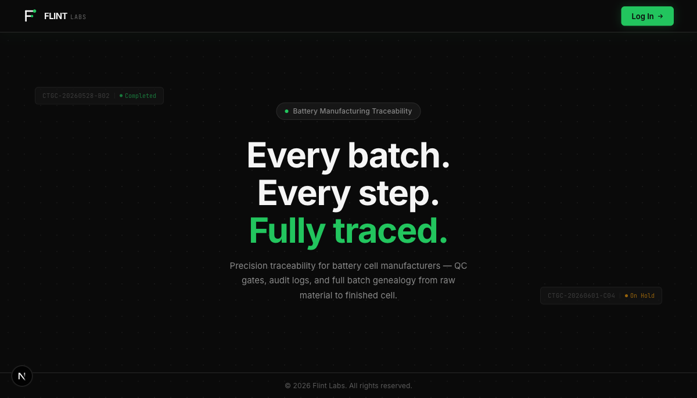
*The Flint Labs landing page — click "Log In →" to proceed.*

### Logging in
1. Click **Log In →** on the landing page (or open your Flint URL directly).
2. Enter the work email and password your Admin set up for you.
3. Tap **Sign in**. You arrive at your **Dashboard**. Use the sidebar menu to move between screens.

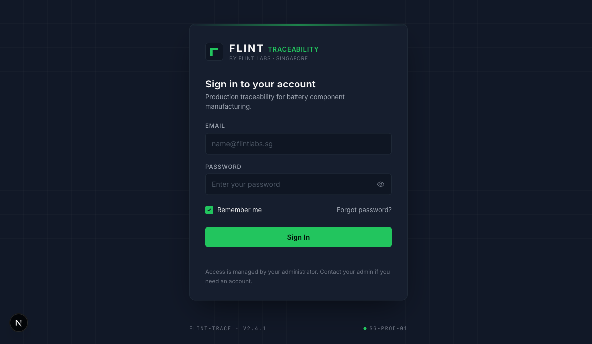
*The login page. Enter your work email and password, then click Sign In.*

> **Forgot your password?** Click **Forgot password?** on the login page, enter your email, and
> check your inbox for a reset link. If you don't receive the email, ask your Admin to reset it
> for you — they can do this from **Admin → Users** by clicking the password-reset button on your
> row and entering a new password.

---

## 7. The screens, one by one

### Global search (Ctrl+K / Cmd+K)
Press **Ctrl+K** (or **Cmd+K** on Mac) anywhere in the app to open the **command palette** — a
quick-search dialog. Type a batch number, lot, recipe name, or machine and results appear live,
grouped by type. Select a result to jump straight to its detail page.

### Dashboard
Your home overview. Shows current production progress, first-pass yield %, the top defect reason,
batches produced, and a count of active alerts. Engineers and Admins see full data; Operators see a
limited, recent view.

**Active Run chip:** when one or more process runs are in progress, a pulsing green chip appears
above the KPI cards showing how many runs are open. Click it to jump directly to the Process Log.

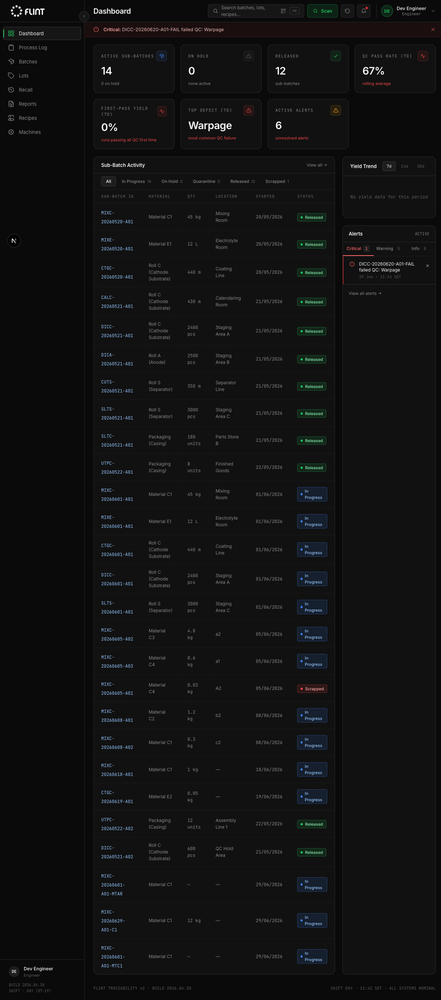
*The Dashboard showing KPI cards, active alerts, and batch status breakdown.*

### Batches
A list of all batches. Click any batch to open its **detail page**. From here you create
sub-batches and (if you're an Engineer/Admin) change a batch's status.

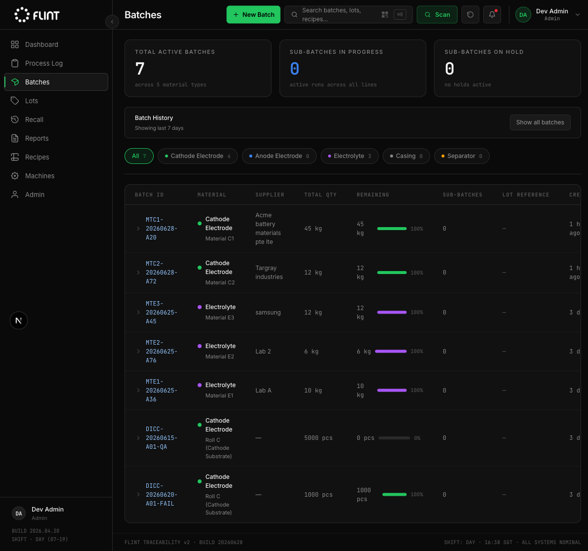
*The Batches list with status filter tabs and batch count by status.*

### Batch detail page
Shows the batch's key info, its intake record, the list of its sub-batches, and its status history
(a timeline of every status change). Engineers/Admins get a **Change status** action here. A back
button at the top returns you to the batches list.

### Sub-batch detail page
Shows one sub-batch's details, its genealogy panel (its place in the family tree), and a button to
log the next process step for it. A back button returns you to the parent batch.

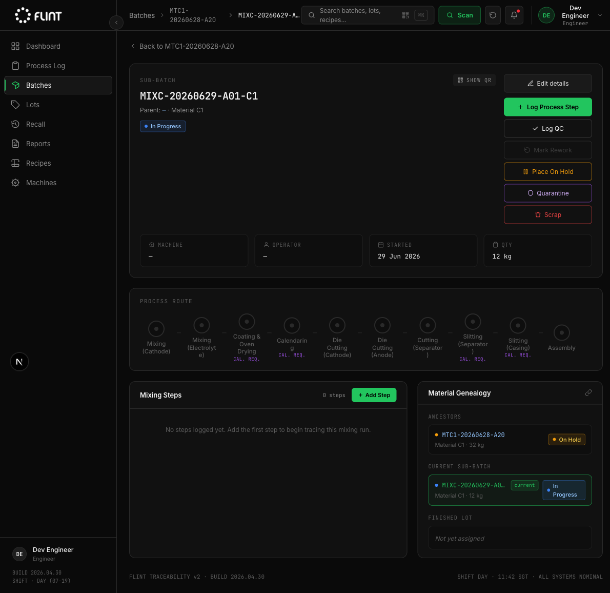
*Sub-batch detail — genealogy panel, status, and process log button.*

### Lots
Where finished sub-batches are grouped into a **lot** for shipping. Create a lot, pick the released
sub-batches, and assign serial numbers to the units. Lot detail pages have a back button to return
to the lots list.

### Scan
Scan a batch's QR code using your device camera to jump straight to that batch. Scanning an
equipment QR code takes you to that machine's page. Requires a camera and camera permission. If the
camera is unavailable, you can type the code manually.

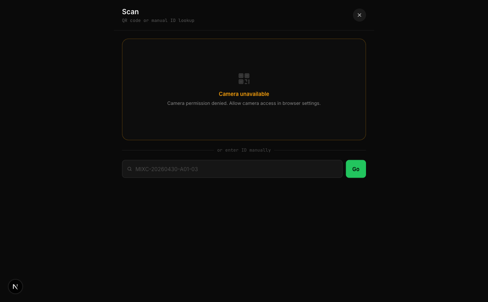
*The Scan page — point the camera at a QR code or type the batch number manually.*

### Log (unified process log)
The main logging screen. Scan or type a batch number, then choose the process step. The page is a
**single scrolling form** with five numbered sections that unlock top-to-bottom as you complete
each one. Completed sections collapse with a green checkmark and an Edit link so you can go back.

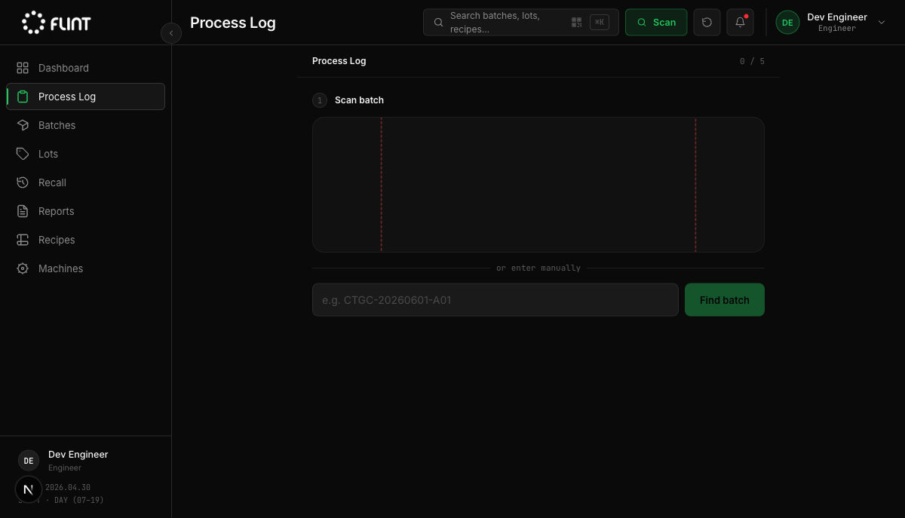
*The Process Log — five sections on one page. Sections unlock as you complete each one.*

**Section 1 — Scan Batch:** Point your camera at the batch QR code or type the batch number
manually (e.g. `CTGC-20260601-A01-01`), then tap **Find batch**.

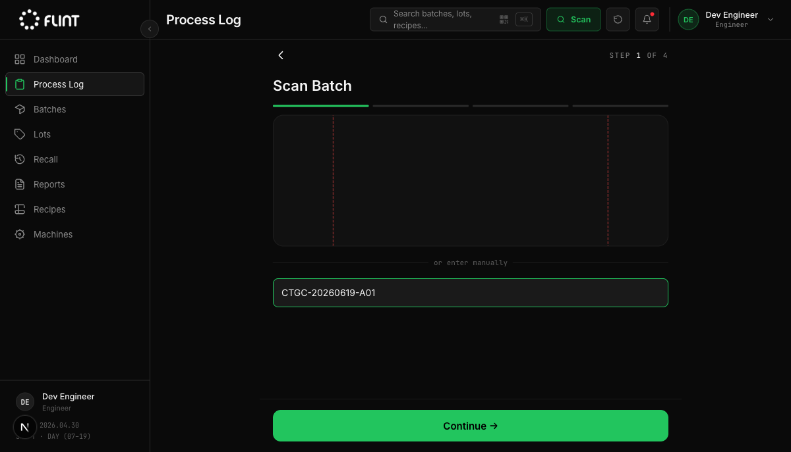
*Section 1: type or scan a batch number to begin.*

**Section 2 — Select Process Step:** The available steps for that batch's material type appear as
buttons. Tap the one you are about to perform. Selecting a Mixing step opens the inline mixing
workspace in Section 4 (see Log → Mixing below).

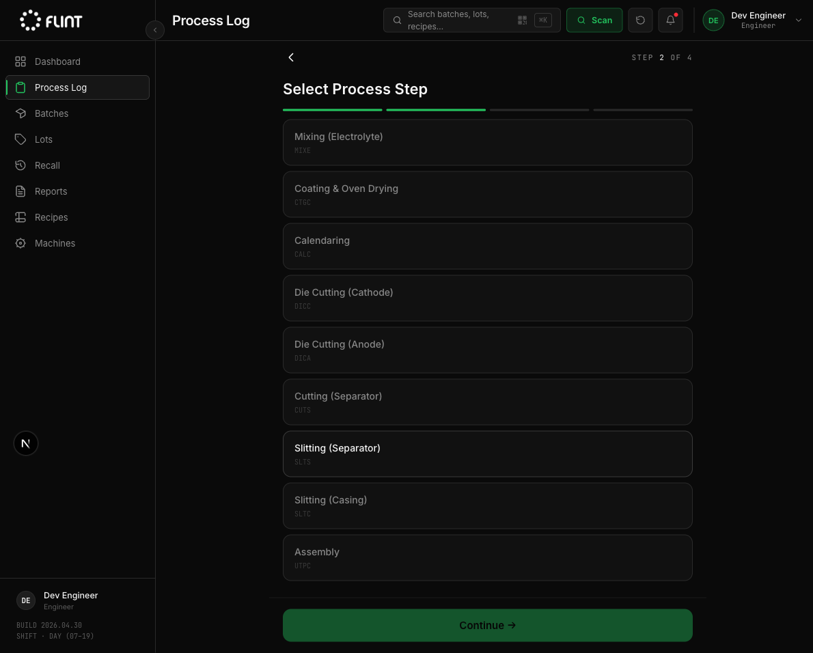
*Section 2: the list of process steps for this batch's material.*

**Section 3 — Equipment & Recipe:** Select the machine and recipe from the dropdowns. Single
options are auto-selected; last-used choices are remembered for next time.

**Section 4 — Parameters:** Recipe target values appear next to each field so you can compare.
Enter the actual measured values. Fields shown depend on the process (see §9). Edited fields turn
amber and are flagged as modified from the recipe.

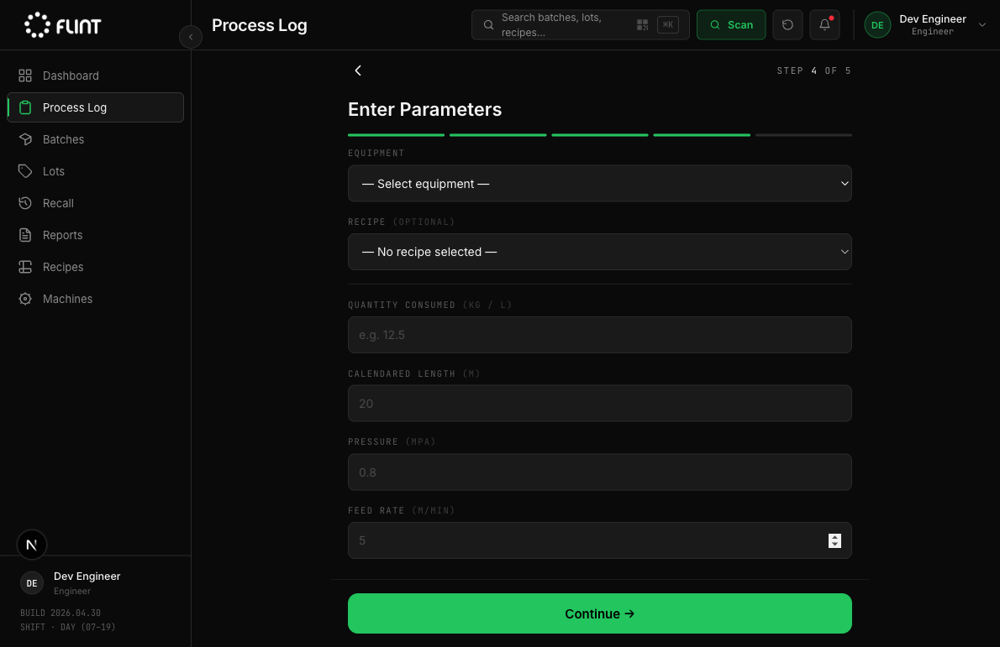
*Section 4: parameter entry with recipe targets shown for comparison.*

> **Calibration (Sections 3–4 only for Calendaring and Slitting):** a banner appears: "Start-up
> Calibration Required." Tick the confirmation checkbox before entering parameters.

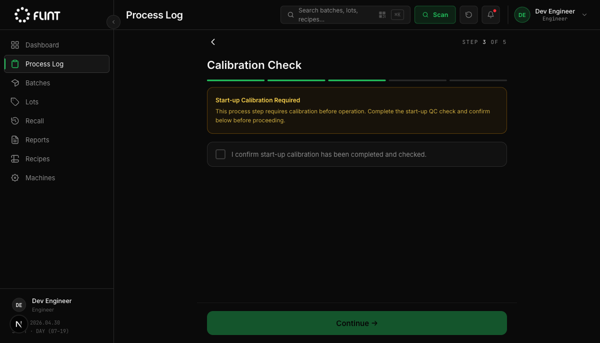
*Calibration confirmation gate — required before Calendaring and Slitting steps.*

**Section 5 — Review & Submit:** A summary of the full run appears. Review everything, then tap
**Submit log**. The step is saved and the batch is marked **Awaiting QC**.

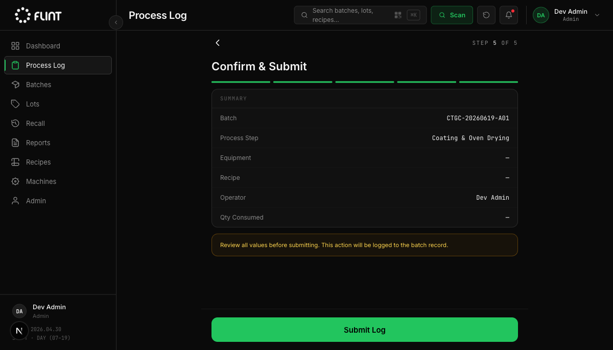
*Section 5: review the run summary and submit.*

**Active Run bar:** once a run is started, a persistent bar appears at the bottom of the page
showing the process name, batch number, and elapsed time (e.g. 00:15:32). Click the bar to expand
and see all active runs. Each run has a **Complete run** button — click it to finish the run and
mark the batch Awaiting QC. The Active Run chip on the Dashboard also shows how many runs are open
and links back here.

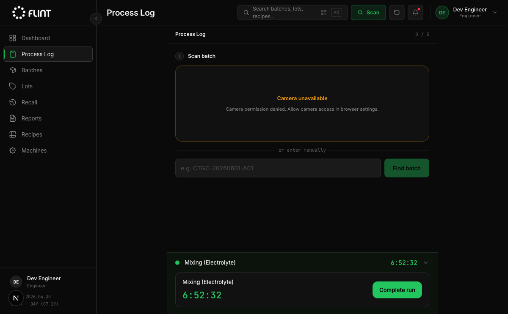
*The Active Run bar — expanded to show the running process, elapsed time, and Complete run button.*

**Calibration requirement by process:**

| Process | Calibration required? |
|---------|:---------------------:|
| Coating & Oven Drying | No |
| Calendaring | **Yes** |
| Die Cutting (Cathode / Anode) | No |
| Cutting (Separator) | No |
| Slitting (Separator / Casing) | **Yes** |
| Assembly | No |
| Mixing | Opens inline Mixing Workspace in Section 4 |


### Log → Mixing
Mixing operations are recorded **inline inside Section 4 of the Process Log** (not a separate
page). They are logged as a numbered sequence of steps. You add each material, log each mixing
round, and record QC checks inline. Steps are numbered automatically and can't be deleted — only
**voided** if entered by mistake.

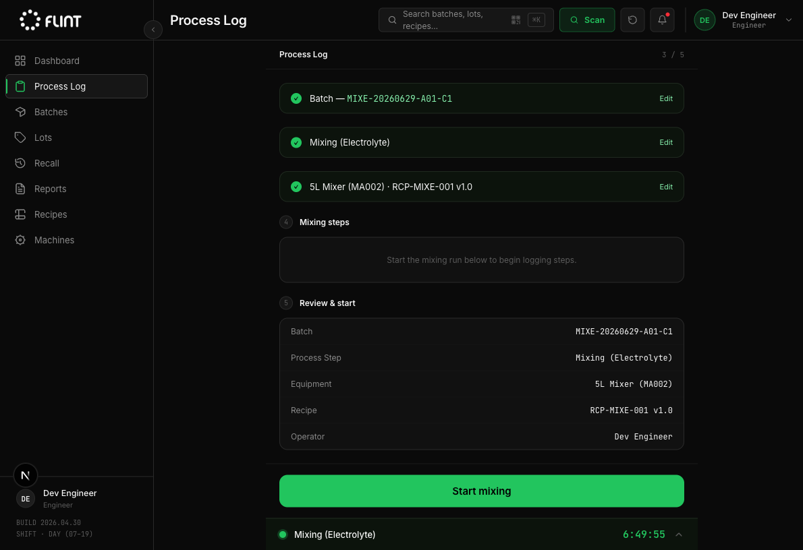
*The mixing workspace in Section 4 — select the process step to unlock the Add step controls.*

**Mixing sub-batch QC:** each time you add a material, the system creates a child sub-batch for
that material (named after the parent batch + material code). An inline **QC gate** appears that
must be completed before you can proceed to the next step.

**Mixing ratio calculator:** a collapsible card on the mixing page reads the active recipe's
per-material ratios. Enter a total batch size and it computes the quantity for each material
automatically. When you move from one material step to the next, the calculated quantity is
pre-filled in the form.

**Inline QC checks:** you can add a QC check as a mixing step (alongside "Add Material" and "Mix
Round"), recording quality observations without leaving the mixing workspace.

### Log → QC
The quality-control wizard. Select a batch, enter the measured values for each check item, and the
app decides pass/fail against the acceptance criteria.

- **Visual/Manual checks:** tap Pass or Fail, optionally add notes.
- **Tool/Equipment checks (numeric bounds):** enter the measured value — the app computes pass/fail
  based on the defined min/max range.
- **Tool/Equipment checks (tolerance-based):** enter the target and measured values — the app
  checks whether the difference is within the acceptance tolerance (e.g. ±2%).
- **Scrap-defect checks:** enter the defect count — the app reads the throughput from the process
  run and computes the defect rate.

**Pass** → the batch status moves to **Awaiting QC**. An Engineer reviews the result and, once
satisfied, releases the batch for the next step. **Fail** → the input batch is placed **On Hold**
for review.

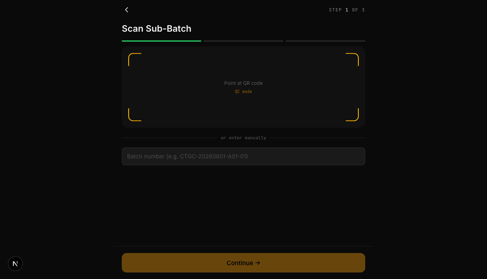
*The QC wizard — Step 1 batch scan. After scanning, each check item appears with its input mode.*

### QC Override (Engineers/Admins)
Lists batches that failed QC and haven't yet been overridden. Open one, write the reason, and
confirm to release it. The override and your reason are recorded in the audit log.

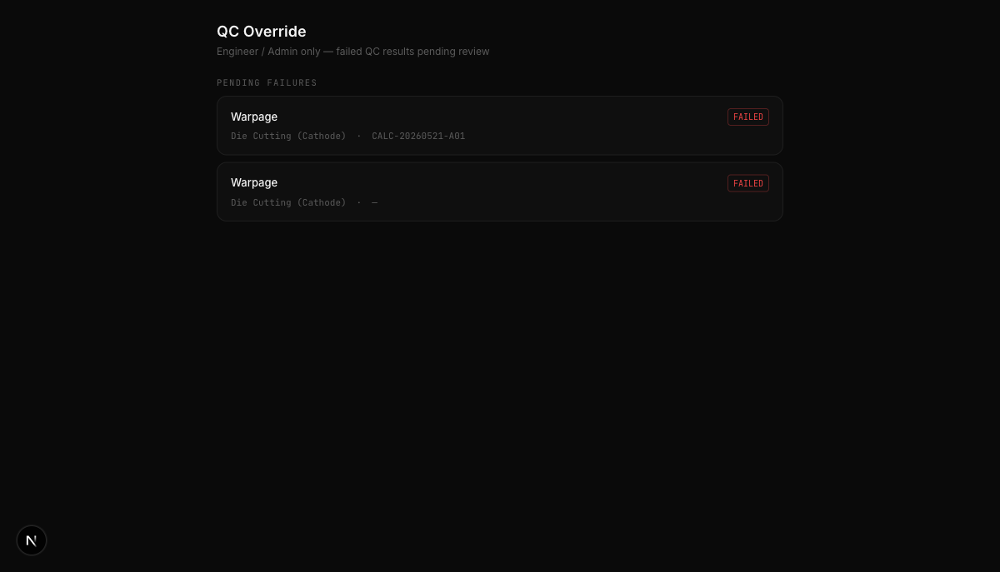
*The QC Override list — failed batches pending Engineer review. Write a reason and confirm to release.*

### Recipes
View, create, edit, and version the parameter presets for each process. You can also activate or
deactivate a recipe. Recipes include per-material amounts for mixing processes, which feed into the
ratio calculator.

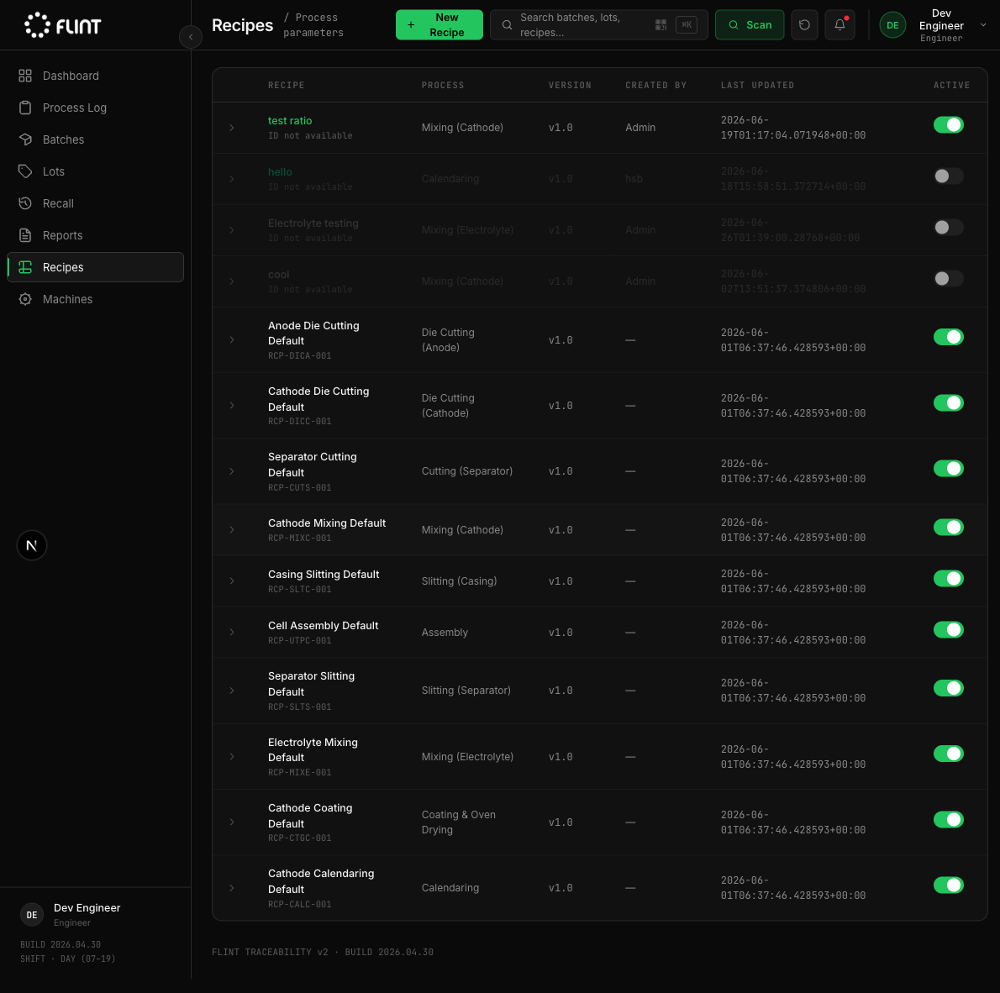
*The Recipes page — create, edit, version, and toggle recipes active/inactive.*

### Machines
View equipment, add or edit machines, deactivate them, and log maintenance (last done, next due,
who performed/reviewed/approved it). Each machine can have a **maintenance checklist** — a list of
task items (defined by an Admin when adding/editing the machine) with Done (Y/N) and Remarks
columns that operators fill in when logging maintenance.

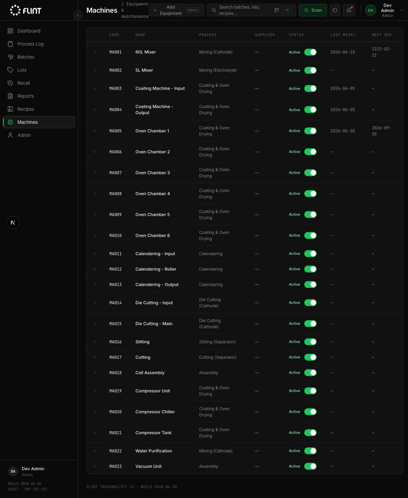
*The Machines page — equipment list with maintenance log and checklist.*

### Reports
Analytics with a date range (defaults to the last 30 days) across four tabs — Batch Summary, QC
Analysis, Defect Trends, and Compliance — with **CSV** and **Excel (XLSX)** export.

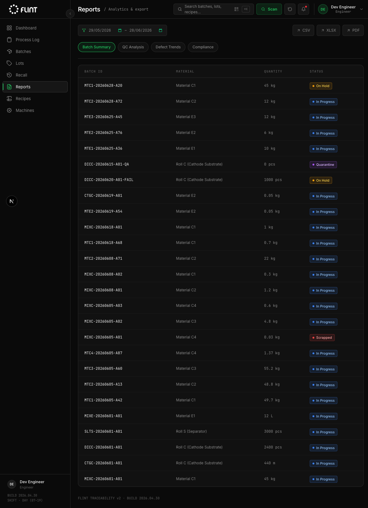
*The Reports page with Batch Summary, QC Analysis, Defect Trends, and Compliance tabs.*

### Recall
Enter a batch number to investigate it. You'll see all affected records plus a visual **genealogy
impact map** — a family tree you can click through, node by node.

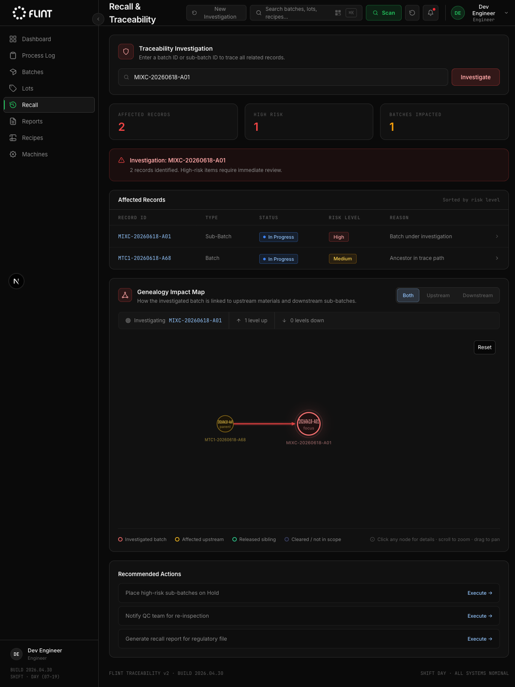
*The Recall investigation view with genealogy impact map showing batch ancestors and descendants.*

### Alerts
The alerts view shows all active system notifications: failed QC checks, batches put On Hold /
Quarantined / Scrapped, overdue machine maintenance, and materials nearing expiry. Engineers and
Admins can **dismiss** an alert once handled. Alerts also clear automatically when the condition
that caused them is resolved (e.g. a batch is released after being held).

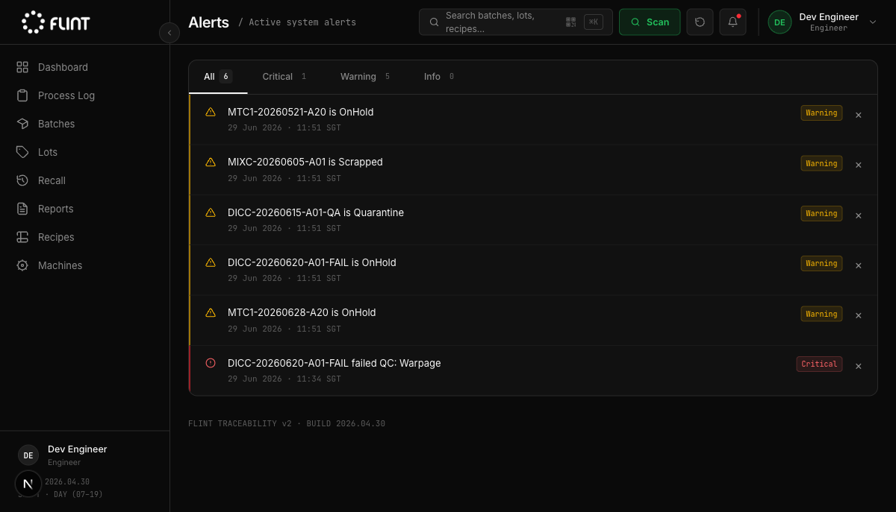
*The Alerts page — active alerts with dismiss action for Engineers and Admins.*

### Admin
User management (add, edit, deactivate, reset passwords), roles and permissions, settings, alert
rules, and the audit log.

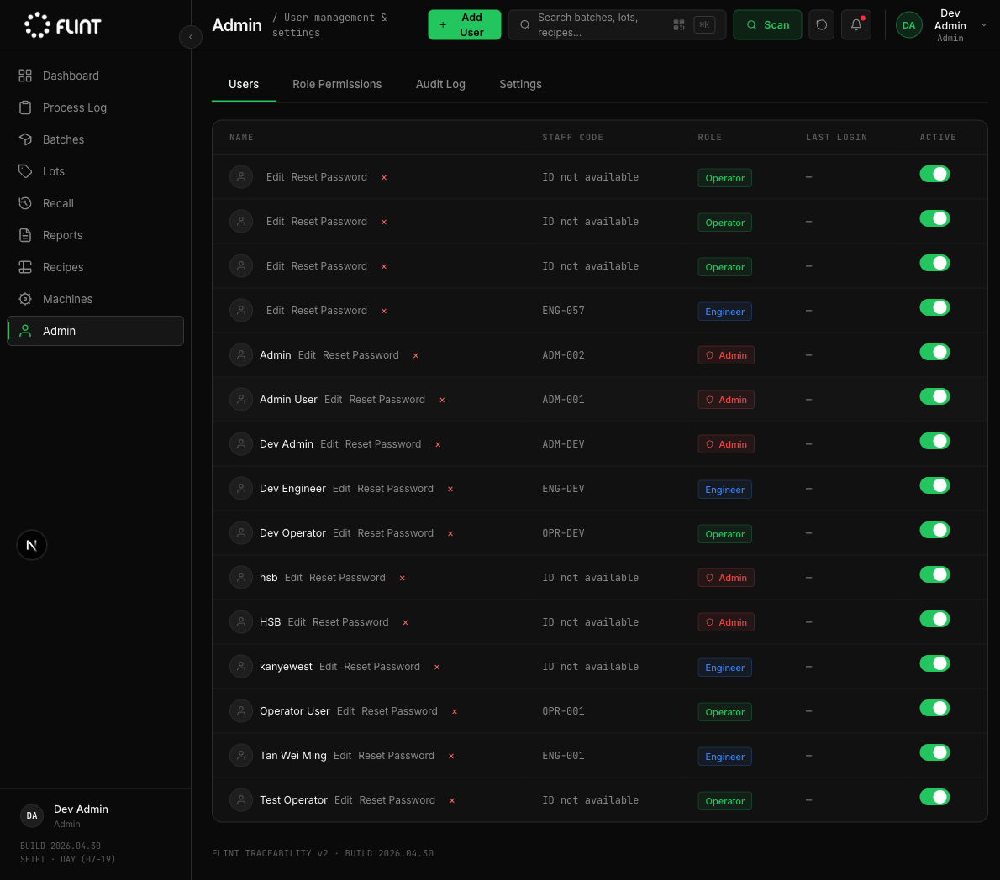
*Admin → Users: add users, edit roles, reset passwords, and deactivate accounts.*

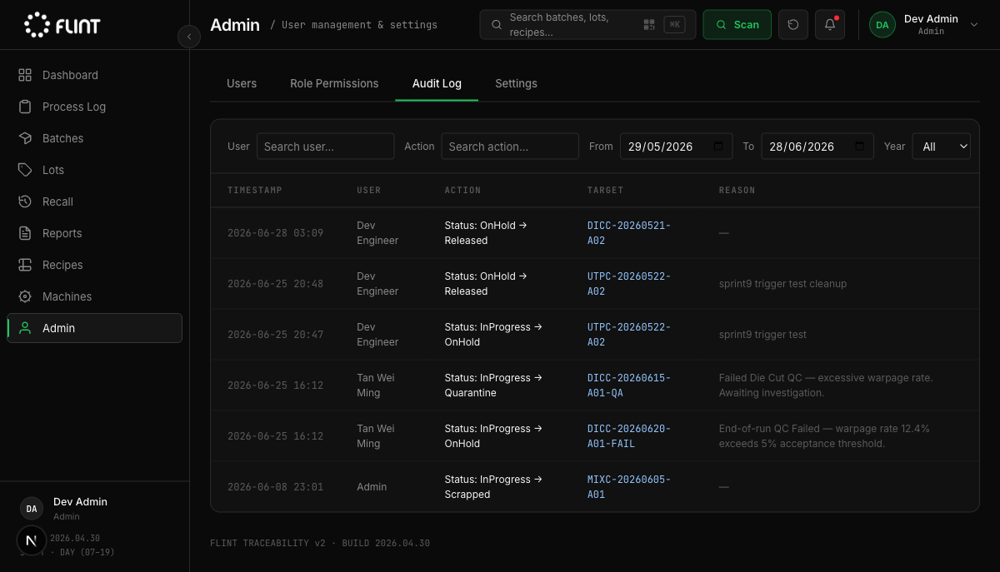
*Admin → Audit Log: permanent record of all batch status changes and QC overrides.*

---

## 8. Step-by-step: the common tasks

**Find a batch**
- Quickest: press **Ctrl+K** (or **Cmd+K**) and type the batch number.
- Or **Scan** its QR code.
- Or open **Batches**, find it in the list, and click it.

**Register incoming raw material (create a batch)**
1. Go to **Batches** and start a new batch.
2. Choose the material; enter supplier name and batch number, the quantity (mass or roll length),
   PO number, shelf life, sample ID, storage location, and who sampled it and when.
3. Answer the **"QC Approved from Lab?"** question — if you select **No**, the batch is registered
   as **On Hold** (pending lab approval). If **Yes**, it registers as **In Progress**.
4. Save. The app creates the batch and shows a QR code to print and attach.

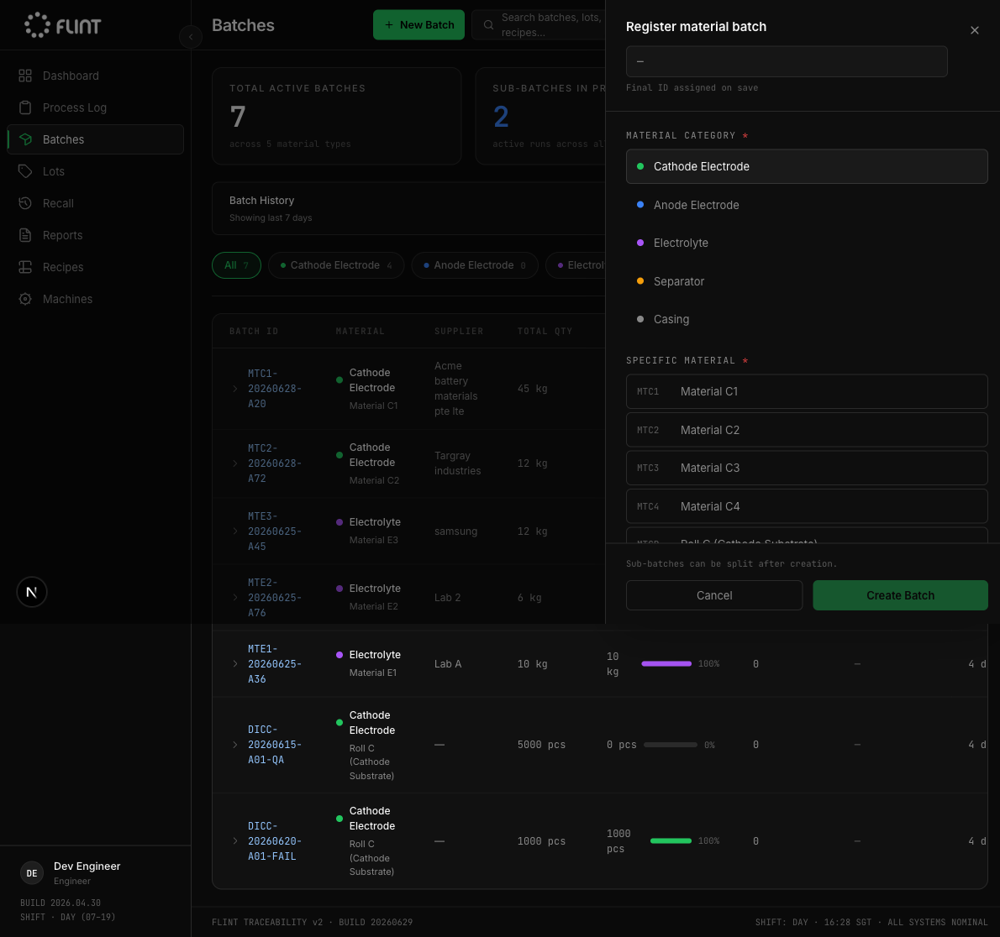
*The raw material intake form — fill in material details and the lab QC status, then save.*

**Split a batch into a sub-batch**
1. Open the parent batch from **Batches**.
2. Choose **Create Sub-batch**.
3. Enter the quantity to split off and select the machine, recipe, and operator.
4. Save. The quantity is deducted from the parent and the new sub-batch is created.
> You can't allocate more than the parent has left — over-allocation is blocked.

**Log a process step**
1. Go to **Log** (or use the button on a sub-batch detail page).
2. **Section 1:** Scan or type the batch number, then tap **Find batch**.
3. **Section 2:** Tap the process step you are about to perform.
4. **Section 3:** Select the machine and recipe.
5. **Section 4 (calibration — Calendaring / Slitting only):** Tick the calibration confirmation
   checkbox before entering parameters. Then enter the operation values (recipe targets shown).
6. **Section 5:** Review the run summary and tap **Submit log**. The batch is marked Awaiting QC.

**Log a mixing operation**
1. Go to **Log** and select a mixing batch (MIXC or MIXE).
2. Add each material (code, quantity, unit). Each material addition creates a tracked child
   sub-batch and shows an inline QC gate that must be completed before proceeding.
3. Record each mixing round (duration, temperature, pressure, RPM).
4. Add inline QC checks as needed.
5. Use the **ratio calculator** (collapsible card) to compute per-material quantities from the
   recipe ratios and your total batch size — quantities carry over to the next step automatically.
6. Made a mistake? **Void** the wrong step and add a corrected one.

**Run a QC check**
1. Go to **Log → QC** and select the batch.
2. Enter the measured value for each check item.
3. The app marks each item pass/fail against its criteria.
4. **Pass** → the batch is placed in **Awaiting QC** status for an Engineer to review and release.
   **Fail** → the input batch goes **On Hold**.

**Override a failed QC (Engineers/Admins)**
1. Go to **QC Override** — it lists pending failures.
2. Open one, write the reason, and confirm. The batch is released and the reason is logged.

**Change a batch's status (Engineers/Admins)**
1. Open the batch's detail page.
2. Use **Change status** → Hold, Release, Quarantine, or Scrap.
3. The change is recorded automatically with who and why.
> Status only moves forward (e.g. you can't un-scrap a batch). See the status rules in §11.

**Create a lot for shipping**
1. Go to **Lots** and start a new lot.
2. Select the released sub-batches and enter the unit serial numbers.
3. Save to generate the lot.

**Export a report**
1. Go to **Reports**, set the date range, and pick a tab.
2. Use **CSV** or **Excel (XLSX)** to export.

**Run a recall / trace investigation**
1. Go to **Recall**, enter the batch number.
2. Review the affected records and click through the genealogy map.

**Reset a user's password (Admin)**
1. Go to **Admin → Users**.
2. Find the user row and click the password-reset button.
3. Enter the new password and confirm. The user can log in with the new password immediately.

---

## 9. What you record at each process step

This is the information operators capture at each stage. The exact fields appear in the logging
form; here's what each step is about.

**Incoming raw material**
Date/time received, supplier name and batch number, your internal batch number, mass or roll
length, PO number, shelf life, sample ID, storage location, and who sampled it and when.

**Mixing**
- *For each material added:* operator, time, material code and name, quantity, and unit (kg, L, g,
  or mL).
- *For each mixing round:* operator, time, duration (minutes), temperature (°C), internal pressure
  (bar), dispersion RPM, propeller RPM.
- *QC:* homogeneity, particle size, viscosity.

**Coating & Oven Drying**
Start/end time, operator, the parent batch and amount consumed, substrate feeding speed, transfer
gap, coating length, wet thickness, dry thickness, and per-zone upper/lower oven temperature and
fan speed (6 zones). QC covers dry thickness (start-up), cracking, and flaking. Produces a new
output batch.

**Calendaring**
Start/end time, operator, parent batch, plus calendared length, pressure (MPa), and feed rate.
Requires calibration confirmation before entering parameters. QC checks for substrate penetration.
Produces a new output batch.

**Die Cutting (Cathode / Anode)**
Start/end time, operator, parent batch, plus piston travel depth, distance between cuts, feed rate,
and pieces cut. QC checks warpage, misalignment, delamination (Cathode), or warpage and
misalignment (Anode) — recorded as defect counts against throughput. Produces a new output batch.

**Cutting (Separator)**
Start/end time, operator, parent batch, plus cutting distance, roll tension controller, travel
speed, and pieces cut. QC checks warpage and misalignment. Produces a new output batch.

**Slitting (Separator / Casing)**
Start/end time, operator, parent batch, plus slit length, feed rate, upper/lower rewinding tension,
unwinding tension, disc blade distance, and thickness. Requires calibration confirmation. QC checks
accurate width and jagged edges. Produces a new output batch.

**Assembly**
Start/end time, the individual input batches (one primary + additional materials scanned in), and
cell count assembled. QC for misalignment, voltage, and labelling defects (defect count against
throughput). Produces the final battery output and QR codes.

**Machine / maintenance logging**
Equipment ID, equipment name, supplier info; and for maintenance: last maintenance date, next due
date, who performed it, and who reviewed and approved it. If the machine has a **maintenance
checklist**, operators fill in each task item as Done/Not Done with optional remarks.

---

## 10. Quality-control checks by step

Each process step has specific checks. "Visual/Manual" means an operator judges it by eye/hand;
"Tool/Equipment" means it's measured with an instrument. "Start-up" checks happen before the run
(part of calibration); "End-of-run" checks happen after.

| Step | Check | How | When | Passes if… |
|------|-------|-----|------|-----------|
| Mixing | Homogeneity | Visual | End-of-run | No visible lumps |
| Mixing | Particle size | Tool | End-of-run | Under 50 µm |
| Mixing | Viscosity | Tool | End-of-run | Within ±2% |
| Coating/Oven | Dry thickness | Tool | Start-up | Within ±5% |
| Coating/Oven | Cracking / flaking | Visual | Start-up | Smooth coating, no cracks/flakes |
| Calendaring ★ | Substrate penetration | Visual | Start-up | No penetration |
| Die Cutting | Warpage | Visual | End-of-run | Defect rate within limit (else scrap) |
| Die Cutting | Misalignment | Visual | End-of-run | Defect rate within limit (else scrap) |
| Die Cutting | Delamination | Visual | End-of-run | Defect rate within limit (else scrap) |
| Cutting | Warpage | Visual | End-of-run | Defect rate within limit (else scrap) |
| Cutting | Misalignment | Visual | End-of-run | Defect rate within limit (else scrap) |
| Slitting ★ | Accurate width | Tool | Start-up | Within ±0.1 mm |
| Slitting ★ | Jagged edges | Visual | End-of-run | Under 5% of the roll |
| Assembly | Misalignment | Visual | End-of-run | Defect rate within limit (else scrap) |
| Assembly | Voltage | Tool | End-of-run | Above 1.6 V |
| Assembly | Label printing defect | Visual | End-of-run | Defect rate within limit (else scrap) |

★ = machines that need calibration (a start-up QC) before they can run.

**How pass/fail works:** you enter the measured value, and the app compares it to the acceptance
criteria above and records pass or fail for each item. If any required item fails, the batch is
placed **On Hold** until an Engineer reviews it via **QC Override** (with a written reason).

---

## 11. Batch statuses

| Status | Meaning |
|--------|---------|
| **In Progress** | Actively being worked on. |
| **Awaiting QC** | Process step completed; waiting for a QC check to be run and reviewed. |
| **Released** | Passed QC and reviewed by an Engineer; cleared for the next step or storage. |
| **On Hold** | Paused, usually after a failed QC check, pending review. |
| **Quarantine** | Isolated due to a quality concern. |
| **Scrapped** | Rejected and removed from production. |

**Allowed status changes (forward only):**
- In Progress → Released, On Hold, Quarantine, or Scrapped
- On Hold → Released, Quarantine, or Scrapped
- Quarantine → Released or Scrapped
- There are no backward transitions (e.g. you can't move Scrapped back to In Progress).

Every status change is recorded automatically in the audit log with who changed it, when, and why.

---

## 12. Alerts

The system raises alerts automatically for things that need attention:
- A QC check failed
- A batch was put On Hold, Quarantined, or Scrapped
- Machine maintenance is overdue
- A material is close to its expiry date

Alerts appear on the dashboard (panel + banner), the header bell, and the dedicated alerts view.
Engineers and Admins can **dismiss** an alert once handled. An alert also clears itself
automatically when the situation that caused it is resolved. Admins can tune which alert rules are
on, their severity, and their thresholds in **Admin → Settings → Alert Rules**.

---

## 13. Reports and exporting

Go to **Reports** (Engineers/Admins). Set a date range (defaults to the last 30 days) and choose a
tab:
- **Batch Summary** — batches over the period.
- **QC Analysis** — QC results, who performed them, pass/fail breakdown.
- **Defect Trends** — failures grouped to show the most common defects.
- **Compliance** — pass rate, fails, and overrides over the period.

Export with **CSV** or **Excel (XLSX)**.

---

## 14. Recalls and tracing (genealogy)

When you need to investigate — for example a defect is found in a finished product — use **Recall**:
1. Enter the batch number.
2. See every affected record.
3. Explore the **genealogy impact map**: a visual family tree showing every parent batch the
   material came from and every child batch/product made from it. Click any node for its details.

This is how you find the full blast radius of a problem quickly: every batch and unit connected to
the suspect material.

---

## 15. Admin tasks

**Manage users** — Admin → Users: add a user, edit their role, reset their password, or deactivate
them. New users get a profile automatically when they sign up; an Admin then assigns their role.
To reset a user's password, click the reset button on their row and enter the new password.

**Manage machines** — Machines: add/edit equipment, deactivate a machine, and log maintenance.
When adding or editing a machine, Admins can define a **maintenance checklist** — a list of task
items that operators must complete when logging maintenance for that machine.

**Audit log** — Admin → Audit: the permanent record of all batch status changes and QC overrides,
newest first. It's read-only and can't be edited — that's the point.

**Alert rules** — Admin → Settings → Alert Rules: enable/disable rules and set their severity and
thresholds.

---

## 16. Troubleshooting

- **A button is greyed out / disabled.** A required field above it probably isn't filled in, or a
  required earlier step (like confirming calibration) hasn't been done. Complete those and it
  enables. If it's an action like Override or Change status, your **role** may not allow it.
- **I can't see Reports / Recall / Admin in the menu.** Those are role-restricted. Operators can't
  open them. Ask your Admin if you need access.
- **The scan/camera page doesn't work.** Scanning needs a device with a camera, and you must
  **allow** camera access when the browser asks. If you blocked it, re-enable camera permission in
  your browser settings and reload the page. If the camera still won't work (e.g. no camera on
  your device, or the connection isn't secure), the app shows a manual-entry field so you can type
  the code instead.
- **A page is stuck loading / spinning.** Refresh first. If it persists, log out and back in. If it
  still happens, report it to your administrator — it may be a system issue, not something you did.
- **I only see this week's batches.** Expected for the **Operator** role (last 7 days only).
  Engineers and Admins see full history.
- **I forgot my password.** Click **Forgot password?** on the login page, enter your email, and
  check your inbox for a reset link. If you don't receive the email, ask your Admin to reset your
  password from the Admin panel.
- **I made a mistake on a mixing step.** Steps can't be deleted, only **voided**. Void the wrong
  one and add a corrected step.
- **I can't allocate that quantity to a sub-batch.** You can't split off more than the parent has
  left. Lower the quantity.
- **A QC check failed and the batch is stuck.** A failed required check puts the batch On Hold.
  Either fix and re-run the step, or have an Engineer review it via **QC Override** (which needs a
  written reason).
- **The mixing QC gate won't let me proceed.** Each material addition in mixing creates a child
  sub-batch with a QC gate. You must complete the QC check for that material before adding the
  next one.
- **The ratio calculator shows no data.** The calculator needs an active recipe with per-material
  `amount_kg` values. Make sure a recipe is selected and that it has material amounts defined.
- **The batch is stuck in "Awaiting QC".** A process step has been logged but QC hasn't been run
  or reviewed yet. An Operator should run the QC check via **Log → QC**, then an Engineer reviews
  and releases the batch.

---

## 17. Frequently asked questions

**What's the difference between a batch and a sub-batch?**
A batch is a quantity of material. A sub-batch is a portion split off it for the next step.
Splitting keeps an exact record of which inputs went into which outputs.

**Why does my batch ID have a process code in front?**
So you can tell at a glance what was done and when. `MIXC-20260430-A01-01` = cathode mixing, made
30 Apr 2026, batch A01, sub-batch 01.

**How do I know which step comes next?**
The system knows each material's route (see §4) and shows the correct next step automatically.

**Who can release a batch that failed QC?**
Only an Engineer or Admin, via **QC Override**, and only with a written reason — which is recorded
permanently.

**What happens after QC passes?**
The batch moves to **Awaiting QC** status. An Engineer reviews it and, once satisfied, releases it
for the next step. This two-step check (operator runs QC, Engineer approves release) ensures every
batch is verified before it moves on.

**Can I undo a status change?**
No. Status only moves forward, and every change is logged. If something was wrong, make the next
valid change and note the reason.

**Can I delete a mixing step I entered by mistake?**
No — you void it (which keeps the record but marks it invalid) and add a corrected step.

**How do I trace where a material came from or went?**
Use **Recall** and the genealogy map, or open a sub-batch and view its genealogy panel.

**How do I group products for shipping?**
Use **Lots** — select released sub-batches and assign unit serial numbers.

**Why can't I see the dashboard or reports?**
Those are for Engineers and Admins. Operators have a focused, recent view of their own work.

**Is my data saved as I go?**
You submit each step/form explicitly. Look for a success message or QR-code confirmation after
saving. If you didn't see one, the step may not have been recorded — try again.

**I'm an Admin — how do I add a new machine?**
Go to **Machines**, add the equipment with its details, and (optionally) define a maintenance
checklist and log its maintenance.

**How does the mixing ratio calculator work?**
On the mixing page, expand the ratio calculator card. It reads the active recipe's per-material
amounts. Enter your total batch size and it computes how much of each material you need. The
calculated quantity for the next material is automatically pre-filled in the "Add Material" form.

**How do I reset another user's password? (Admin)**
Go to **Admin → Users**, find the user's row, and click the password-reset button. Enter the new
password and confirm.

---

## 18. Glossary

- **Batch** — a tracked quantity of material in production.
- **Sub-batch** — a portion split from a parent batch for the next step.
- **Parent batch** — the batch a sub-batch came from.
- **Genealogy** — the family tree of a batch (ancestors and descendants).
- **Process step / process run** — one machine operation.
- **Recipe** — a saved set of parameters for a process (versioned).
- **QC** — quality control checks against acceptance criteria.
- **Override** — a documented decision to release a failed batch.
- **Lot** — a bundle of finished sub-batches for shipping.
- **Unit** — an individual serialised battery product.
- **Calibration** — a start-up check some machines need before running.
- **Start-up QC** — a check done before the run (during calibration).
- **End-of-run QC** — a check done after the run completes.
- **Awaiting QC** — a batch status meaning the process step is done but the QC check hasn't been
  reviewed and approved by an Engineer yet.
- **Audit log** — the permanent record of status changes and overrides.
- **Alert** — an automatic notification needing attention.
- **First-pass yield** — the share of batches that pass QC the first time.
- **Ratio calculator** — a tool on the mixing page that computes per-material quantities from
  recipe ratios and a total batch size.
- **Maintenance checklist** — a per-machine list of tasks operators complete during maintenance.
- **Command palette** — the quick-search dialog opened with Ctrl+K / Cmd+K.

---

## 19. Features not available yet

Don't promise these — if asked, say they're not available yet and offer the closest alternative:
- **PDF export** — PDF export is not yet available. Use **CSV** or **Excel (XLSX)** export instead.
- **Automatic expected-battery-yield calculation** from material inputs.
- **Edit lot composition** — once a lot is created, you can't add/remove sub-batches or units from
  it yet (lots are read-only after creation).
- **Admin preset configuration** for steps and stations.
- **Profile / settings page** — there is no dedicated profile page for users to update their own
  details.

For anything not covered in this guide, advise the user to contact their system administrator.
